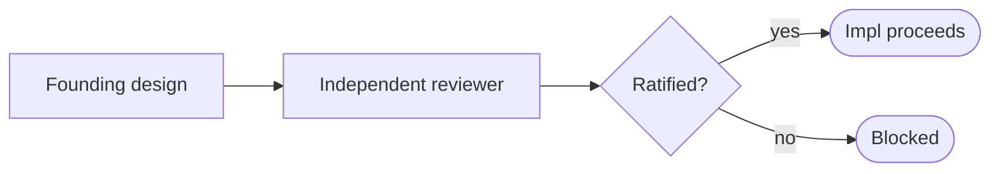

# Independent pre-implementation design review — GoF appendix rendering

> **Fill draft.** Worked Structure + Sample Code slots for the catalogue entry
> `agent/governance-doc-controls/independent-design-review.md`, in the book's Gang-of-Four appendix layout.
> The follow-up pass injects the two filled slots at the placeholders keyed by the entry name
> `Independent pre-implementation design review`. Intent / Motivation / Applicability / Consequences /
> Known Uses / Related Patterns are projected from the catalogue `.md` — reproduced in brief so the entry
> reads as a complete GoF page.

## Independent pre-implementation design review

**Intent** — Before any implementation phase, a fresh reviewer that did not author the design re-derives it
from the code, verifies its central claims empirically, and rules on the open design forks — the
reviewer wins conflicts, and implementation proceeds only on the ratified design.

### Motivation

An author cannot audit their own premises. The central assumption feels obvious *because* they wrote
it, so it never gets re-tested — an unverified constant, a stronger-model over-reach, a plausible-but-wrong
assumption that shapes the whole plan. The failure is an author's design bias sliding unchecked into the
code, and it is silent: the design reads clean until the flaw surfaces on work already built atop it.

### Applicability

Reach for this when a design phase precedes implementation with its open questions named, a second reviewer
of comparable strength who did not author the design is available, and the review's ruling actually gates
implementation rather than degrading to advisory prose.

### Structure

The design passes to a reviewer who did not write it. The reviewer re-derives it from the code, runs the
central claims, and rules on the open forks; implementation proceeds only on a ratified design and is
blocked on a revise.



*Accessible description: a founding design passes to an independent, non-author reviewer, who rules on the design's open forks; implementation proceeds only if ratified, otherwise it is blocked.*

### Sample Code

The gate is procedural, not a script: its content is a fresh reviewer re-deriving the design and ruling on
its forks. The one mechanizable part is that the ruling binds — a revise verdict must block implementation,
never fall through to advisory prose.

```python
def admit_design(design, reviewer, *, author) -> int:
    """Independence is the mechanism: a self-review reproduces the blind spot, not a check on it."""
    if reviewer is author:
        raise SystemExit("review must be performed by someone who did not author the design")
    verdict = reviewer.re_derive_from_code(design).rule_on_forks(design.open_questions)
    if verdict != "ratified":                 # reviewer wins conflicts
        print(f"BLOCK: design not ratified ({verdict}); fold the revise before any code is written")
        return 1
    return 0                                    # implementation proceeds on the ratified design
```

### Consequences

- **It doubles the design cost** — a full second pass by an independent mind, spent because a wrong premise
  baked into implementation is far more expensive to unwind than to catch.
- **Only founding / high-stakes designs earn it** — forcing the gate onto a mechanical fix is ceremony the
  author routes around; scope it to designs whose flaws would compound.
- **Independence can be faked** — a reviewer who defers to the author, or reads the prose instead of
  re-deriving from the code, files a review that looks done and catches nothing.

### Known Uses

- The polarity-inversion catch: a control about to spell its positive-membership set with a guessed
  empty-string token — inverting the control's polarity tree-wide while passing every named pin — caught
  because the independent reviewer ran the tool and read its actual default token.
- Every founding design gets one independent review pass, ruling on its open forks, before implementation
  begins.

### Related Patterns

- **Counterpart** — the Epic Definition-of-Done: the two ends of one effort. This ratifies the *design*
  before code exists; the Definition-of-Done verifies the *built work* at close.
- **Enabler** — the Epic-and-design templates make *open questions* and *second-order dynamics* required
  sections, so the forks this reviewer rules on are already written down.
- **See also** — self-governance: both are design-time governance moves — one converts a recurring failure
  into a control, this catches an author's bias before it ships.
