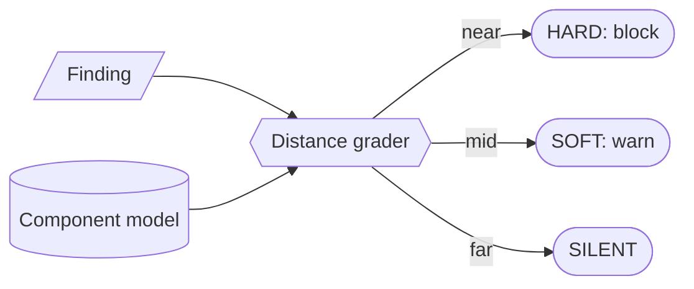

# Model-graded finding severity (distance-graded gate) — GoF appendix rendering

> **Draft fill.** Worked Structure + Sample Code slots for the catalogue entry
> `models-bridge/system-models/model-graded-finding-severity.md`, rendered in the book's Gang-of-Four
> appendix layout. The follow-up pass injects the two filled slots at the placeholders keyed by the entry
> name `Model-graded finding severity (distance-graded gate)`. Intent / Motivation / Applicability /
> Consequences / Known Uses / Related Patterns are projected from the catalogue `.md` — reproduced in brief
> so the entry reads as a complete GoF page.

## Model-graded finding severity (distance-graded gate)

**Intent** — Grade each lint finding's severity — block, warn, or silence — by the finding's *distance*, in
a structured component model, from the files the commit actually changed, computed by one central join the
gate runs over every finding rather than by each lint scoping itself.

### Motivation

A whole-tree lint reports findings from all over the tree. Two ways to gate both fail: *all-or-nothing*
blocking blocks a one-file commit on a pre-existing finding three subsystems away — noise it can't fix, so
agents learn to bypass the gate; *every-lint-scopes-itself* re-decides relevance in N places that drift N
ways. The shared failure is findings graded uniformly wrong, with no single place owning "how close is this
finding to what the commit changed?"

### Applicability

Reach for this when a structured component model can be read at check time, the lints already emit findings
as typed records (site, causing input, kind, fix-guidance), a downstream no-baseline backstop catches
SILENT findings, and a cost budget keeps the whole-tree members central while routing expensive ones to a
self-scoped path.

### Structure

Each lint emits a structured finding — its site, its causing input, a kind, fix-guidance. The gate reads
the component model at check time and runs one central grader over every finding: HARD (site or cause in
the changed set) blocks, SOFT (the finding's component was touched) warns, SILENT (neither) defers to the
backstop. An unplaceable finding fails closed to HARD.



*Accessible description: a finding and the component model feed one central grader that ramps severity by
distance from the change — near blocks (HARD), a touched component warns (SOFT), and neither defers to a
downstream backstop (SILENT). A finding the grader cannot place fails closed to HARD, so a gap in the
contract is treated as most severe, not least.*

### Sample Code

The grader operates on the structured-finding contract alone — it never reaches into a lint's internals, so
a new lint that emits the contract is graded for free. The grade is additive-restrictive: HARD requires a
real member of the changed set, so a grader bug can at worst let a finding slip to the backstop, never
fabricate a spurious block.

```python
def grade(finding, changed_files: set, changed_components: set, model) -> str:
    """One central grader; distance from the change decides how loudly an existing finding speaks."""
    try:
        if finding.site in changed_files or (finding.causing_input in changed_files):
            return "HARD"                                   # at the change — block
        if model.component_of(finding.site) in changed_components:
            return "SOFT"                                   # in a touched component — warn
        return "SILENT"                                     # elsewhere — defer to the backstop
    except Exception:
        return "HARD"                                       # unplaceable finding fails CLOSED, not open

def gate(findings, changed_files, model) -> list[str]:
    changed_components = {model.component_of(f) for f in changed_files}
    blockers = [f for f in findings
                if grade(f, changed_files, changed_components, model) == "HARD"]
    return [f"{b.site}: {b.kind} — {b.fix_guidance}" for b in blockers]  # HARD carries actionable text
```

### Consequences

- **One grader, one blast radius** — centralizing the join means a grader bug touches every lint; the trade
  buys a single well-tested surface over N private re-derivations, and additive-restrictiveness bounds the
  worst case to a fail-safe.
- **SOFT debt accumulates** — a SOFT warn never forces a fix, so a component collects pre-existing findings;
  cap the per-commit output and let the backstop force the drain.
- **Whole-tree cost per governed commit** — grading every finding means running the lints whole-tree;
  measure it, keep the cheap members central, route the expensive ones to a self-scoped path.
- **The contract now carries weight** — a lint that stops emitting a well-formed finding degrades to opaque
  HARD; the emission contract earns a check of its own.

### Known Uses

- A pre-commit hook that grades a governed-doc commit's whole-tree lint findings — a doc-staleness check and
  an index-comprehensiveness check — against the component-and-zone model, in one central join, fixing a
  recurring incident where a commit touching one doc was blocked by stale findings elsewhere.
- A commit that *adds* an unindexed doc still blocks: the finding's site is an untouched index file, but its
  causing input is the added doc, so it grades HARD by causation.

### Related Patterns

- **Enabler** — the component & zone model: the structured model the grader reads at check time — the
  sharpest instance of a model *consumed to run a mechanism*, dogfooded on every governed commit.
- **Enabler** — meta-model consumption: the read-don't-snapshot discipline the grader follows when it
  imports the model at check time rather than baking a copy.
- **Counterpart** — drift & parity gates: both read a model at check time, but a parity gate asks *does the
  model match reality?*; this asks *how close is this finding to the change?* and returns a graded answer.
- **See also** — the pre-commit hook the grader runs inside; and the symbol-anchored traceability graph, a
  sibling that turns a model into a live check — that grades a join's health, this grades a finding's
  distance.
