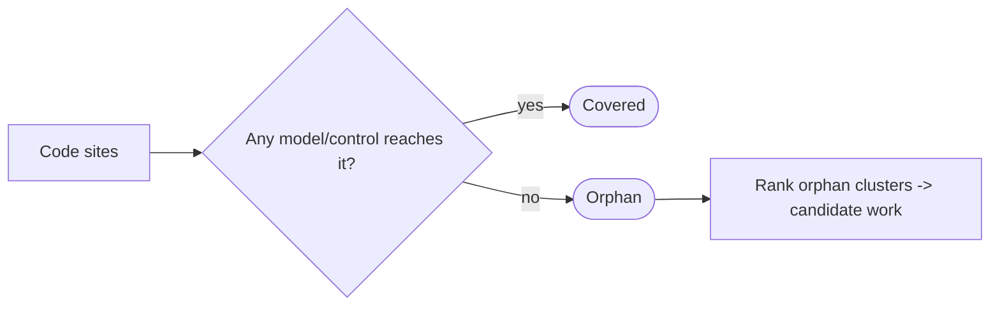

# Orphan-coverage metric (walk code → governance; score the un-covered remainder) — GoF appendix rendering

> **Fill draft.** Worked Structure + Sample Code slots for the catalogue entry
> `models-bridge/system-models/orphan-coverage-metric.md`, in the book's Gang-of-Four appendix layout. The
> follow-up pass injects the two filled slots at the placeholders keyed by the entry name
> `Orphan-coverage metric (walk code → governance; score the un-covered remainder)`. Intent / Motivation /
> Applicability / Consequences / Known Uses / Related Patterns are projected from the catalogue `.md` —
> reproduced in brief so the entry reads as a complete GoF page.

## Orphan-coverage metric (walk code → governance; score the un-covered remainder)

**Intent** — Point a tracer at the *code* and ask, for each governance-relevant site, "does any model row or
any control node reach this?" Score the remainder — the orphans, sites nothing governs — as a rate, cluster
them, and treat each cluster as a candidate for a new model or control. It walks the inverse of a
control-outward census, and it never gates.

### Motivation

The dangerous gap is the one nothing points at: a seam that no model describes and no control watches. A
census that walks *controls outward* cannot see this class — it reads only the sites its controls already
point at, so it reports high per-control coverage while whole regions of code sit un-touched. The knowledge
of *which code has no governing model or control* lives nowhere until an un-watched site fails.

### Applicability

Reach for this when a tracer can resolve, per site, whether a model row or control node reaches it; the
model and control sets are read as live data rather than a hand-kept list; and a done-condition (a glue-only
residual, not zero) bounds the drain so it does not become a completeness-chase.

### Structure

For each governance-relevant code site, the tracer asks whether any model row or control node reaches it. A
reached site is covered; an un-reached site is an orphan. The orphans are scored as a rate, clustered, and
each dense cluster is ranked as candidate work — the metric never blocks a commit.



*Accessible description: each code site is checked against whether any model row or control node reaches it; reached sites are covered, unreached sites are orphans, and orphans are clustered and ranked into candidate work — the metric never blocks a commit.*

### Sample Code

The reach is computed from the live model and control sets, never a hand-kept coverage list that rots. The
output is a ranked backlog of orphan clusters, and the function returns 0 always — it ranks work, it never
gates.

```python
def orphan_report(sites, model_rows, control_nodes) -> int:
    """Score the un-governed fraction of the code estate; rank the orphan clusters. Exit 0 always."""
    orphans = [s for s in sites
               if not any(reaches(r, s) for r in model_rows)
               and not any(reaches(n, s) for n in control_nodes)]
    rate = len(orphans) / len(sites)
    for cluster in rank_by_density(cluster_sites(orphans)):
        print(f"CANDIDATE ({len(cluster)} sites): model or control missing at {cluster.anchor}")
    print(f"orphan rate {rate:.0%} — instrument only, no commit blocked")
    return 0                                   # sensor, never a gate
```

### Consequences

- **The done-condition is a glue-only regime, not zero** — driving past the residual of re-export shims and
  thin facades chases coverage nobody needs; a small glue-only residual is the honest stopping point.
- **It measures presence, not strength** — a site a weak model or soft-only control reaches counts as
  covered; the metric closes the "nothing reaches this at all" gap and leans on others to judge strength.
- **The tracer's reach rule is essential** — a mis-resolved site reports a false orphan or false
  coverage, so the reach rule must track how models and controls anchor to code.

### Known Uses

- Un-modeled code (code → model): scored the sites no typed model row reaches and drove one subsystem's
  un-modeled fraction from roughly a half toward a fifth over successive rounds, each round's densest
  cluster driving the next model built.
- Un-governed code (code → control): the explicit dual — score the sites no control node reaches; a headline
  orphan cluster corroborated an independently-found gap a separate cleanup had just closed.

### Related Patterns

- **Counterpart** — the control-coverage census: the same coverage-of-governance idea walked the other
  direction (control → target over a closed taxonomy, vs code → governor over the code estate).
- **Sibling** — the model-derived test-obligation census: both derive a should-exist set and surface the
  gap — that one gates on a missing test, this one only ranks a missing model or control.
- **Consumer** — the symbol-anchored traceability graph: the metric rides the graph's code↔model
  reachability, read as a coverage question rather than the graph's own integrity question.
- **See also** — the query surface the orphan roll-up and its ranked clusters project through.
