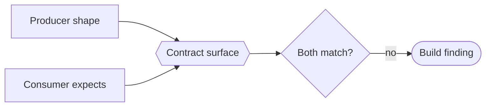

# Typed contract surfaces (the contract is a checked model, not a comment) — GoF appendix rendering

> **Draft fill.** Worked Structure + Sample Code slots for the catalogue entry
> `models-bridge/system-models/typed-contract-surfaces.md`, rendered in the book's Gang-of-Four appendix
> layout. The follow-up pass injects the two filled slots at the placeholders keyed by the entry name
> `Typed contract surfaces (the contract is a checked model, not a comment)`. Intent / Motivation /
> Applicability / Consequences / Known Uses / Related Patterns are projected from the catalogue `.md` —
> reproduced in brief so the entry reads as a complete GoF page.

## Typed contract surfaces (the contract is a checked model, not a comment)

**Intent** — Turn the contract between two parties — an HTTP API and its clients, two languages sharing a
wire format, a command-line tool and the scripts that parse its output — into a structured, checked model
instead of a shared assumption. The producer's shape and the consumer's expectation both reconcile against
one declared surface, so a breaking change reddens a build gate rather than silently breaking the far side
at runtime.

### Motivation

A contract crossing a boundary usually lives as a comment, an example payload, or nothing at all. One side
changes its shape; the other keeps parsing the old one; the mismatch surfaces as a runtime error far from
the edit. An HTTP endpoint drops a field and a client deserializes `null`; a worker renames a status marker
another language greps for; a CLI changes its stdout JSON and every script that piped it breaks at once. In
each case the two sides share a shape written down nowhere a check can read.

### Applicability

Reach for this when there are two identifiable sides to reconcile, a build-time gate reads the surface and
checks real handlers and consumers against it, and "the contract" is nameable independently of any one
implementation — or there is nothing for both sides to point at.

### Structure

The boundary shape is a typed surface — the endpoint set, the cross-language marker and JSON schemas, the
per-subcommand output spec — that the build reads. The producer (handler, emitter, subcommand) and the
consumer (client, parser, script) each reconcile against it, so a change on one side surfaces as a mismatch
at the same gate. The surface carries policy too (visibility, auth, which output points are stable fuzz
oracles), and a stable output point becomes the oracle a fuzzer checks against.



*Accessible description: a producer's real shape and a consumer's expectation both reconcile against one
declared contract surface, which carries policy metadata too. A mismatch on either side is a build finding,
caught at the edit rather than in production.*

### Sample Code

The surface earns the word *model* by being reconciled against *both* sides at build time — a plain schema
you hand-write and hope stays accurate has no such tie. Neither the producer's real shape nor the
consumer's expectation can move without the gate noticing.

```python
def contract_findings(surface, producer_shape: set, consumer_expectation: set) -> list[str]:
    """Reconcile BOTH sides against one declared surface — either divergence is a build finding."""
    declared = surface.fields
    findings = []
    for missing in declared - producer_shape:
        findings.append(f"producer drops declared field {missing!r} — clients will deserialize null")
    for extra in consumer_expectation - declared:
        findings.append(f"consumer expects {extra!r}, not on the contract — stale expectation")
    return findings

def is_fuzz_oracle(surface, output_point: str) -> bool:
    """A stable output point is a spec commitment — the oracle an adversarial input is checked against."""
    return output_point in surface.stable_output_points
```

### Consequences

- **A breaking change becomes a build finding, not a production incident** — moving a field, renaming a
  marker, or reshaping output reddens the gate at the edit, friction exactly where the cost of silence was
  highest.
- **The surface is one more thing to keep true** — a contract model that stops matching its producer gives
  false confidence, so the reconciliation gate is essential; a surface no check reconciles is worse than
  none, because it looks authoritative.
- **Three boundaries, one genre, but distinct instances** — an API model, a wire schema, and a CLI-output
  spec share the pattern yet differ in what "the far side" is; folding them into one artifact would blur
  checks that run at different times.

### Known Uses

- A structured endpoint model carrying per-endpoint visibility, auth, and billing, reconciled against the
  request handlers that serve it.
- A cross-language wire-contract registry: the status markers and JSON shapes a worker in one language emits
  and a coordinator in another consumes, checked against both emit and parse sites.
- A per-subcommand CLI-output spec that doubles as a fuzz oracle — the stable stdout shape an adversarial
  input is checked against, so a fuzz failure lands on the declared spec point rather than one run's
  formatting.

### Related Patterns

- **Sibling** — the service-flow model: the inter-service wiring model names *which* services call which;
  this genre types the *shape* of what crosses each call. One says who talks to whom, the other in what
  language.
- **Layer** — drift & parity gates: the reconciliation machinery that keeps each contract surface equal to
  its real producer and consumer.
- **Consumer** — fuzz campaigns: the CLI-output contract is the stable oracle a fuzz campaign checks
  generated output against, so an adversarial input fails to the declared spec point.
- **Counterpart** — meta-model consumption: consumers should *read* the contract surface rather than
  hardcode a snapshot of it, the read-side discipline that keeps a contract's two ends pointed at one
  declaration.
- **See also** — semantic-level enforcement: a contract check belongs at the boundary's own semantic level —
  the endpoint shape, the marker schema — not as a raw string match a layer below.
