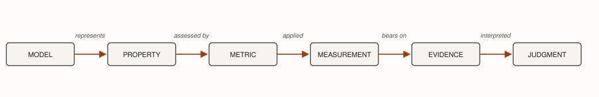

**Premise.** *Validation asks what evidence is sufficient to deliver a software system into the world.*

Software's updateability changes the economics of validation. Engineers can sometimes deliver before resolving every uncertainty, observe what happens, and repair the failures they discover: a game can ship with an occasional graphical defect. In that limited sense, *move fast and break things* describes a real engineering strategy.

But an update repairs the software, not necessarily the consequences of its previous behavior. It cannot recover money already lost, make disclosed information private again, or reverse a physical injury. As the consequences of being wrong grow more substantial or less reversible, learning through failure becomes more expensive. Validation therefore does not seek maximal confidence before every delivery; it asks what evidence is sufficient for *this* one.

Answering that requires six related judgments:

- **What is at stake?** What would happen if the system were wrong, and how reversible would the consequences be?
- **Where must we establish confidence?** Which claims matter, and at what scope do their properties exist?
- **How can we obtain evidence?** What can execution, analysis, review, formal reasoning, measurement, or operation tell us, and what can each not tell us?
- **What validation strategy fits the uncertainty?** What failure are we trying to expose, and what oracle can make that failure observable across enough of the relevant behavior?
- **How strong is the resulting evidence?** How much does it cover, how representative and discriminating is it, how independent are its sources, and what uncertainty remains?
- **When is it enough?** Given the consequences, available margin, controls on failure, and residual uncertainty, should we deliver, gather more evidence, change the system, revisit an earlier decision, or refuse?

The questions structure the judgment rather than script it; evidence can send an engineer backward.

## What is at stake?

Consider three defects: a game sometimes draws a character incorrectly, a TODO application occasionally loses a task, a medical device can deliver an incorrect dose. They differ in severity, reversibility, and how directly the software produces the harm. The game defect may annoy a player; the lost task destroys information on which a user depends; the wrong dose can directly injure its user. Almost any defect connects to severe harm through some causal chain, but causal distance matters: frustrated players sometimes behave badly, yet that does not make a graphical defect safety-critical.

Consequence establishes an evidentiary burden; it does not mechanically dictate the decision. Stakeholders and engineers can weigh the same consequence differently, and engineers do not merely execute the risk preferences of whoever controls the project: professional authority includes refusing a delivery the engineer cannot justify. The opposite error is real too: demanding far more assurance than the stakes warrant wastes resources and delays useful software. What is at stake determines how much uncertainty engineers can responsibly carry through delivery.

Consequence is also not fixed. Engineered controls change what a failure is permitted to affect, so validation asks not only how likely we are to have missed a failure but what the system allows that failure to reach. The final section returns to this.

## Where must we establish confidence?

Validation begins with claims, not techniques. A payment service might need to establish that a payment cannot be charged twice, that unauthorized users cannot initiate payments, and that normal requests complete within an acceptable time. Evidence supporting one claim may say little about another. Begin with *what must be true for this delivery to be justified?* Only then ask where confidence in each claim has to attach.

Specification supplies the starting point. A specification states what the MACHINE must do under assumptions about its ENVIRONMENT; requirements name outcomes in the WORLD. The claim that ultimately matters therefore concerns the machine operating in its actual environment and producing the promised outcome.

That suggests an obvious approach: exercise the whole system at its real boundary, where the thing we care about actually happens. Whole-system evidence is necessary. It is also insufficient as the only mechanism. When an end-to-end run fails, the defect could be anywhere in the system, and such failures are expensive to reproduce, localize, and diagnose. Many properties are also far cheaper to exercise or analyze on a part than on the assembly.

So engineers deliberately establish evidence at smaller scopes as well. For the "at most one charge" claim:

- **Local evidence.** Does the idempotency component reject a repeated payment identifier?
- **Compositional evidence.** What happens when a client retry and a server retry interact?
- **Assembled-boundary evidence.** Does one submitted payment ever produce two charges at the service boundary?
- **World evidence.** Under the payment provider's actual semantics, can the customer still be charged twice?

**Validate a property at the smallest scope capable of establishing it — but no smaller.** The first half captures the economics: small scopes are cheap to run and their failures are cheap to diagnose. The second half preserves the end-to-end principle. Correct parts do not necessarily compose into a correct system. Components can each satisfy local latency budgets while their end-to-end path exceeds its system budget; individually reasonable assumptions can leave a responsibility unowned; correct retry mechanisms can interact to produce duplicate execution. Local evidence supports a broader argument. It cannot substitute for evidence about a property that exists only in composition.

Software engineers have conventional names for roughly these scopes: **unit → integration → system → acceptance**. The names describe where evidence attaches, not how important it is, and the boundaries between them shift with what counts as a part. A "unit" for one team is a subsystem for another. Attach the vocabulary to the scopes the claims already demanded rather than treating the four names as a fixed taxonomy.

Engineering models supply the other half of the picture. Requirements establish outcomes the engineering effort has promised in the world. Specification represents properties the machine and environment must have if those promises are to be kept. Architecture represents the organization through which system properties must emerge. Design represents mechanisms and local properties through which parts fulfill their responsibilities. Implementation produces the realization about which evidence can now be gathered. A specification may bound response latency; an architectural model may allocate that latency across a path; a design may require a worker to remain below a memory limit or a retry mechanism to be idempotent.

Put the two legs together and the argument summarizes as a V. Down the left side, engineering models become progressively more specific as they constrain realization. Up the right side, validation obtains evidence about those properties at the scopes where they apply.

*Models become more specific toward realization; validation gathers evidence about their properties at the scope where each applies.*

At the top of the V, the distinction from Specification returns: evidence about the MACHINE alone cannot establish every requirement in the WORLD. Engineers may also need evidence that the ENVIRONMENT provides the assumptions on which the specification depends and that MACHINE + ENVIRONMENT actually produce the promised outcome.

## How can we obtain evidence?

Scope says where evidence attaches. It does not say how the evidence was obtained. Several evidence mechanisms do that, and each carries a characteristic limitation that fixes what it can and cannot tell us.

- **Dynamic testing** observes selected executions. Its fundamental limitation is sampling: executions not performed remain unobserved.
- **Static analysis** reasons about possible behavior without executing it. Its conclusions depend on the abstraction it uses and on what the analyzer's guarantees actually mean; false positives and false negatives follow from those guarantees.
- **Human review and inspection** contribute semantic knowledge and judgment that may not be encoded mechanically. A reviewer can notice that the wrong problem was solved. But attention is finite, and research on vigilance and rare-target search gives us reason not to treat prolonged inspection as exhaustive assurance.
- **Formal methods** reason mechanically over explicit models and properties. Bounded model checking, for example, asks whether any execution within a bound violates a property, and returns a counterexample when one does. Its guarantee extends only as far as the model, property, assumptions, and bound.
- **Measurement and experimentation** obtain quantitative evidence under stated conditions.
- **Operational observation** obtains evidence from the deployed system in its actual environment, but only after exposure to consequences has begun.

**Scope and evidence mechanism are independent choices.** A component can be dynamically tested, statically analyzed, reviewed, or formally checked. "Unit" tells us where evidence attaches; "testing" tells us something about how it was obtained.

Measurement deserves its own chain, because a number alone establishes nothing. A property identifies something that matters to an engineering decision. A metric defines how some aspect of that property will be assessed. A measurement is an observed value obtained by applying that metric under particular conditions. An architectural model might require an end-to-end request path to remain below a 500 ms latency bound; engineers could assess that property using p99 request latency under a defined workload; a measured value of 420 ms then provides evidence about the architectural claim. The value means little without the property, metric, workload, and environment that give it meaning.

*A measurement becomes evidence only through the property and conditions that give it meaning.*

A disagreement between a predicted and a measured value may indicate a defective implementation, an incomplete model, an invalid assumption, or a poor metric. Validation asks which explanation the evidence supports rather than assuming that either the model or the realization must be correct.

## What validation strategy fits the uncertainty?

Dynamic testing needs one thing the instrument itself does not supply: a way to decide whether an execution was correct. This is the **oracle problem**. Producing an execution is usually cheap; knowing whether its result is right can be expensive. Validation strategies differ in how they answer it, and therefore in how much search they can afford.

The organizing question is not *which testing method is most sophisticated?* but *what failure am I trying to expose, and what strategy makes that failure observable?*

| Strategy | What it searches | Where the oracle comes from |
|---|---|---|
| **Example-based** | Cases the engineer judged important | A known expected result, stated case by case |
| **Property-based** | Generated inputs across a class | One property stated over the whole class |
| **Metamorphic** | Related executions | A relation that must hold among executions, even when no single answer is known |
| **Differential** | Inputs on which implementations disagree | An independently developed implementation |
| **Fuzzing** | Unusual, malformed, and unanticipated inputs | A weak oracle: crashes, hangs, assertion failures, sanitizer reports |

A weak oracle enables enormous search. That is the trade the lower rows make: they give up on knowing the right answer for each case in exchange for examining far more cases than an engineer could enumerate. The strategies are not ranked, and they combine. Fuzzing can drive a property-based oracle; differential comparison can supply the oracle for generated inputs.

Strategy and scope are independent too. A property can be stated over a function, a service boundary, or an assembled system, and the same strategy applies at each.

## How strong is the evidence?

Neither a technique's name nor the quantity of evidence it produces establishes its strength. A model checker can exhaustively verify a property of the wrong model; thousands of generated tests can share one mistaken oracle; reviewers can share the author's mistaken assumption; a precise measurement can assess the wrong property. Evidence is judged along several dimensions at once:

| Dimension | Ask |
|---|---|
| **Coverage** | How much of the relevant behavior did we examine? |
| **Detection power** | Would this evidence expose the failure we care about? |
| **Representativeness** | Do the examined conditions resemble delivery? |
| **Scope** | Does the evidence attach where the property actually exists? |
| **Independence** | Could one mistaken assumption invalidate several pieces of evidence at once? |
| **Assumptions** | What must be true for this evidence to mean what we think it means? |
| **Residual uncertainty** | What consequential possibilities remain unresolved? |

Coverage and detection power are often confused, and the difference matters. Coverage records where we looked. Detection power asks whether looking there would have revealed the failure. A suite can execute every line while asserting almost nothing about the results. Mutation score is the canonical illustration: deliberately damage the program and ask how often the evidence notices.

**Evidence multiplies; independence does not.** A thousand tests generated from the same mistaken interpretation of a requirement are not a thousand independent reasons to believe the interpretation is correct. They are one reason, repeated. The strength of a body of evidence depends not only on its quantity, but on the independence of the assumptions and failure modes behind it. Cheap generation makes this sharper, not softer: when a tool can produce an implementation and its tests from the same prompt, both can inherit one misunderstanding, and the suite's size signals nothing about it.

Ask of any evidence: *What uncertainty does this evidence reduce, at what scope, and what assumptions or failure modes remain?*

## When is it enough?

Other engineering disciplines supply useful language for residual uncertainty. A **tolerance** describes a range of behavior the system may exhibit while remaining acceptable. A **margin** describes the separation between expected or observed behavior and an unacceptable boundary. A system whose measured p99 latency is 420 ms against a 500 ms limit occupies a different engineering position from one measuring 499 ms, even though both currently satisfy the requirement.

The measured separation is not necessarily the defensible margin. Workloads vary, measurements carry uncertainty, models omit effects, and operating conditions change. Engineers therefore ask how much separation remains after accounting for the uncertainty that matters. Metrics do not eliminate judgment; they make some of the quantities on which judgment depends explicit.

The analogy to physical engineering has a limit, and it is worth stating plainly. Software behavior is discrete. Nearby inputs and nearby program states need not produce nearby outcomes: a one-bit difference, a boundary condition, or a single unexpected transition can place execution on a qualitatively different path. Physical systems exhibit discontinuities too, as fracture and instability show, but in software discontinuity is routine.

That changes what margin can tell us. A large observed performance margin may be meaningful for a quantitative performance claim. There is no comparable numerical distance from a latent authorization bypass, a duplicate transaction, or an unhandled state transition. Passing many nearby cases does not imply that the unobserved cases between and around them are safe.

Software engineers compensate partly by engineering **controls that bound the consequences** of behavior they failed to predict. Interfaces restrict possible interactions. Process and container isolation restrict propagation. Type and memory-safety mechanisms rule out classes of behavior. Permissions and capability boundaries limit authority. Transactions limit partially completed changes. Resource quotas, timeouts, circuit breakers, staged rollout, and rollback constrain what a failure can affect. Such controls do not prove the enclosed software correct. They change the delivery decision by changing the possible consequence of being wrong. This is a further reason architectural boundaries matter: good boundaries make incomplete evidence safer to act upon.

**For quantitative uncertainty, ask how much margin remains. For discrete and unanticipated behavior, ask how far failure is permitted to propagate.**

Before delivering, then, ask:

- **Claims.** Have we obtained evidence for the consequential claims?
- **Strength.** How strong is that evidence along the relevant dimensions?
- **Margin.** Where behavior is quantitative, how much defensible room remains before unacceptable behavior?
- **Containment.** If an unanticipated behavior occurs, what controls limit its consequence?
- **Consequence.** What happens if those arguments are wrong?
- **Reversibility.** Can we detect, stop, repair, and recover from failure after delivery?

Those considerations feed a decision with more than two outcomes:

- **Deliver.** The available evidence justifies accepting the remaining uncertainty.
- **Gather more evidence.** Additional information could materially change the decision.
- **Change the system.** Reducing the risk is preferable to gathering more evidence about it.
- **Revisit an upstream decision.** The evidence exposes a problem with a requirement, specification, architecture, or design choice.
- **Refuse.** No available course makes delivery professionally defensible.

These are not a checklist, and several feed backward. A failed validation need not mean "test more": sometimes the implementation should change, sometimes the architecture is wrong, and sometimes the commitment itself should be reconsidered. The question is therefore not simply *should we deliver?* but *what action follows from what we now know?*

Evidence also changes after delivery. Monitoring, incidents, measurements, and user reports change the state of knowledge; continuing to deliver is then a new decision under new evidence. Evidence can also age when the system changes: engineers must ask which claims a modification could affect and which evidence therefore needs to be renewed. Software's updateability, where this argument began, makes post-delivery learning unusually practical — and creates the matching obligation to respond when that learning undermines the justification for delivering at all.

---

**Read the expanded treatment:** [*The Software Engineering Handbook*, "Validation" →](https://davisjam.github.io/model-based-agentic-software-engineering/book/se-handbook/08-validation.html)
