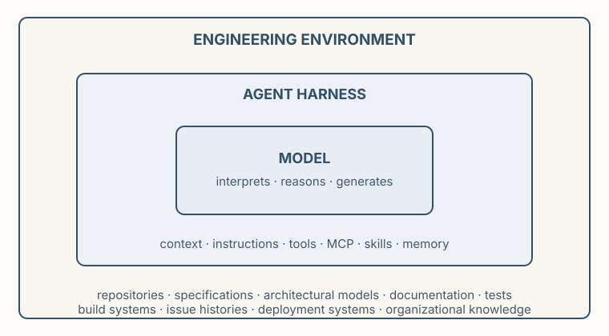

**Premise.** *An agent's engineering capability is not a property of the model alone. What an agent can accomplish depends on the model, the harness through which it acts, and the engineering environment in which the work occurs.*

This unit asks how engineers should delegate work to capable but fallible machines: the question begins with where capability comes from.

## Where does capability live?

An agent has three layers:

- **The model** interprets information, reasons, and generates candidate actions or artifacts.
- **The agent harness** turns that capability into an actor. It determines what context the model receives, what it remembers, which tools it can invoke, what actions it may take, how results return as feedback, and how work continues across steps. Contemporary harnesses share a small set of mechanisms: context, instructions, tools, MCP, skills, and memory. We study them for the engineering function each serves, not to memorize a platform.
- **The engineering environment** surrounds the work: repositories, specifications, architectural models, documentation, tests, build systems, issue histories, deployment systems, and organizational knowledge.

*The layers are not independent: the harness selects what the model sees and does; the environment sets what must be reconstructed; the model bounds the reasoning.*

Capability is a design variable. Frontier, smaller, open-weight, and specialized models trade against decomposition, representations, tools, and task scope; calls cost money, time, computation, and context; irrelevant context obscures what does matter. "Which model is best" has no context-free answer; the engineering question is what combination of model, harness, environment, and human judgment suffices for this work.

## Engineers have levers

Each layer offers points of intervention:

| Lever | Engineering purpose | Examples |
|---|---|---|
| Model | Select the underlying reasoning capability | frontier, low-cost, specialized, open-weight |
| Context | Make relevant information available now | files, specifications, retrieved knowledge |
| Instructions | Shape how work should be approached | system instructions, project instructions |
| Tools | Give the agent capabilities to observe or act | shell, compiler, tests, search, APIs |
| MCP | Connect agents to external capabilities through a common interface | repository, issue tracker, engineering service |
| Skills | Package reusable ways of performing recurring work | review procedure, remediation workflow |
| Memory / state | Preserve useful information across reasoning steps or tasks | plans, task state, durable records |
| Work structure | Change the reasoning problem itself | decomposition, checkpoints, intermediate artifacts |

The levers are not interchangeable. A tool does not solve a missing-context problem, more context does not create authority, and a skill does not guarantee its instructions are followed. When an agent struggles, "use a better model" is one engineering response among eight.

## The reasoning horizon

An agent's **reasoning horizon** is the amount of relevant state it can effectively bring to bear on a task. Models, context, retrieval, and tools extend it; so do better representations: an agent checking a change against the architecture can reconstruct dependencies from source or consult a trustworthy dependency model. The move is Pólya's — change the problem presented to the reasoner rather than the reasoner. Do not make the agent infer repeatedly what the environment can represent usefully; the objective is the right reasoning surface, not more context.

Recurring reconstruction is evidence of useful knowledge; the question is whether it stays ephemeral or becomes inheritable. Knowledge can live in people, prose, diagrams, specifications, models, tests, tools, conventions, and mechanisms, at different costs: permanence everywhere accumulates stale representations, implicitness everywhere forces rediscovery. Ask what future engineers — or future agents — would regret having to rediscover: an old knowledge-management question, newly visible when every reasoning episode can re-purchase the same reconstruction.

Decomposition changes the reasoning problem itself. Smaller tasks carry narrower context and clearer outputs, but information must cross the boundaries, and a poor decomposition forces reconstruction, continuous coordination, or locally reasonable but globally conflicting decisions. Agentic engineering does not eliminate architecture; it adds another system to architect, the system performing the engineering work.

## Capability is not authority

A model responds to an invocation; an agent acts over time. The harness creates that difference. Tools also confer authority: search is one grant; modify, merge, or deploy quite another. Two design decisions follow: what does the agent need to perform the work, and what consequences should it be permitted to produce?

Guidance answers only the first. Prompts, examples, retrieved context, plans, and instructions make desirable behavior more likely; none makes the outcome true. For consequential obligations, engineers may require evidence or controls outside the reasoning that produced the result. Help the agent succeed, but do not confuse helping it succeed with establishing that it did; later units develop the distinction.

## Engineer the whole system

Model, harness, and environment are alternative and complementary places to spend engineering effort: a better model, a better representation, a different decomposition, preserved knowledge, narrower authority, evidence at a consequential boundary. The objective is not to maximize autonomy, minimize cost, or put a human in every loop; it is to design a system in which machine capability, the engineering environment, and human judgment are together sufficient for the consequences of the work.

**Before you delegate.** Ask what work you are delegating, what the agent must know, what it should reason about, whether the task fits its reasoning horizon, what must persist, what authority it needs, and what evidence you will require. The agent is one component in the engineering system; engineer the system, not merely the prompt.

## Scope

This unit deliberately avoids the technical details of how language models produce intelligence; we consider their properties in the abstract, with enough detail to provide a useful model for controlling their behavior. We do study the mechanisms through which contemporary agents are controlled and connected to engineering work — context management, tools, MCP, skills, memory, permissions, and work decomposition — for their engineering purpose rather than the details of any particular product.
