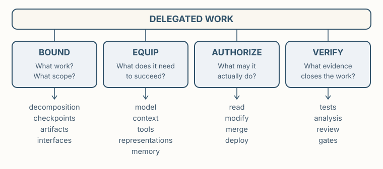

**Premise.** *Delegation is something engineers design.*

Earlier, we defined engineering as the discipline of exercising informed control over consequential systems and accepting responsibility for their outcomes. That definition does not require engineers to personally perform every act of realization. Work can be delegated — to other people or to machine intelligence — while responsibility for the resulting system remains with the engineer.

This unit asks how to make that delegation an engineering decision. An agent's engineering capability is not a property of the model alone. What an agent can accomplish depends on the model, the harness through which it acts, the engineering environment in which the work occurs, and how the work itself is structured.

Delegation is therefore a system-design problem: bound the work, equip the agent, authorize its actions, and verify the result.

**BOUND → EQUIP → AUTHORIZE → VERIFY**

These are not rigid stages. They are four questions an engineer must answer when delegating consequential work. What work should the agent perform? What does it need in order to succeed? What consequences should it be permitted to produce? What evidence will justify accepting the result?

The rest of this unit develops the engineering levers available for answering those questions.

*Capability is designed across model, harness, and environment. Authority and evidence determine which consequences that capability may produce.*

## Where does capability live?

An agent has three layers:

- **The model** interprets information, reasons, and generates candidate actions or artifacts.
- **The agent harness** turns that capability into an actor. It determines what context the model receives, what it remembers, which tools it can invoke, what actions it may take, how results return as feedback, and how work continues across steps.
- **The engineering environment** surrounds the work: repositories, specifications, architectural models, documentation, tests, build systems, issue histories, deployment systems, and organizational knowledge.

*The layers are not independent: the harness selects what the model sees and does; the environment sets what must be reconstructed; the model bounds the reasoning.*

Capability is a design variable. Frontier, smaller, open-weight, and specialized models trade against decomposition, representations, tools, and task scope; calls cost money, time, computation, and context. "Which model is best" has no context-free answer.

These layers determine the capability available for delegated work. They do not determine what work should be delegated, what authority the agent should receive, or what evidence should be required before its work is accepted.

## Engineers have levers

Once the work has been bounded, engineers can equip the agent by intervening at several points in this system:

| Lever | Engineering purpose | Examples |
|---|---|---|
| Model | Select the underlying reasoning capability | frontier, low-cost, specialized, open-weight |
| Context | Make relevant information available now | files, specifications, retrieved knowledge |
| Instructions | Shape how work should be approached | system instructions, project instructions |
| Tools | Give the agent capabilities to observe or act | shell, compiler, tests, search, APIs |
| MCP | Connect agents to external capabilities through a common interface | repository, issue tracker, engineering service |
| Skills | Package reusable ways of performing recurring work | review procedure, remediation workflow |
| Memory / state | Preserve useful information across reasoning steps or tasks | plans, task state, durable records |
| Task structure | Change the reasoning problem itself | decomposition, checkpoints, intermediate artifacts |

The levers are not interchangeable. A tool does not solve a missing-context problem, more context does not create authority, and a skill does not guarantee its instructions are followed. When an agent struggles, "use a better model" is one engineering response among eight.

## Bound the work

Delegation begins by deciding what work the agent should perform. A task that is too broad may require the agent to maintain more relevant state than it can reason about effectively; a task divided too finely may require so much information to cross its boundaries that decomposition makes the work harder rather than easier.

Engineers can therefore change the task itself. They can narrow its scope, divide it into stages, establish intermediate artifacts, introduce checkpoints, separate generation from evaluation, or choose boundaries that reduce the amount of state each step must consider. These are not merely project-management choices. They change the reasoning problem presented to the agent.

A useful delegation boundary gives the agent enough freedom to perform coherent work while keeping the consequential context and outputs tractable. The question is not *how small can we make the task?* It is *what boundary makes this work independently reasonable without forcing important relationships to be reconstructed across the boundary?* Agentic engineering does not eliminate architecture; it adds another system to architect, the system performing the engineering work.

## Engineer the reasoning surface

An agent's **reasoning horizon** is the amount of relevant state it can effectively bring to bear on a task. Better representations extend it: an agent checking a change against the architecture can reconstruct dependencies from source or consult a trustworthy dependency model. The move is Pólya's — change the problem presented to the reasoner rather than the reasoner.

When work exceeds the agent's reasoning horizon, engineers have several choices: reduce the task, improve the representation, retrieve relevant context, externalize state, provide a tool, or move the delegation boundary. The objective is not to maximize the amount of context presented to the model. It is to construct a reasoning surface on which the relevant relationships become tractable.

Recurring reconstruction is evidence of useful knowledge; the question is whether it stays ephemeral or becomes inheritable. Knowledge can live in people, prose, diagrams, specifications, models, tests, tools, conventions, and mechanisms, at different costs: permanence everywhere accumulates stale representations, implicitness everywhere forces rediscovery. Ask what future engineers — or future agents — would regret having to rediscover. Do not make the agent infer repeatedly what the environment can represent usefully.

## Capability is not authority

A model responds to an invocation; an agent acts over time. The harness creates that difference, and tools confer authority as well as capability. Consider the same capable coding agent under five grants of authority: read repository → propose patch → modify branch → merge → deploy. Its underlying reasoning capability may be unchanged. What changes is the consequence it is permitted to produce. Authority is therefore an engineering variable independent of capability.

Two design decisions follow: what does the agent need to perform the work, and what consequences should it be permitted to produce? Equipping the agent answers the first question; authorization answers the second. Prompts, examples, retrieved context, plans, and instructions can make desirable behavior more likely. They do not restrict what an authorized action can cause, nor do they establish that the resulting artifact satisfies its obligations.

## Verify the result

Delegating realization does not delegate responsibility for deciding whether its result is acceptable. Before the work begins, engineers should therefore ask what evidence will be required to close the delegation. A generated patch might require tests and review; an architectural change might require evidence about dependency or performance consequences; a deployment might require stronger checks because its consequences are immediate and difficult to reverse.

The required evidence depends on the claims and consequences of the work, not on whether a human or an agent produced it. Nor should the agent's own judgment that its work is correct generally be confused with independent evidence for that claim. Later units develop how engineering environments can evaluate such obligations and control what happens when they are violated.

## Engineer the whole system

**BOUND → EQUIP → AUTHORIZE → VERIFY.** Bound the work so that it presents a tractable reasoning problem. Equip the agent with the capability, representations, context, state, and tools needed to perform it. Grant only the authority appropriate to the consequences of the task. Determine what evidence must exist before the work is accepted or allowed to produce further consequences.

These decisions interact. Better representations may let an agent handle a larger task. Narrower authority may make greater autonomy acceptable. Stronger verification may justify delegating work whose realization would otherwise require close human supervision. A more capable model may reduce the amount of decomposition required. The engineering object is therefore not the agent alone but the system in which delegation occurs.

**Before you delegate.** What work is bounded here? What must the agent know and be able to do? Does the task fit its reasoning horizon? What authority does it need? What consequences should remain outside that authority? What evidence will close the work?

## Scope

This unit deliberately avoids the technical details of how language models produce intelligence; we consider their properties in the abstract, with enough detail to provide a useful model for controlling their behavior. We do study the mechanisms through which contemporary agents are controlled and connected to engineering work — context management, tools, MCP, skills, memory, permissions, and work decomposition — for their engineering purpose rather than the details of any particular product.
