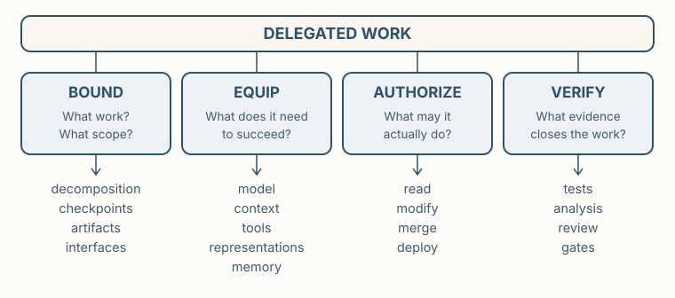
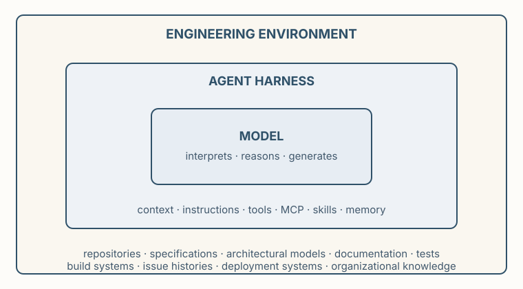

**Premise.** *Delegation is an engineering decision shaped by the work, the recipient, and the consequences.*

Earlier, we defined engineering as the discipline of exercising informed control over consequential systems and accepting responsibility for their outcomes. That does not require engineers to personally perform every act of realization. Work can be delegated; responsibility for the resulting system remains with the engineer.

Delegation is not new. Software engineers delegate to colleagues, contractors, libraries, compilers, and other automation. Factories did the same earlier still: engineers delegated fabrication to skilled machinists while drawings, tolerances, gauges, and inspection preserved control over the result. Nursing provides another consequential setting in which work is deliberately assigned according to the capability of the recipient, the consequences of the task, and the supervision available.

Across these settings, the recipient changes but the delegation problem persists: what work should be handed over, what does the recipient need, what consequences may it produce, and what evidence justifies accepting the result?

Software agents introduce a new recipient: probabilistic automation capable of reasoning and acting over time. Their capabilities and costs differ substantially from both people and deterministic automation, but the engineering problem of delegation remains.

| | another person | deterministic automation | probabilistic automation |
|---|---|---|---|
| **reliability** | depends on skill and care; may fudge, or claim competence not held, and may not recognize that a situation is unfamiliar | exact and repeatable within its specification — and wrong exactly as specified, every time | depends on model strength and context; produces fluent work whether or not it is correct |
| **unforeseen circumstances** | can adapt, but recognizing novelty itself takes expertise | has no independent judgment for novel circumstances | can reason about novelty, but may fail to recognize or handle it correctly |
| **what the delegator supplies** | instruction, context, and review | a specification, once | instruction, context, and review — re-supplied each engagement |
| **memory** | learns durably; knowledge accrues in the person | does not learn, but *is* memory — the check encodes it permanently | carries memory as session state, externalized files, and weights; the durable part is what was externalized by design, and the internal part is not interpretable |
| **accountable?** | yes | no | no |
| **cost shape** | low setup, high per unit | high setup, near-zero per unit | low setup, low but non-zero per unit |

This unit asks how to make that delegation an engineering decision. An agent's engineering capability is not a property of the model alone. What an agent can accomplish depends on the model, the harness through which it acts, the engineering environment in which the work occurs, and how the work itself is structured.

Delegation is therefore a system-design problem: bound the work, equip the agent, authorize its actions, and verify the result.

**BOUND → EQUIP → AUTHORIZE → VERIFY**

These are not rigid stages. They are four questions an engineer must answer when delegating consequential work. What work should the agent perform? What does it need in order to succeed? What consequences should it be permitted to produce? What evidence will justify accepting the result?

The rest of this unit develops the engineering levers available for answering those questions.

*Capability is designed across model, harness, and environment. Authority and evidence determine which consequences that capability may produce.*

## Where does capability live?

An agent's capability emerges from three layers:

- **The model** interprets information, reasons, and generates candidate actions or artifacts.
- **The agent harness** turns that reasoning into sustained action by managing context, state, tools, feedback, and continuation across steps.
- **The engineering environment** supplies the artifacts and systems in which the work occurs: repositories, specifications, engineering models, tests, build and deployment systems, and organizational knowledge.

*The layers interact: the harness determines what reaches the model and what it can do; the environment determines what knowledge and mechanisms are available; the model bounds the reasoning.*

These layers determine the capability available for delegated work. They do not determine what work should be delegated, what authority the agent should receive, or what evidence should be required before its work is accepted.

## Equip the agent

Within this system, engineers have three broad ways to equip the agent for the bounded work:

| Equip | Engineering purpose | Examples |
|---|---|---|
| Reasoner | Select the underlying reasoning capability | frontier, low-cost, specialized, open-weight models |
| Information | Make relevant knowledge and state available to the reasoner | context, instructions, retrieved knowledge, memory, representations |
| Means | Give the agent ways to observe, act, and carry out recurring work | tools, APIs, MCP connections, skills, workflows |

These interventions solve different problems. A stronger reasoner does not supply missing information; more context does not provide a missing capability to act; a tool does not establish that its use is authorized. Diagnose what the delegation lacks before deciding how to equip it.

## Bound the work

Delegation begins by deciding what work the agent should perform and what choices it may resolve. A task that is too broad may require more relevant state than the agent can reason about effectively; one divided too finely may force important relationships to be repeatedly reconstructed across task boundaries.

An agent's **reasoning horizon** is the amount of relevant state it can effectively bring to bear on a task. Engineers can move work within that horizon by narrowing its scope, choosing better boundaries, retrieving relevant context, externalizing state, supplying tools, or providing representations that make important relationships easier to reason about. A dependency model, for example, may expose relationships that the agent could otherwise reconstruct only by examining thousands of source lines.

The objective is not the smallest task or the largest context window. It is a tractable reasoning surface: enough freedom for the agent to perform coherent work without requiring consequential relationships to be repeatedly reconstructed. When the same knowledge must be recovered again and again, that is evidence that the engineering environment may need to represent it explicitly.

Delegation therefore leaves some degrees of freedom for the recipient to resolve. Greater capability may let engineers leave more choices open. Deciding which choices to delegate remains an engineering decision.

## Capability is not authority

A model responds to an invocation; an agent acts over time. The harness creates that difference, and tools confer authority as well as capability. Consider the same capable coding agent under five grants of authority:

*read repository → propose patch → modify branch → merge → deploy*

Its underlying reasoning capability may be unchanged. What changes is the consequence it is permitted to produce. Authority is therefore an engineering variable independent of capability.

Instructions can make desirable behavior more likely. They do not restrict what an authorized action can cause or establish that the resulting artifact is acceptable.

## Verify the result

Delegating realization does not delegate responsibility for deciding whether its result is acceptable. Before the work begins, engineers should therefore ask what evidence will be required to close the delegation. A generated patch might require tests and review; an architectural change might require evidence about dependency or performance consequences; a deployment might require stronger checks because its consequences are immediate and difficult to reverse.

The required evidence depends on the claims and consequences of the work, not on whether a human or an agent produced it. Nor should the agent's own judgment that its work is correct generally be confused with independent evidence for that claim. Later units develop how engineering environments can evaluate such obligations and control what happens when they are violated.

## Engineer the whole system

**BOUND → EQUIP → AUTHORIZE → VERIFY.** These decisions interact. Better representations or a more capable model may permit broader delegation; narrower authority or stronger verification may make greater autonomy acceptable. The engineering object is not the agent alone but the system in which delegation occurs.

## Scope

We study contemporary mechanisms such as context management, tools, MCP, skills, memory, permissions, and work decomposition for the engineering purposes they serve, rather than the details of particular products.

Modeling asks how consequential engineering knowledge can be represented so that humans and agents need not continually reconstruct it. Alignment asks when engineering obligations should have consequences for what the environment permits or accepts.

## What changes as agents improve?

Contemporary agents still require substantial engineering around their reasoning: task boundaries, external context and representations, tools, permissions, and human oversight. Those properties are changing rapidly. Agents are becoming better at sustained reasoning, independent progress, tool use, and constructing useful representations for themselves.

Suppose those capabilities improve substantially. What changes about BOUND → EQUIP → AUTHORIZE → VERIFY? What stays the same?
