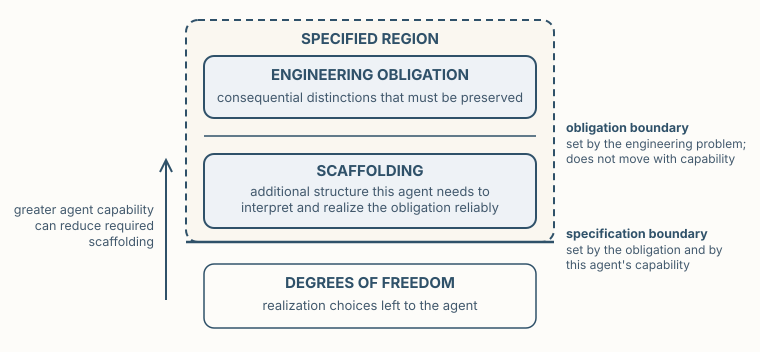

**Premise.** *A model is useful because it leaves things out and makes explicit what must remain.*

Agents make delegation cheap. But delegation creates a communication problem: the agent must recover what matters from what we give it. We cannot, and should not, specify every implementation choice. The engineering problem is to communicate consequential structure and intent while leaving the remaining degrees of freedom to the agent. That is the role of Modeling.

Earlier, we defined engineering as the discipline of exercising informed control over consequential systems. Informed control requires more than possessing an implementation. An engineer must be able to answer consequential questions without reconstructing the entire system every time the question changes.

A dependency graph discards most of a program while preserving relationships among components. A state machine discards most implementation detail while preserving states, transitions, and the transitions that must not occur. A quantitative model discards behavior and structure while preserving quantities and bounds relevant to cost, latency, or capacity. Each is useful because it omits most of the system and because it makes the distinctions relevant to its question explicit.

Modeling is therefore an act of purposeful reduction. We decide what a question requires us to preserve, what can remain free, and how to represent what remains. The objective is not to reproduce the system in another notation. It is to construct representations in which consequential engineering questions become cheap to answer.

## Two lectures, three activities

The unit spans two lectures because the problem splits in two:

- **Lecture 1 — Purposeful Reduction** asks *what must the model preserve?* One model, one question: from engineering question to reduction, repertoire, degrees of freedom and parsimony, representation, and interpretation.
- **Lecture 2 — Systems of Models** asks *how do several purposeful reductions become dependable engineering knowledge?* Many models, connected to a real system: semantics, correspondence, identity and authority, composition.

Three classroom activities exercise three progressively harder judgments: Reduce and Interpret in the first lecture, Join in the second. Reduce → Interpret → Join is the sequence of activities, not a theory of Modeling.

## Questions come first

Consider a software system and some questions an engineer might ask of it:

- *Which components may depend on this service?*
- *Can this workflow reach an illegal state?*
- *Which operations lie on the latency-critical path?*
- *Where is customer data permitted to flow?*
- *Who is responsible when this component fails?*

There is no reason to expect one representation to answer all of these questions well. A component graph makes dependencies obvious while saying almost nothing about legal runtime behavior. A state machine exposes that behavior while omitting deployment. A deployment model locates software without explaining who owns it. The first modeling decision is therefore not *which notation should I use?* It is *what question am I trying to answer?*

The unit turns that decision into a discipline. For every model, ask four questions:

- **Engineering question** — what do we need to know?
- **Model** — what purposeful reduction makes that question tractable?
- **Property** — what claim should become expressible over that model?
- **Quality** — is the reduction adequate for the question, and does its representation make the intended interpretation sufficiently likely?

## Use the engineering repertoire

The reduction rarely needs to be invented. Engineering disciplines have accumulated models for recurring kinds of questions: component and dependency graphs, state machines, data-flow models, ownership and resource models, decision and policy models, quantitative models, schemas, provenance records. Do not invent a representation merely because you can. Start from the repertoire and select for the question.

UML is one established source within that repertoire, with fourteen standardized diagram types across structure, behavior, interaction, and deployment. Model-based systems engineering broadens the space further, treating requirements, interfaces, structure, and allocations as explicit engineering artifacts. The assigned readings ask you to browse this breadth, not memorize it. There is no universal model of a software system; selecting among models is itself an engineering decision.

## Reducing a real system

The book's examples follow DocAble, a production document-remediation system. Three of its models show how the question sizes the reduction.

A model can be very small. *Which code may mutate a user's document?* One structural model answers with a single architectural relation: remediation reaches format-specific mutation through one structured-document seam. Queues, retries, sessions, and the mechanics of each repair are all omitted; the question needs only the one relation.

A larger question needs more. *Which computations make up the remediation pipeline, and how do they compose?* Answering that takes explicit entities, typed relations, and stable identities: each registered computation becomes a node, and the edges distinguish data a computation consumes from information it merely consults. The first model preserves one architectural relation. The second preserves a family of typed compositional relations over the same system.

A behavioral model shows that the fact that matters may be the edge that does not exist. DocAble's crash-recovery model requires durable publication to precede the database record that names the artifact, and it states that obligation structurally: no transition reaches the record while the artifact is only staged. An absent transition carries engineering meaning. The model does not merely translate code into a diagram; it makes an obligation available for reasoning through its allowed and disallowed transitions.

## Preserve the obligation; leave the rest free

A useful model does not merely remove detail. It distinguishes obligations from degrees of freedom. The recovery ordering above is not free; helper decomposition, local names, and much of the control flow remain free. This is the same move we practiced in Architecture and Design: constrain consequential choices without unnecessarily constraining realization. And when implementation is delegated to an agent, not every delegated choice needs to return as a model. We need models for the distinctions we intend to reason about, preserve, or govern.

Two reasoning directions find that boundary. Degrees of freedom reasons top-down from the engineering obligation: what must be preserved, and what may therefore remain free? Parsimony reasons bottom-up from the proposed representation: which included distinctions earn their place? If removing a distinction would not impair the engineering question, it probably does not belong. Top-down reasoning guards against omitting something consequential; bottom-up reasoning guards against accumulating detail merely because it is available. Move in both directions until the model preserves what the question requires without reproducing the territory.

## How much must we specify?

Parsimony depends on one more thing: the agent. The engineering obligation fixes the consequential distinctions that must be preserved, and no increase in agent capability relaxes it. But a particular agent may also need scaffolding — additional decomposition, examples, or intermediate structure — to interpret and realize the obligation reliably. Call the obligation plus its scaffolding the **specified region**: everything the engineer actually writes down. Below it lie the degrees of freedom, the realization choices left to the agent.

*Two boundaries, not one. The obligation boundary is set by the engineering problem and does not move with capability. The specification boundary does: a more capable agent needs less scaffolding, shrinking the specified region toward the obligation.*

Capability can reduce how much we must specify. It cannot reduce what must be true. Parsimony, restated for delegation: how little do we need to specify while still preserving the engineering obligation and enabling this agent to interpret and realize it reliably?

Two production cases answer the obvious question: *how do I know whether I left out the right things?* The first is DocAble's lease model, which governs ownership of an in-flight job. A lease records an owner, a generation, and a lifetime. Suppose worker A holds generation 7, appears to stall, and the job is subsequently claimed by worker B at generation 8. A late action from A must not clear or supersede B's newer claim. The missing transition matters: stale-generation release is not a permitted way to change the current ownership state.

Notice what this model omits: the processing topology. Ownership, generation, lifetime, and reclamation are consequential for this question; how the job's work is partitioned is not. The implementation later changed in ways that altered its processing topology without changing these semantics. The model remained useful because it had omitted something that was genuinely a degree of freedom. We changed the pointers to the code, but not the model.

The entitlement model shows the opposite failure. An admission decision reduced a user's entitlement to a single credit count. The implementation possessed the fact that an entitlement was unlimited, but the scalar representation had nowhere to preserve that distinction, and an unlimited user became zero credits. Once discarded, the distinction was gone: no downstream reasoning can recover semantics a representation no longer contains. This sets the lower limit on parsimony. A model may omit irrelevant detail; it cannot omit a distinction the engineering obligation requires.

## A model is not its representation

The recovery model can be drawn as a state diagram, written as a transition table, declared as structured data an implementation consults, or left implicit in ordinary program logic. The forms differ in syntax, audience, analyzability, and distance from the implementation, yet they preserve substantially the same transition relation. We therefore distinguish two terms:

- **Model** — a purposeful reduction of some territory that preserves selected properties or relationships for answering engineering questions.
- **Representation** — a concrete form in which a model is expressed so that humans or machines can inspect, manipulate, analyze, or consume it.

A diagram is a representation, not a synonym for a model. The distinction lets us state properties over models: the recovery model makes *publication precedes the record* expressible whatever the encoding. It also prepares Lecture 2: the same engineering fact can appear in several representations, because authority belongs to the model, not to any encoding of it.

## Representation affects interpretation

The forms are not interchangeable in engineering quality. A state machine may make a lifecycle constraint easier to recover than several paragraphs of prose. A typed, machine-readable relation may be interpreted more consistently by an agent than an informal convention. Two representations can express the same intended model and still differ in what a reader actually recovers.

We can state the idea probabilistically. For an intended engineering claim *c* and a representation *r*, consider *P*(agent correctly interprets *c* given *r*). Modeling does not make this probability one. Ambiguous names, overloaded arrows, missing semantics, and poorly chosen reductions all produce misinterpretation. Representation is an engineering choice partly because it changes the probability that the consequential claim is recovered correctly.

The representation is part of the interface between engineer and agent, and delegation succeeds only if the agent interprets the model as intended. Parsimony gains a probabilistic reading too: a representation can fail by omitting a necessary distinction or by burying it among irrelevant ones. And the fourth question becomes concrete: does the representation make the consequential interpretation sufficiently likely? Later units use this probabilistic view systematically; for now, the seed is enough.

## Models are engineered artifacts

Lecture 2 begins where the first lecture's models accumulate. Engineering with models then resembles programming: schemas constrain interpretation the way types do, model elements need stable identities the way names do, and the DRY principle warns about duplicated knowledge in both. Four requirements accumulate as models become a system: meaning, correspondence, identity, and composition.

**Meaning.** Consider the simplest architectural diagram: an arrow from A to B. As a structural claim it says *A calls B*. As a decision claim it says *A may call B*. As an observation it says *A was observed calling B*. Same nodes, same arrow, different engineering claims — and an absent decision edge means *not allowed*, not *does not happen*. The probability seed returns as diagnosis: an unlabeled, overloaded arrow can leave correct interpretation unlikely even though the diagram looks tidy. The fix is not more detail but better semantics; a compact typed edge can be interpreted more reliably than a longer ambiguous description.

**Correspondence.** A model makes claims about a territory, and engineering must maintain the correspondence. Where the implementation owns the truth, *derive* the model from it. Where the model owns the truth, *generate* the downstream artifact from it. Where neither fully determines the other, *trace and check* the correspondences a machine can decide. And correspondence is not correctness: a model and an implementation can agree perfectly and both be wrong for the engineering question.

**Identity and authority.** Once several models describe one system, they meet at shared elements. In DocAble, a computation identity lets measured latency and cost join the computation graph; a service identity connects flow policy, deployment, and access control. The rule is not *never duplicate bytes*; projections, caches, diagrams, and agent-facing views may duplicate freely. The rule is: do not independently maintain the same engineering fact in several places. Give model elements stable identities, give each consequential fact an authoritative source, and derive or join the rest. Here the model-versus-representation distinction pays off: several representations may legitimately expose the same fact.

**Composition without collapse.** DocAble's sharpest case is a single declared relation: one service may call another. That edge participates in questions no single model answers. Is the communication permitted? Where is the callee deployed? What runtime identity invokes it, and what invocation grant must exist? Does the deployed topology correspond to the declared one? The declared edges are held in exact correspondence with the deployment edge set, and deployment derives the cloud invocation grants from those declared edges. No single artifact contains that deployment plan; joining purposeful reductions through shared identities produces it.

The temptation after joins is obvious: put everything into one universal model. Resist it. Each reduction is useful because it suppresses information irrelevant to its question, and one enormous model would recreate the complexity Modeling exists to reduce. There is no grand model.

## Three activities, three judgments

- **Reduce** (Lecture 1). Groups receive the same small system but different engineering questions. What must your model preserve? What may it omit? What property should become expressible? The debrief carries the lesson: different questions about the same territory produce different models, and each group must defend that its model is parsimonious.
- **Interpret** (Lecture 1). Groups receive several small representations, including the same A-to-B drawing twice under different semantics. For each: what engineering question does it answer, what semantics do you infer, what property does it make expressible, and what remains ambiguous? The exercise makes the probability of correct interpretation tangible without estimating a number.
- **Join** (Lecture 2). Groups receive small model fragments sharing identities — service flow, deployment, runtime identity and access, measurements — and a question none answers alone. Which models are needed, which identities permit the join, what does the composition answer, and what still cannot be concluded? A join is not omniscience.

## From Modeling to Alignment

The three units of this act form one progression. Delegation asked what work and what freedom we give the agent. Modeling asks what we must make explicit so the agent and the engineer can reason correctly. Alignment asks how consequential engineering knowledge should govern what happens.

Modeling answers one problem of delegation: does the agent have a representation from which it can recover what we mean? But correctly interpreting an obligation does not guarantee satisfying it. A state model can make an illegal transition expressible. A decision model can state that a call is prohibited. A quantitative model can expose a bound. None determines, by itself, what the engineering environment should do when realization disagrees.

Should the disagreement be recorded? Presented to an engineer? Checked in CI? Should it block deployment, or be made impossible by construction? Modeling determines what engineering knowledge we make explicit. Alignment determines what consequence that knowledge should have.
