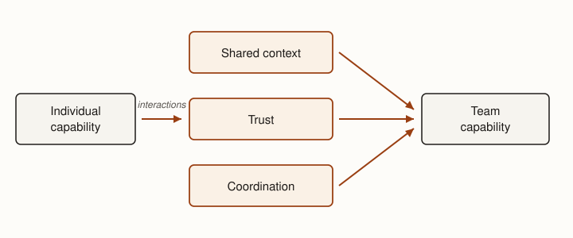

**Premise.** *A software team is a system for coordinating engineering capability.*

Software engineering requires more than assembling capable individuals. As projects grow, engineers
must divide work, maintain shared context, make compatible decisions, integrate changes, and detect
when their understanding has diverged.

This creates an apparent puzzle. If interaction among engineers is costly, why use teams at all?

The answer is capability. One engineer has limited time, knowledge, and attention. Different
engineers contribute different expertise; work can proceed in parallel; people can check one
another's reasoning; and systems can outlive the individuals who originally built them. Large systems
also exceed what one person can understand and maintain.

Teams therefore buy capability. Coordination is part of the price.

::: {.definition #def-coordination-cost title="Coordination cost"}
Coordination cost is the communication, dependency, handoff, and integration work that team members
incur to keep their contributions compatible. Adding engineers adds capability, but it also adds
coordination cost — which is why engineering organizations do not scale linearly simply by adding
people.
:::

## Individual capability is more than implementation {#sec-individual-capability}

Effective engineers do more than implement software. Li, Ko, and Zhu's study of experienced software
engineers found that implementation competence was important but insufficient to explain unusually
effective engineers [@li2015great]. Four capabilities are particularly useful here.

- **Learn and adapt.** Effective engineers learn unfamiliar domains and revise their understanding
  when conditions change.
- **Exercise judgment.** They make defensible decisions under incomplete information, including
  recognizing which decisions can safely remain reversible.
- **Understand the system.** They reason about the product, organization, customers, tools, and
  consequences surrounding the code rather than only the implementation immediately before them.
- **Enable others.** They create shared context, communicate according to what others know, provide
  credible information, and help other engineers succeed.

The last capability changes the unit of analysis. A good engineer does not merely produce more
personally. A good engineer increases the effectiveness of the system around them.

## Team capability is an emergent property {#sec-team-capability}

A collection of effective engineers does not automatically form an effective team. Some useful
properties belong to the team rather than to any individual member.

- **Shared context.** Team members need sufficiently compatible understandings of goals, priorities,
  system state, ownership, past decisions, and current changes. Shared context does not mean
  identical knowledge. On a large system that would be impossible. It means enough compatible
  knowledge for people to coordinate correctly.
- **Trust.** Information exchanged within the team must be usable. Engineers need to report status,
  uncertainty, risk, and mistakes credibly, and other engineers must be able to act on those reports.
  A team without trust may produce abundant communication while transmitting little reliable
  information.
- **Coordination.** Work needs ownership, dependencies must be managed, parallel work divided, and
  independently produced pieces integrated. Communication helps, but communication alone does not
  determine who decides or who is responsible.

::: {.figure #fig-team-capability alt="A flow diagram. A box labeled Individual capability leads, through an arrow labeled interactions, to three boxes labeled Shared context, Trust, and Coordination; arrows from those three boxes converge on a final box labeled Team capability."}

Individual capability becomes team capability only through interactions that build shared context,
trust, and coordination. These team-level properties are what a team's engineering output actually
flows through.
:::

As @fig-team-capability suggests, these properties are produced by interaction and consumed by
engineering work. A team that neglects them does not lose capability all at once; it discovers the
loss later, as integration failures, duplicated work, and decisions that quietly contradict one
another.

## Why teams do not scale linearly {#sec-team-scaling}

Adding an engineer adds capability, but it also creates potential interactions. Five engineers have
ten possible pairs; fifteen have 105. This does not mean that every engineer communicates equally
with every other engineer. In a well-designed organization they should not. The combinatorial growth
instead illustrates what unconstrained interaction would cost [@brooks1995].

Communication is only one source of coordination cost. More engineers also create more dependencies,
onboarding, independently changing work, integration, and shared context to maintain.

::: {.key-idea #key-scale-capability title="Scale capability faster than coordination cost"}
As an engineering organization grows, useful capacity should grow with it. Coordination cost will
also grow, but an organization cannot scale if coordination grows as quickly as, or faster than, the
capability being added. The engineering objective is therefore not to eliminate coordination. It is
to make coordination scale more slowly than capability.
:::

## Coordination can be engineered {#sec-engineering-coordination}

Coordination cost is not a fixed tax. Like the process dimensions of the previous chapter, it is a
property engineers can deliberately move. Four families of strategy recur.

| Strategy | Examples |
|----------|----------|
| Reduce dependencies | ownership, stable interfaces, modularity |
| Make knowledge reusable | documentation, conventions, discoverable expertise |
| Automate coordination | version control, automated tests, CI, tooling |
| Scale decision structures | review rules, ownership rules, team boundaries |

: Strategies for engineering coordination. {#tbl-coordination-strategies}

What the strategies in @tbl-coordination-strategies share is leverage: one decision should serve many
future interactions.

Architecture can change who needs to coordinate with whom. Stable interfaces allow one group to work
without continuously reconstructing the internal decisions of another. A software boundary can
therefore also become an organizational boundary: knowledge and coordination can remain bounded on
each side.

This is not an argument that organizational and software boundaries must always coincide. It is an
argument that architecture affects the topology of coordination. A boundary that hides useful
implementation details can reduce both technical coupling and the number of human interactions
required to make a change. @ch-architecture develops the technical side of this idea; here it is
enough to notice that an architectural decision is also a decision about who must talk to whom.

## Four dimensions of coordination {#sec-four-dimensions}

Coordination mechanisms can be compared along at least four dimensions.

- **Topology:** Who must coordinate with whom?
- **Frequency:** How often must coordination occur?
- **Cost:** How expensive is each interaction?
- **Reliability:** Does the necessary coordination actually occur correctly?

These dimensions turn familiar practices into engineering choices. A stable interface may reduce
frequency. A team boundary may change topology. An asynchronous message may reduce cost relative to
a meeting. An automated check may improve reliability by ensuring that a repeated obligation is
evaluated every time.

::: {.decision #decision-engineer-coordination title="Engineer the coordination"}
For a proposed coordination mechanism, ask: (1) Who must interact? (2) How often? (3) At what cost?
(4) How reliably must the interaction occur? Then choose the simplest mechanism that satisfies those
needs.
:::

## Coordination mechanisms {#sec-coordination-mechanisms}

The familiar tools of engineering teams are instances of this model, not separate topics.

**Communication.** Start with what must be shared, with whom, how quickly, and whether it must
persist. Then choose synchronous or asynchronous, and ephemeral or durable, communication.

**Meetings.** A meeting exchanges simultaneous attention for rapid context-sharing and interactive
decisions. Its cost scales with attendance. Use one when synchronization is worth that cost.

**Durable decisions.** A decision that exists only in memory must eventually be reconstructed or
lost. Recording it turns one act of coordination into something many future engineers can reuse.

**Visible work state.** Project management is not fundamentally ticket-tracker bureaucracy; it
externalizes what exists, who owns it, its state, blockers, and what happens next.

**Version control and automation.** Git is a protocol for concurrent change. Branch isolates work;
commit records change; a pull request exposes proposed integration; review creates a decision point;
merge establishes shared state. Automated checks move some repeated coordination from human memory
and judgment into machinery.

## GenAI changes both sides of the equation {#sec-genai-team}

GenAI can increase the surface that one engineer can meaningfully own. Faster comprehension,
implementation, testing, and exploration may allow work that previously crossed several people to
remain with one engineer. In that case some coordination does not merely become cheaper. It
disappears.

But higher individual throughput can also increase the rate at which the team must absorb changes,
review decisions, maintain shared context, and integrate work. If the surrounding coordination
system does not improve, amplified individual capability can simply move the bottleneck outward.

An amplifier amplifies a well-designed coordination system — or overwhelms a bad one.

::: {.note title="Not all interaction is overhead"}
Teams are also learning and social systems. Human interaction transfers tacit knowledge, supports
mentorship, develops shared understanding, and creates relationships through which future
coordination becomes easier. The objective is therefore not minimum human interaction. It is to
eliminate interaction whose purpose is merely reconstructing work state while preserving interaction
that creates engineering or organizational value.
:::

## Closing {#sec-teamwork-closing}

The practical engineering question is therefore not simply *how do we make each engineer more
productive?* It is also: *how should work and communication be structured so that individual
capability becomes reliable team capability?*

## Summary

Teams create engineering capability that individuals cannot provide alone, but capability does not
scale linearly with headcount. Adding people also adds communication, dependency, handoff,
onboarding, and integration work. Effective teams therefore depend on more than capable individuals:
they need sufficiently shared context, trust, clear ownership, and mechanisms that keep parallel
work compatible.

Coordination itself can be engineered. Architecture, ownership boundaries, durable records, version
control, automation, and communication practices can reduce how often people must synchronize or
make necessary synchronization more reliable. The objective is not minimum interaction; teams also
learn and develop through interaction. The engineering objective is to make team capability grow
faster than coordination cost.

::: read_further
Li, Paul Luo, Amy J. Ko, and Jiamin Zhu. ["What Makes a Great Software Engineer?"](https://doi.org/10.1109/ICSE.2015.335) In *Proceedings of the 37th IEEE/ACM International Conference on Software Engineering (ICSE)*, 700–710. IEEE, 2015. The interview study behind this chapter's account of individual capability; it shows why experienced engineers rate judgment, system understanding, and enabling colleagues alongside implementation skill.

Brooks, Frederick P., Jr. *The Mythical Man-Month: Essays on Software Engineering*. Anniversary ed. Reading, MA: Addison-Wesley, 1995. The title essay is the classic argument that adding people adds coordination work as well as capacity — the nonlinear-scaling observation this chapter turns into an engineering objective.
:::
