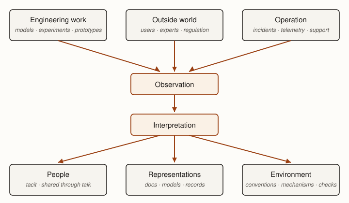

*How should what engineers learn persist?*

**Premise.** *Software engineering depends on knowledge that must outlive the people, systems, and
circumstances in which it was discovered.*

Teamwork lets engineers combine capabilities that no individual possesses alone, but coordination in
the moment is not enough. People forget and leave teams. Specialists know different parts of a
system. Decisions made in one year constrain engineers working years later, while production
failures can reveal facts nobody knew when those decisions were made. An engineering organization
therefore needs memory: enough of what it learns must persist that future engineers can make
decisions without repeatedly reconstructing the past.

This problem is particularly important because software is the engineering discipline of change. The
artifact changes, and so does the environment in which it operates. A representation created
yesterday may already describe an earlier version of the system. That does not make the
representation useless. It means engineers must judge what it still tells them and how much weight
it deserves in the decision they face now.

Knowledge management is therefore not the task of documenting everything. It is a problem of
engineering judgment:

*What should the organization remember, in what form, and with how much confidence?*

::: {.definition #def-engineering-knowledge title="Engineering knowledge"}
Engineering knowledge is information about a system, its environment, or the decisions surrounding
it that can support future engineering judgment.

A developer discovers that a third-party service silently throttles requests above a particular
rate. That observation becomes engineering knowledge when it can inform future decisions about
batching, retries, capacity, or replacement of the dependency.
:::

Engineering knowledge includes facts about the artifact, but it is not limited to them. Engineers
also need to know why decisions were made, which assumptions supported them, what alternatives were
rejected, what happened when a system encountered the world, and what remains uncertain. Knowledge
management is the deliberate acquisition, representation, preservation, use, and revision of such
knowledge when it may matter to future engineering decisions. Recording why a database was selected,
retaining the measurements that supported the choice, and later reconsidering the decision when
workload assumptions change are all knowledge-management activities.

## Engineering organizations must remember {#sec-organizations-remember}

An engineering organization can know more than any person in it. One engineer may understand why a
subsystem has an unusual interface, another which customer workflow motivated it, and another the
production incident that caused a particular safeguard to be added. Nobody needs to know everything.
The organization needs to be able to recover the relevant knowledge when a decision requires it.

That capability is distributed across people, representations, tools, and the relationships among
them [@hutchins1995cockpit]. An engineer may not personally know why a constraint exists, for
example, yet still make a sound decision because the constraint is visible in a specification,
embodied in an interface, or enforced by a check. What the organization can know and do therefore
depends partly on how knowledge is distributed through its engineering environment.

Without some form of engineering memory, that distributed knowledge decays with the conversations
and people that carried it. Engineers rediscover old constraints, repeat experiments, reopen settled
arguments without knowing why earlier alternatives were rejected, or remove peculiar-looking
mechanisms whose purpose has become invisible. The cost appears later as repeated work and decisions
made without information the organization once possessed.

Preserving knowledge is not free either. Someone must record it, organize it, find it, interpret it,
and sometimes maintain it as the system changes. A repository containing every conversation,
intermediate thought, measurement, and obsolete plan might preserve enormous amounts of information
while making useful knowledge harder to find.

The engineering problem is therefore selective:

*What will future engineers regret having to rediscover?*

Consequential knowledge, frequently reused knowledge, expensive discoveries, and decisions with
long-lived effects are stronger candidates for preservation; ephemeral details whose rediscovery is
cheap are weaker ones. The purpose of engineering memory is not to preserve everything. It is to
reduce consequential rediscovery.

## Engineering knowledge comes from many places {#sec-knowledge-sources}

Engineering organizations learn continuously. Some knowledge comes from deliberate engineering
activity. Some arrives from outside the engineering organization. Some is supplied by the behavior
of the system itself.

::: {.figure #fig-knowledge-flows alt="A flow diagram in three tiers. Three boxes at the top, labeled Engineering work, Outside world, and Operation, feed arrows into a box labeled Observation, which leads to a box labeled Interpretation. From Interpretation, arrows branch to three destination boxes labeled People, Representations, and Environment."}

Engineering organizations learn from engineering work, the surrounding world, and operation of the
system. Judgment determines what those observations mean and whether the resulting knowledge should
remain with people, be represented explicitly, or be incorporated into the engineering environment.
:::

### Internal engineering work {#sec-internal-work}

Engineering produces information as well as artifacts. A prototype can reveal that a proposed
mechanism is too slow; a dependency analysis can expose unexpected coupling; a design exercise can
reveal an assumption that architecture left unresolved. Code review, experiments, measurements, and
implementation itself similarly teach engineers about the system they are constructing.

Unsuccessful work can be valuable for the same reason. A rejected design may establish why an
apparently attractive approach fails under an important constraint. Preserving the reasoning can
prevent a future engineer from paying the same cost to rediscover the same limit.

### Stakeholders and the external environment {#sec-external-knowledge}

Knowledge also enters from outside the engineering organization. Customers describe problems and
workflows; users report confusing behavior; regulators impose obligations; domain experts explain
facts about the world the software represents. Contracts establish commitments, suppliers change
interfaces, standards evolve, and changing technologies alter what solutions are feasible.

These inputs do not arrive as perfectly formed engineering truths. A customer request may describe a
proposed solution rather than the underlying need. Two users may want incompatible behavior. A
regulation may require interpretation; a domain expert may be mistaken; an external dependency may
behave differently from its documentation. Engineering therefore has to interpret external knowledge
before deciding what consequences it should have for the system.

### Operation, failures, and incidents {#sec-operational-knowledge}

Once software operates in the world, its behavior becomes another source of knowledge. Measurements
reveal workloads that estimates did not predict. Support cases reveal workflows designers did not
anticipate. Security reports expose assumptions attackers can violate, while failures reveal
combinations of circumstances that design-time reasoning missed.

Incidents are especially valuable because they provide evidence about assumptions the engineering
organization actually made. A timeout may expose an unrealistic latency assumption. Data loss may
reveal that two components disagreed about which held authoritative state. A deployment failure may
expose a dependency missing from the architectural model. Repairing the immediate failure restores
service; learning from it asks what the incident revealed about the organization's previous
understanding.

An incident is therefore not only something to repair. It is an opportunity to learn what the
organization misunderstood.

::: {.note #note-observation-not-knowledge title="Observation is not yet engineering knowledge"}
A customer complaint, benchmark result, incident, engineer's intuition, or regulatory interpretation
is an input to engineering judgment. It does not automatically establish what is true or what
engineers should do.

Ask what the observation supports, what alternative explanations remain, how broadly the lesson
generalizes, and whether it is consequential enough to affect future decisions. Capturing inputs
without interpreting them can preserve information without producing useful engineering knowledge.
:::

## Not everything should be remembered {#sec-selective-memory}

Once engineers recognize knowledge as valuable, preserving more of it can seem obviously beneficial.
Past a point, the strategy defeats itself. Documents must be searched and interpreted; models
compete for attention; old decisions must be distinguished from current ones; contradictory records
require reconciliation. Material that nobody trusts becomes another body of information future
engineers must search before they can act.

Capturing knowledge also creates maintenance costs. A representation intended to describe the
current system may require revision as the system evolves. The more representations an organization
creates, the more relationships it may need to maintain among them.

Whether knowledge deserves durable representation therefore depends on its expected future value.

::: {.decision #decision-should-knowledge-persist title="Should this knowledge persist?"}
Ask:

- **What happens if it is forgotten?** Forgetting the command used for a one-time migration may be
  harmless. Forgetting why a safety check exists may not be.
- **How likely are engineers to need it again?** Recurring decisions justify more durable treatment
  than genuine exceptions.
- **How expensive would rediscovery be?** A two-minute experiment may be cheaper to repeat than
  maintain. Months of investigation are different.
- **How many future decisions could it affect?** A local implementation detail may affect one
  engineer; a system-wide constraint may affect hundreds of changes.
- **What will preservation cost?** Capturing, finding, interpreting, revising, and reconciling
  knowledge also consume engineering capacity.
:::

The question is therefore not simply whether something is worth knowing. Engineers must compare the
expected value of future use against the cost of making the knowledge persist.

## Knowledge can be represented with different strengths {#sec-representation-forms}

Knowledge can persist through people, communication, representations, or the engineering
environment. These forms make different tradeoffs. Tacit knowledge held by an experienced engineer
can be rich and adaptable, but access depends on that person. Conversation spreads knowledge among
people, but the resulting shared context can disappear as membership changes. Explicit
representations such as prose, diagrams, models, requirements, measurements, runbooks, and decision
records survive the original conversation, although every representation selects some facts and
omits others.

Recurring knowledge can also be incorporated into the engineering environment. A recurring decision
may become a convention or shared library. A recurring mistake may become a static check. An
obligation may become an automated test or control. Future engineers no longer need to retrieve the
lesson from another person's memory before benefiting from it; they encounter the accumulated
knowledge in the environment in which they work.

These forms do not constitute a maturity ladder. A conversation may be exactly right for an
ephemeral issue, while prose may preserve rationale that would be meaningless as an automated rule.
A model can expose relationships that prose obscures. Automation is useful only when the underlying
knowledge is stable and precise enough to support it. The appropriate representation depends on how
the knowledge is expected to be used.

::: {.key-idea #key-knowledge-can-move title="Knowledge can move"}
A lesson may begin in one engineer's experience, become shared through conversation, be represented
in a document or model, and eventually become a convention or automated control.

Move knowledge when the expected benefit of making it more durable, discoverable, precise, or
enforceable exceeds the cost.
:::

::: {.note #note-knowledge-graphs title="Knowledge graphs and engineering agents"}
Documents are not the only way to represent engineering knowledge. A knowledge graph represents
entities and relationships explicitly: a component depends on a service; a requirement constrains an
interface; a test provides evidence for a claim; a decision supersedes an earlier decision. Graph
structure makes relationships available for traversal and computation rather than leaving them
implicit across prose and files.

This possibility has become more consequential with engineering agents. A human engineer can often
reconstruct relationships by reading several documents and using experience to connect them. An
agent likewise benefits when important relationships are represented explicitly rather than
requiring them to be repeatedly inferred from text. Knowledge graphs can therefore serve as part of
an engineering environment through which both humans and agents retrieve context, follow
dependencies, and identify relevant knowledge.

A graph does not solve the knowledge-management problem by itself. Its nodes and relationships can
still be incomplete, stale, ambiguous, or wrong. The same questions developed in this chapter still
apply: Where did this knowledge come from? What claim does it support? How current is it? And how
much weight should an engineer or agent place on it?
:::

## Representations are evidence, not reality {#sec-representations-evidence}

Every representation leaves something out. A dependency graph omits details irrelevant to
dependencies; an architectural diagram selects relationships at a particular level of abstraction;
meeting notes preserve a summary rather than the meeting itself. This selectivity is what makes
representations useful. A representation that reproduced reality in every detail would offer little
reduction in the reasoning required to understand it.

Software adds another complication because the represented system keeps changing. Suppose an
architectural diagram accurately describes a system when it is created. Engineers later add
dependencies, split components, introduce caches, replace services, and create exceptions. The
diagram rarely becomes false at one identifiable moment. Its relationship to the current system
instead becomes increasingly approximate.

Approximation does not erase the diagram's value. It may remain excellent evidence of the original
architecture, explain why interfaces have their present shapes, preserve terminology still used by
the team, or reveal the organizing idea from which the current system evolved. None of those uses
establishes that it still describes every current dependency.

A representation can remain useful as it drifts from current reality, but the weight engineers
place on it should reflect its fidelity to the claim being considered now.

This is a routine problem rather than an exceptional failure of documentation. Software is built to
change, so engineers routinely make present decisions using knowledge produced under earlier
conditions. The relevant question is not simply whether a representation is "up to date." It is what
claim the engineer is trying to support, how the representation was produced, and what relevant
parts of reality have changed since then.

Provenance helps answer that question:

- Who produced this representation?
- When was it produced?
- What observations or evidence supported it?
- What purpose was it intended to serve?
- What claim did it actually make?
- What relevant conditions have changed since then?
- What incentives or interests may have shaped what was recorded?
- What claim are we trying to support with it now?

These questions do not produce a mechanical confidence score. They establish the context in which an
engineer can judge how much evidentiary weight a representation deserves for the particular decision
at hand.

::: {.example #example-one-document-different-evidence title="One document, different evidence"}
Consider an architectural diagram created in 2023 showing a payment service as three components: an
API, a payment processor, and a database. By 2026 the system has added a queue, a fraud service, and
direct reporting access to the database.

The diagram remains strong evidence of the decomposition the architects intended in 2023 and may
explain why several interfaces still look the way they do. It is weaker evidence about today's
dependency structure and provides almost no evidence that the workload assumptions behind the
original architecture remain valid. The document did not suddenly become useless when the first
change occurred. Different claims simply require different evidence.

Age does not determine usefulness. The claim being made determines the evidence required.
:::

## Records are not neutral {#sec-records-not-neutral}

Representations are also produced by people inside organizations. Those people have incomplete
information, interpret events differently, possess different authority, and may face incentives that
affect what gets measured, estimated, emphasized, or recorded. Engineering records therefore carry
the circumstances of their production along with their technical content.

::: {.warning #warning-records-not-neutral title="Records are not neutral"}
Engineering records are created by people inside organizations. They may be incomplete, mistaken,
selective, optimistic, politically convenient, or occasionally deliberately false. Estimates can
reflect incentives as well as forecasts. Meeting notes reflect what the recorder noticed,
understood, and chose to preserve. Decision records may describe a cleaner rationale than the one
that actually produced the decision. Representation gives knowledge persistence. It does not give it
truth.
:::

Records can also acquire audiences their authors never anticipated. Internal messages, estimates,
meeting notes, design discussions, and incident records may later be read by executives, auditors,
regulators, courts, journalists, or legislators. This is not an argument for avoiding records or
disguising uncomfortable facts. Engineers should distinguish observation from interpretation,
preserve material uncertainty and disagreement, attribute decisions accurately, and write records
that can fairly explain what was known and decided at the time.

*Who records a decision influences what the organization later remembers about it. Treat that
influence as an engineering responsibility.*

The appropriate response is neither cynicism nor blind trust. It is the same response engineers
apply to other evidence: understand its provenance, understand what claim it supports, and calibrate
the weight placed on it.

## Engineering knowledge has a lifecycle {#sec-knowledge-lifecycle}

Representing knowledge is not the end of knowledge management. A useful simplified lifecycle is:

*Observe → Interpret → Represent → Use → Reassess*

A production incident reveals that an upstream service sometimes takes thirty seconds to respond.
Engineers first observe the timeout pattern, then interpret it as evidence that an assumed latency
bound is unsafe. They represent the conclusion in a dependency record and establish a timeout
policy. Future engineers use that knowledge when designing calls to the service. If the dependency
or its service-level guarantees later change, the organization must reassess whether the old
conclusion still deserves authority.

The lifecycle matters because engineering knowledge is acquired under particular circumstances and
later used under circumstances that may differ. Measurements describe workloads that may change;
design decisions depend on assumptions that may disappear; customer needs evolve; new evidence may
contradict earlier conclusions.

Reassessment does not always mean revision. Historical knowledge can remain useful precisely because
it describes the past. An old decision record may no longer govern the current architecture while
remaining the best explanation of why the architecture evolved in a particular direction.

It is therefore useful to distinguish historical value from current authority. Superseding an
engineering record need not mean deleting it. Future engineers may need both the current decision
and the history that explains how the organization reached it. Conversely, preserving an old record
without making its changed status visible can be dangerous. An engineer may reasonably treat an
apparently current runbook, requirement, or architectural rule as authoritative when the
organization no longer does.

Good engineering memory requires both remembering and knowing what no longer deserves authority.

## Consequential knowledge should change engineering {#sec-knowledge-changes-engineering}

The strongest evidence that knowledge matters is often that engineers keep needing it. Repeated
rediscovery is evidence about the representation itself. A fact that engineers continually
reconstruct may need to become easier to find. An explanation repeated to every new team member may
deserve durable representation. Repeated mistakes can indicate that documentation is too weak a form
for the knowledge being preserved. When incidents repeatedly expose the same assumption, the
organization may need to change the engineering environment rather than remind engineers of the
lesson again.

Consequential knowledge can therefore migrate into more durable engineering structure, and the
appropriate destination depends on what future decision the knowledge should constrain. Some
knowledge becomes a requirement because it describes what stakeholders need from the system. Some
becomes specification because engineers must make acceptable behavior precise. Some becomes
architecture because later engineering should inherit a consequential organizational decision. Some
becomes a design convention or shared mechanism because engineers should not repeatedly solve the
same local problem. Some becomes validation evidence or a continuing check because the organization
needs grounds for believing that an important claim remains true. Choosing among those destinations
requires understanding what kind of engineering decision the knowledge should support; the remaining
chapters develop those decisions in turn.

*Learning should sometimes change how future engineering is performed.* An organization that
repeatedly experiences the same surprise without changing what it remembers, represents, or does has
collected experience without accumulating much engineering knowledge.

@ch-failure-aware-engineering returns to this problem from the other direction: when reality
contradicts what engineers expected, how should the resulting experience become engineering knowledge
that changes the system, the organization, and the engineer?

## Measurement for decision-making {#sec-measurement-engineering-knowledge}

An organization can hold large quantities of recorded information while remaining poor at
remembering. The property of interest is not how much has been stored, but whether consequential
knowledge becomes available in a usable form at the moment an engineering decision requires it.

Parts of that process can be observed. Engineers can measure how long it takes to find the
information needed for a decision, how often existing knowledge must be rediscovered through fresh
investigation, and how frequently supposedly current records contradict the implemented system.
Failure records deserve particular attention here, because they preserve cases in which reality
contradicted an earlier understanding. When an incident repeats a lesson the organization has already
encountered, that recurrence is evidence about the knowledge lifecycle itself: the earlier lesson was
not represented durably enough, not retrievable when it mattered, not recognized as applicable, or
not applied.

A second useful question is whether represented knowledge can be traced to the artifacts it is
supposed to govern. Which code realizes this architectural decision? Which implementation depends on
this environmental assumption? Which tests supply evidence for this requirement? Performing that
tracing by hand is expensive and feels to engineers like pure overhead, which is why it is usually
not done. Language models can now search across prose, code, specifications, issue histories, and
tests to propose these links at far lower cost. A proposed link is evidence, not ground truth. But
cheap proposals make it practical to inspect whether consequential knowledge actually reaches the
work it was meant to influence.

These remain proxies. Search latency does not measure knowledge quality, document counts do not
measure organizational memory, and an automatically inferred link does not establish that two
artifacts are correctly related. Even apparent reuse can faithfully preserve an incorrect lesson. The
model developed in this chapter therefore remains necessary: engineers must weigh the source,
representation, strength, currency, and consequences of knowledge rather than counting its artifacts.

Used with that caution, measurement can nevertheless show where the lifecycle is breaking down.
Repeated rediscovery, decisions no one can locate, records that have drifted from the system they
describe, and recurring violations of lessons already learned are all evidence that consequential
knowledge is not surviving in a form strong enough to influence future engineering.

## Summary

Engineering organizations learn from many sources. Engineers discover facts through design,
implementation, modeling, experiments, and measurement. Stakeholders and the external environment
supply needs, constraints, claims, and changes. Deployed systems supply observations through normal
operation, failures, and incidents. None of these inputs interprets itself.

Knowledge management determines which lessons deserve to persist and how they should be represented.
Tacit understanding, communication, documents, models, conventions, mechanisms, and automated
controls provide different combinations of richness, durability, discoverability, precision, and
authority. More durable representation is valuable only when its future benefit justifies its cost.

Representations are evidence rather than reality. They abstract, they age, and the systems they
describe evolve. Their usefulness need not disappear as they drift from current reality, but the
weight placed on them should reflect their provenance and their fidelity to the particular claim
under consideration. Representation also does not guarantee truth: organizational incentives,
incomplete information, interpretation, and authority affect what gets recorded.

Engineering knowledge therefore has a lifecycle. Engineers observe, interpret, represent, use, and
reassess what they know. Consequential recurring knowledge should sometimes become part of the
structure within which future engineering occurs.

Engineering knowledge lets yesterday's learning reduce today's rediscovery. The next question is
what the system ought to accomplish in the first place.

::: read_further
Hutchins, Edwin. ["How a Cockpit Remembers Its Speeds."](https://doi.org/10.1207/s15516709cog1903_1)
*Cognitive Science* 19, no. 3 (1995): 265–288. The canonical demonstration of distributed cognition
across people, procedures, instruments, and representations.

Rus, Ioana, and Mikael Lindvall. ["Knowledge Management in Software Engineering."](https://doi.org/10.1109/MS.2002.1003450)
*IEEE Software* 19, no. 3 (2002): 26–38. Introduces knowledge management as a software-engineering
problem of creating, sharing, and preserving organizational knowledge.

Hansen, Morten T., Nitin Nohria, and Thomas Tierney. ["What's Your Strategy for Managing Knowledge?"](https://hbr.org/1999/03/whats-your-strategy-for-managing-knowledge)
*Harvard Business Review* 77, no. 2 (1999): 106–116. Contrasts codifying knowledge with connecting
the people who possess it.

Hogan, Aidan, et al. ["Knowledge Graphs."](https://doi.org/10.1145/3447772) *ACM Computing Surveys*
54, no. 4 (2021), Article 71. A comprehensive survey of knowledge graphs as explicit, processable
representations of entities and relationships. Read the introductory material and the sections on
representation rather than the entire survey.
:::
