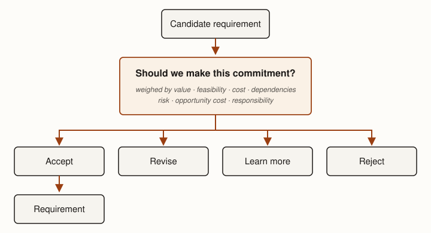

**Premise.** *Requirements engineering addresses two coupled problems: discovering what would
create value and deciding what we can responsibly promise.*

Software systems are built for purposes in the world. Before engineers can decide how a system
should work, they must decide what would create value and what they can responsibly promise to
deliver. Neither decision is simply a matter of asking people what they want. A user usually describes a solution
they can imagine, using the vocabulary of systems they already know. Their request may reveal
something important without literally describing what should be built. Different stakeholders may
want different things. Important needs may remain implicit until something violates them.
Obligations may also come from laws, contracts, existing systems, operations, standards, or other
parts of the surrounding domain.

The requirements engineer is therefore not a stenographer. Requirements engineering requires
interpretation, and engineers are responsible for the interpretations and commitments they make.
Discovery and commitment therefore inform one another: what appears valuable affects what engineers
consider promising, while feasibility, cost, risk, and new evidence can change what appears
valuable.

::: {.definition #def-requirements-engineering title="Requirements engineering"}
Requirements engineering connects the purposes a system serves to decisions about what the system
should do and what constraints it must satisfy. It discovers candidate obligations, evaluates them,
and determines which engineers can responsibly accept as commitments.
:::

That definition compresses two coupled judgments this chapter unpacks. Discovery asks what would
create value and produces candidate obligations. Commitment asks what we can responsibly promise. A
candidate can be accepted, revised, investigated further, or rejected. Neither judgment is final
while the other is changing. What engineers learn while deciding—an estimate, a dependency, a
stakeholder conflict—can change what appears valuable. What engineers learn about value can
likewise change which commitments are worth investigating.

::: {.key-idea #key-defensible-commitment title="The standard requirements work must meet"}
Requirements engineering does not eliminate uncertainty before commitment. It reduces uncertainty
enough that a commitment can be defended.
:::

That standard governs everything that follows. Discovery buys information a defensible
commitment needs; commitment judges whether enough has been bought.

## What would create value {#sec-what-might-matter}

The first problem is discovering what would create value. A
requirement is meaningful relative to some purpose. Requirements connect what a system is for to
what engineers promise the system will do. Locally, the relationship appears simple: Purpose →
Requirements → System.

In practice, purpose does not arrive as a complete, coherent description. Different stakeholders see
different parts of the problem. A manager may understand organizational goals and constraints while
an operator understands daily work, exceptions, and workarounds. A customer may understand the
outcome they want without knowing which system behavior would produce it. Stakeholders may disagree
about priorities or even about the problem being solved. Requirements engineering exists partly
because purpose must be discovered, interpreted, reconciled, and converted into obligations that
engineering can act upon.

Users and customers are important sources of candidates, but they are not the only ones. Candidate
requirements can come from users, customers, operations, existing systems, technology, laws and
standards, contracts, competitors, and the surrounding domain. Each source sees different
obligations. An operations engineer may need logging, rate limiting, observability, or a way to
disable a malfunctioning feature even though no end user would ask for them. An existing system may
impose a data format that other systems have come to depend upon. A contract may contain an
obligation that nobody currently working on the software negotiated. Laws and standards can impose
obligations on an organization that ultimately require particular software behavior.

These sources can also differ in authority and precision. A regulation, for example, may impose a
binding requirement to provide security appropriate to some risk without prescribing exactly what
technical measures satisfy it. The requirement is authoritative, but engineering work remains.
Authority and precision are different properties: a requirement can be binding while leaving
important engineering decisions open.

Requirements are commonly described in several overlapping categories — useful as ways of checking
that the candidate space has been covered, not as the conceptual model of requirements engineering.
Functional requirements describe behavior the system should provide — for example: email an
administrator when a project has no moderator. Quality requirements describe how well the system
should behave or limits its behavior should satisfy. Some are already close to measurable: 95% of
searches return within one second. Others express a meaningful obligation while leaving substantial
interpretation unresolved: the system follows security best practices. Domain and external
requirements arise from the environment in which the system exists — for example, a regulation may
require that withdrawing consent be as easy as giving it.

These examples differ greatly in precision. Being a requirement does not imply being sufficiently
precise to implement or validate. "95% of searches return within one second" already supplies a
measurable threshold. "The system follows security best practices" leaves important questions
unanswered: which practices, against which threats, and what evidence would establish that the
obligation has been satisfied? Resolving those questions is part of the path from requirements to
specification.

Candidates also rarely stand alone. Understanding one may require knowing who needs it, what goal
it serves, why it exists, which scenarios exercise it, how important it is, which interfaces it
affects, and how anyone could determine whether it has been satisfied. Recording only a requirement
sentence can discard information needed to interpret the obligation later.

## Learning what would create value {#sec-discovering}

Discovery moves the effort from what might matter to what appears valuable, and engineers choose
discovery techniques according to what they do not yet know. Ask when stakeholders can articulate
the needed information: interviews, surveys, workshops, and similar techniques expose goals,
preferences, constraints, and disagreements that people can describe. Observe when important
knowledge is embedded in work practice: observation of users, operational data, existing systems,
incidents, and workarounds can expose needs that nobody thought to state.

Compare when competitors, substitutes, or previous systems reveal alternatives that have already
been explored; existing solutions can expose both expectations and opportunities. Build when people
cannot evaluate an idea well in the abstract but can react to something concrete: a prototype,
mock-up, experiment, or partial implementation can turn an imagined possibility into something
stakeholders can inspect and criticize.

Each technique buys information, and the choice among them is itself an engineering judgment. The
guiding questions are where the missing knowledge lives and what resolving it costs. If the people
involved hold the answer and can state it, asking is cheap and direct. If the answer is tacit,
embedded in habits, workarounds, and exceptions, asking will return an idealized account, and
observing is worth its higher cost. If someone else has already paid to explore the alternative,
comparing recovers their investment. If nobody can evaluate the idea until it exists, building is
the only technique that produces the missing evidence, and its cost should be sized to the
uncertainty it resolves.

Software's changeability makes building unusually useful as a way to learn. When a prototype is
expensive, engineers have strong incentives to describe an idea carefully before realizing it. The
first substantial reaction from stakeholders may arrive only after considerable work. When a
prototype is cheap, the sequence can change: Idea → Build enough to react to → Reaction → Revise →
Reaction → Revise. People are often better at criticizing an artifact than specifying one in
advance. A partial realization can therefore expose needs, preferences, assumptions, and
disagreements that remained invisible in discussion.

This does not make every prototype useful. A prototype should exercise the uncertainty engineers are
trying to resolve. Something that looks finished can also acquire commitments nobody intended:
stakeholders may interpret a provisional interface, behavior, or technical choice as a decision.

::: {.note title="Prototype ≠ specification"}
A prototype can teach us the requirements. It is not the specification, and it is not necessarily
the product.
:::

The engineering question is not whether to think or to build. It is which action buys the
information needed for the next consequential decision.

Discovery is also iterative rather than a single pass. Engineers discover candidate obligations,
organize them, negotiate conflicts, record decisions, and learn from what happens next: Discover →
Organize → Negotiate → Record → Learn → repeat. Every software process performs some version of this
loop. What differs is when requirements are established, how much is established at once, and how
often earlier decisions are revisited.

## What can we responsibly promise? {#sec-candidate-to-commitment}

Discovering that something would be valuable does not automatically make it a requirement.

::: {.definition #def-candidate-requirement title="Candidate requirement and requirement"}
A candidate requirement is an obligation under consideration. A requirement is an obligation the
engineering effort has accepted.
:::

The distinction matters because accepting a requirement creates responsibility, and the decision
that separates the two has more resolutions than yes or no. A candidate can be **accepted** as an
obligation, **revised** to keep most of its value at lower cost or risk, held while the engineers
**learn more**, or **rejected**. All four outcomes are legitimate resolutions; only accept yields a
requirement (@fig-commitment-decision).

::: {.figure #fig-commitment-decision alt="A flow diagram. A box labeled Candidate requirement leads into a decision box labeled Should we make this commitment?, annotated: weighed by value, feasibility, cost, dependencies, risk, opportunity cost, and responsibility. The decision resolves to one of four peer outcomes: accept, revise, learn more, or reject. An arrow from accept leads to a final box labeled Requirement."}

The commitment decision. A candidate requirement is weighed and resolves to one of four peer
outcomes; only accept yields a requirement.
:::

Several kinds of information weigh the decision, though none provides a formula for it:

- **Value.** What would the candidate contribute to the purposes the system serves, and for whom?
- **Feasibility.** Can it be satisfied under the available constraints? Engineers should not accept
  obligations they cannot reasonably satisfy.
- **Cost.** What would delivering and keeping it take? An obligation worth \$100,000 may not be
  worth \$10 million.
- **Dependencies.** What else must exist or hold for it to work? Apparently small obligations can
  require substantial surrounding work.
- **Risk.** What could go wrong in building it, or in having built it? The consequences of being
  wrong differ.
- **Opportunity cost.** What else could the same effort accomplish?
- **Responsibility.** What consequences would accepting this obligation make us responsible for? A
  system can be desired, technically feasible, and affordable while still creating consequences
  engineers should not accept.

Suppose a team learns that customers would value four improvements: accessibility remediation, a new
collaboration feature, twice the current performance, and enterprise single sign-on with auditing.
The team has enough capacity to deliver only two. Which two should it promise? There is not enough
information to answer, and that is the point. Engineers need to know who benefits, which obligations
are mandatory, how much value each creates, what dependencies each introduces, what each will cost
over its lifetime, what risks each creates, and what opportunities are lost by choosing it.

The same gap appears at larger scale. Consider an organization preparing to replace or substantially
change an enterprise system. Stakeholders may already have produced a large spreadsheet of requested
features. That list can contain substantial useful information and still be insufficient to
establish a credible scope, cost, or implementation plan [@kostova2019]. Different groups often know
different parts of the system. Management may understand organizational strategy, regulation,
budgets, and desired outcomes. Operational staff may understand actual workflows, exceptions,
recurring friction, and workarounds. Technical staff may understand dependencies and constraints
invisible to both groups.

Requirements work brings these perspectives together. Workshops, analysis, and negotiation can
expose components and dependencies, reconcile competing concerns, identify organizational changes,
sequence work, and produce a more credible estimate. The result is not simply a longer requirements
list but a better basis for commitment — because *a list of requirements is not the ability to
commit.* The second transition in the model is its own engineering work, not a signature at the
bottom of the first.

## Sometimes the right decision is to learn more {#sec-learn-more}

Of the four outcomes, learning more is the one engineers most often fail to take deliberately. When
uncertainty could change whether a commitment should be accepted, three questions structure the
choice: What don't we know? Could knowing it change the decision? What would it cost to find out?
If nothing we could learn would change the decision, more information is not worth buying; decide
with what is known. If a cheap investigation could flip the decision, buying it first is the
defensible move.

The same mechanisms used to discover value can now buy information about a specific
commitment. Interview another stakeholder when the uncertainty is about value. Observe the
current workflow when the uncertainty is about tacit needs. Investigate a dependency when the
uncertainty is about feasibility. Improve an estimate when the uncertainty is about cost. Build a
prototype when nothing short of a concrete artifact will produce the evidence.

This is what makes the model's backward flow real rather than decorative. Attempting to decide
generates learning, and the learning re-enters discovery. An estimate may expose a dependency that
changes the proposed requirement. A prototype may show that a requested workflow does not solve the
underlying problem. Negotiation may reveal that one stakeholder's requirement conflicts with
another's. Engineers may reject one candidate and discover an alternative that achieves the same
purpose at lower cost or risk.

Learning more is not free. Investigation consumes the same capacity delivery does, and a deferred
decision is sometimes a decision made badly by default. The chapter's standard supplies the test:
buy information while it can still change the decision; stop when the commitment can be defended.

## Requirements are commitments under scarcity {#sec-commitments-under-scarcity}

Why does the commitment decision deserve this machinery? Because engineering capacity is finite
and an accepted obligation is long-lived. Accepting one obligation consumes
resources that could have served another. The cost of a requirement therefore includes not only what
it takes to satisfy it, but also the value of what the organization gives up by doing so. This is
opportunity cost. Requirements engineering asks not merely *would this create value?* but *is this
an obligation we can responsibly accept?*

Accepting also changes the engineering problem itself. The requirement becomes something future
architecture, design, implementation, validation, operations, and maintenance must preserve.

Cheap implementation does not change this. Suppose a stakeholder requests a feature and asks why it
should cost much when a software agent can implement it in minutes. The premise may be partly
correct: implementation can be cheap. But implementation is only one part of the cost created by
accepting an obligation. The feature may still require requirements work, design, integration,
validation, security analysis, deployment, operations, maintenance, support, and future changes. It
may interact with other obligations or increase the cost of satisfying them.

These surrounding costs are not immutable. Better architecture can isolate change. Automation can
reduce validation cost. Reusable infrastructure can reduce operations cost. Better representations
can reduce the cost of understanding the system. But cheaper implementation does not reduce the
lifecycle cost of a requirement to zero. It changes the economics of what we promise; it does not
abolish those economics.

Weighing cost at all requires estimates, and estimates themselves depend on requirements. A simple
conceptual model is: Cost ≈ Size × Cost per unit × Cost drivers. Size describes how much capability
must be produced. Cost per unit reflects what an organization can historically produce with a given
amount of effort. Cost drivers capture properties that make apparently similar amounts of
functionality more or less expensive: assurance, integration, performance, migration, unusual
expertise, operational constraints, and other obligations. Requirements affect all three.

This creates an unavoidable loop. Engineers need some understanding of scope to estimate cost, while
estimates help determine which scope is worth accepting. Requirements and estimates therefore become
more precise together: precise enough, by the chapter's standard, to defend the commitment, not
precise enough to eliminate uncertainty.

::: {.note title="Estimate ≠ budget ≠ target ≠ commitment"}
An estimate predicts. A budget allocates resources. A target expresses a desired outcome. A
commitment is a promise. Confusing them can turn uncertainty in an estimate into an impossible
engineering obligation.
:::

## From requirements to specification {#sec-to-specification}

The model now runs end to end. Requirements engineering begins with a large space of things that
might matter. Discovery produces candidate obligations. The commitment decision — weighing value,
feasibility, cost, dependencies, risk, opportunity cost, and responsibility — accepts, revises,
defers, or rejects each candidate, and what is learned along the way can reopen any earlier step.
Nor does acceptance end the movement: what engineers learn through specification, design,
implementation, validation, and use may expose missing obligations or show that an earlier
commitment should change.

An accepted obligation may still leave many possible systems. "The system follows security best
practices" is an obligation, but it does not yet establish what practices count, which threats
matter, or what evidence is sufficient. "Alert the user when their sleep pattern suggests illness"
says something important about the desired product, yet accepting it leaves unresolved which
observations justify an alert, when the alert should occur, and what behavior counts as satisfying
the promise. Knowing what we are willing to promise does not yet tell an implementor which
realizations would satisfy the promise.

Requirements engineering asks: *what should we promise?* Specification — the subject of
@ch-specification — asks: *what exactly are we promising?*

## Summary

Requirements engineering addresses two coupled problems: discovering what would create value and
deciding what engineers can responsibly promise. Requirements can arise from users, operations,
existing systems, contracts, regulations, standards, technology, and the surrounding domain. Asking,
observing, comparing, prototyping, and experimenting buy different kinds of information about what
matters.

Discovering value does not create a commitment. Candidate obligations must also be evaluated against
feasibility, lifecycle cost, opportunity cost, risk, and professional responsibility. That
evaluation can itself produce new information: an estimate, dependency, conflict, or prototype may
change what appears valuable or suggest a better alternative. Requirements engineering therefore
does not eliminate uncertainty before commitment. It reduces uncertainty enough that a commitment
can be defended.

::: read_further
Nuseibeh, Bashar, and Steve Easterbrook. ["Requirements Engineering: A Roadmap."](https://doi.org/10.1145/336512.336523) In *Proceedings of the Conference on The Future of Software Engineering (ICSE '00)*, 35–46. New York: ACM, 2000. A concise map of the field — elicitation, modeling, analysis, negotiation, and evolution — that situates this chapter's discover-then-commit model within the discipline's larger structure.

Patton, Jeff. ["The New User Story Backlog Is a Map."](https://web.archive.org/web/20190718153846/https://www.jpattonassociates.com/the-new-backlog/) Jeff Patton & Associates, October 8, 2008. A practitioner's argument for organizing requirements around what users are trying to accomplish rather than a flat feature list — a working example of mapping what might matter before deciding what to promise.

Kostova, Blagovesta, Lucien Etzlinger, David Derrier, Gil Regev, and Alain Wegmann. ["Requirements Elicitation with a Service Canvas for Packaged Enterprise Systems."](https://doi.org/10.1109/RE.2019.00043) In *2019 IEEE 27th International Requirements Engineering Conference (RE)*, 340–350. IEEE, 2019. An industrial case study showing what a customer's initial requirements list failed to capture — the evidence behind "a list of requirements is not the ability to commit."
:::
