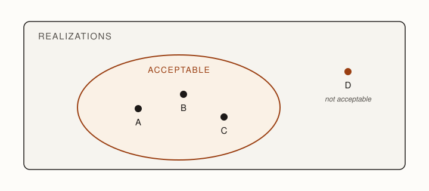

**Premise.** *Requirements describe what must be true. A specification makes those requirements
actionable by constraining what an acceptable realization may do, without unnecessarily deciding how
it must be built.*

::: {.definition #def-specification title="Specification"}
A specification establishes a boundary around the realizations that would be acceptable. It makes
consequential distinctions explicit while preserving choices whose alternatives are genuinely
acceptable. It need not select one implementation.
:::

Requirements rarely determine a unique implementation. Many different realizations may satisfy the
same stated requirement, while other apparently reasonable realizations violate distinctions
stakeholders care about.

A specification therefore does two things at once. It constrains choices that matter, and it leaves
other choices open.

Think of all possible implementations as a realization space. Each obligation rules out some portion
of that space. What remains is the set of acceptable realizations.

A good specification usually does not identify one point. It establishes a boundary.

::: {.figure #fig-realization-space alt="A large region labeled Realizations contains a smaller region labeled Acceptable holding three points labeled A, B, and C; a fourth point labeled D lies outside the acceptable region and is marked not acceptable."}

A specification bounds a realization space. Realizations A, B, and C lie within the acceptable
region; realization D does not.
:::

## From a requirement to acceptable realizations {#sec-acceptable-realizations}

Consider a hypothetical Sleep Advisor, an application that learns a user's normal sleep patterns and
helps identify potentially important changes.

One requirement is:

> R4. Alert the user when their sleep pattern suggests illness.

Imagine three teams receive only that sentence.

Build A establishes a baseline when the application is installed and compares the user's sleep
against it every morning.

Build B maintains a rolling 30-day baseline and reports significant changes in a weekly digest.

Build C uses a model incorporating heart-rate data and alerts only when its confidence exceeds a
specified threshold.

All three can plausibly claim to satisfy R4 as written.

They are not the same product.

A user could notice the difference immediately. The requirement has therefore left open choices that
may be consequential.

The specification problem is: which differences did we mean to constrain?

A specification need not choose Build A, B, or C. But it should make explicit the distinctions among
them that determine whether we would accept the result.

## Requirements concern the world; specifications constrain the machine {#sec-world-machine}

Requirements and specifications describe different things.

Consider this requirement: Users are warned before illness affects their day.

Its vocabulary belongs to the world: users, illness, and days. A software system cannot directly
sense "illness affects their day."

Now consider: Emit one advisory within 60 seconds of wake detection.

This statement constrains behavior at the machine's boundary. Its terms refer to phenomena the
machine can detect or produce.

Following @zave1997darkcorners, domain assumptions connect these two kinds of
statements. Under appropriate assumptions about the environment, satisfying the machine
specification should produce the required effect in the world: Specification + Domain assumptions ⇒
Requirement.

This relationship exposes two different kinds of failure.

The machine can fail to satisfy its specification. That is a failure of the realization.

But the machine can also satisfy the specification while the requirement fails because a domain
assumption was incorrect. Perhaps wake detection does not correspond reliably to when the user
begins their day. Perhaps the observations available to the system are insufficient to infer the
relevant condition.

Correct software is not sufficient when our assumptions about the world are incorrect.

This is why requirements such as the system follows security best practices can be legitimate
requirements without yet being adequate specifications. They express an obligation in the world but
leave substantial work before an implementor knows which machine behaviors are acceptable.

## What must be made explicit? {#sec-what-explicit}

Consider another Sleep Advisor requirement:

> R7. Let the user share a weekly sleep summary with their doctor.

That sentence raises several different kinds of questions.

What must the application actually do? What constitutes a weekly summary? How does the user select
the recipient? What does successful sharing mean?

What facts about the environment must be true? Does the doctor have an address or account the
application can use? What forms of consent are required? What happens if delivery fails?

And what can safely remain unspecified? Perhaps the internal library used to generate the summary is
irrelevant. Perhaps several transport mechanisms are equally acceptable.

Not every missing fact should be handled in the same way.

::: {.exercise #ex-what-is-missing title="What is missing?"}
For R7, identify: (1) What behavior must the machine provide? (2) What facts about the domain must
be established? (3) What choices could safely be left to the implementor? Do not assume every
unanswered question belongs in the specification.
:::

## Case study: the A-7E specification {#sec-a7e}

*Software Requirements for the A-7E Aircraft* [@alspaugh1992a7e] provides a substantial example of
engineers making complicated obligations explicit without prescribing one implementation.

The specification is 472 pages long and uses multiple representations: prose, defined data, tables,
modes, timing constraints, required subsets, and descriptions of expected changes. Its value here is
not a particular notation. It is the relationship between the engineering question and the
representation used to answer it.

Four features are especially instructive.

**Behavior without implementation.** The A-7E specification describes externally visible behavior
using modes, conditions, events, and required responses. Transition tables make combinations of
cases inspectable. The specification can therefore say what must happen in a particular mode when a
particular event occurs without prescribing the classes, functions, data structures, or control flow
that produce that behavior. A detailed specification need not imply a fully determined
implementation.

**Quantitative bounds.** Different questions require different representations. Timing obligations
are expressed through quantitative tables rather than mode transitions. The A-7E specification
distinguishes quantities such as the current rate, the minimum allowable rate, and a maximum useful
rate. It also explicitly records cases where timing is not significant. That last case matters.
Deliberately unconstrained is different from forgotten. If engineers have considered a property and
concluded that its alternatives are acceptable, recording that decision communicates useful
information. A future implementor need not wonder whether the missing constraint was an omission.

**Useful subsets.** The specification also requires the system to support useful subsets of its
functionality. Functionality can be added or removed while preserving the behavior of what remains.
This rules out implementations whose complete behavior is correct but whose parts are so entangled
that useful subsets cannot exist. A specification-level obligation can therefore have architectural
consequences without prescribing one architecture.

**Expected change.** Finally, the specification distinguishes assumptions designers may treat as
stable from changes they should anticipate. Expected change is engineering information. Two
implementations may satisfy every current behavioral obligation while differing greatly in their
ability to accommodate a likely future change. Communicating which assumptions are stable and which
are expected to move allows designers to preserve flexibility where it is likely to matter.

The lesson is not that good specifications should look like the A-7E specification. It is almost the
opposite. Behavior, timing, useful subsets, and expected change pose different engineering
questions, so the document uses different representations to make their consequential distinctions
explicit.

## A model is a purposeful view {#sec-purposeful-view}

A specification is not a notation.

An obligation can be represented in prose, a table, a diagram, an equation, a schema, a state model,
or many other forms. The useful representation depends on the engineering question.

A model is a purposeful view. It preserves the distinctions needed to answer an engineering question
and suppresses details that do not matter to that question.

A representation that preserved everything would simply be the system itself. It would answer no
question more cheaply than the system does.

The recurring pattern is: Engineering question → Representation → Property → Analysis or check.

::: {.definition #def-invariant title="Property and invariant"}
A property is a claim expressible over a model. An invariant is a property required to hold over its
declared domain.
:::

A representation does not create the obligation. It gives engineers a vocabulary in which the
obligation can be stated, examined, and sometimes checked.

Consider three questions about the Sleep Advisor.

::: {.table #tbl-spec-views}
| Engineering question | Useful view | Example property |
|---|---|---|
| What may happen next? | State model | An advisory may be issued only while the system is monitoring the user or investigating a suspected departure. |
| What must happen before what? | Activity or sequence model | Do not issue an advisory until the night's observations have been classified. |
| What information is valid? | Schema | A weekly summary contains exactly seven nightly entries. |
:::

The system did not change. The engineering question changed, so the useful representation changed.

No single representation needs to say everything. Several peer views can describe the same system
through shared concepts while exposing different consequential properties.

## Specification bounds a realization space {#sec-bounds-realization-space}

Every additional obligation eliminates some possible realizations.

Suppose one obligation constrains behavior and another constrains timing. Each rules out some
programs. The realizations satisfying both lie in the intersection.

That intersection is the acceptable realization space.

This gives specification a cost. Every additional obligation removes choices from the implementor.
Narrowing the space is valuable when the eliminated alternatives matter. If two alternatives are
genuinely equivalent for our purposes, forbidding one has spent constraint and bought nothing.

More specification is not automatically better specification.

::: {.tradeoff #tradeoff-constraint-optionality title="Constraint and optionality"}
Specification buys control by eliminating alternatives. Constrain a choice when its alternatives
have consequentially different outcomes. Preserve it when the alternatives are genuinely acceptable.
Overspecification converts cheap future choices into expensive present commitments.
:::

Software's changeability makes this tradeoff particularly important. Many software choices can
remain inexpensive to revisit after an initial realization. Prematurely fixing them can destroy
useful optionality.

But an unconstrained choice presents another problem: how do we know that it was deliberately left
open?

## Not constrained is not the same as free {#sec-unknown-tacit-free}

An unconstrained choice can have three importantly different meanings.

**Unknown.** We do not yet understand the consequences well enough to decide. The appropriate
response is to learn.

**Tacit.** A consequential boundary exists, but it has not been made explicit. The appropriate
response is to externalize it.

**Free.** The alternatives are genuinely acceptable. The appropriate response is to leave the choice
open.

Only the third is a deliberate degree of freedom.

::: {.definition #def-degree-of-freedom title="Degree of freedom"}
A degree of freedom is a choice deliberately left to the implementor because its permitted
alternatives are acceptable within the bounds the engineering effort has established.
:::

A useful diagnostic for a tacit requirement is the reaction "not that."

Return to R7: Let the user share a weekly sleep summary with their doctor.

Suppose an attempted email bounces. One implementor reports the failure to the user. Another records
the failure in a log and reports that the sharing operation succeeded.

Nothing in R7 explicitly forbids the second behavior.

But if seeing that realization produces the reaction "Obviously not that," then the specification
omitted a real boundary. Someone already believed that a failed delivery must be visible to the
user. The obligation existed; it simply remained tacit.

A teammate familiar with the product may reconstruct such missing obligations from shared context. A
new engineer, contractor, or software agent may not.

"Obviously not that" is evidence of a tacit requirement.

## Constrain, leave open, or explore {#sec-constrain-leave-open-explore}

The Unknown/Tacit/Free distinction produces three different engineering actions.

::: {.decision #decision-constrain-leave-open-explore title="Constrain, leave open, or explore?"}
Constrain when the alternatives differ consequentially. Leave open when the alternatives are
genuinely acceptable. Explore when you do not yet know which is true.
:::

Exploration is not failure to specify. It is the appropriate response to uncertainty that additional
prose cannot resolve.

Consider how sensitive the Sleep Advisor should be when identifying illness. Engineers may not yet
know what tradeoff users will tolerate between false alarms and missed events. Inventing a threshold
merely because a specification needs a number would convert uncertainty into an arbitrary
obligation.

The appropriate response may instead be to gather evidence.

A degree of freedom is known freedom. Uncertainty is not.

## Software lets specifications learn {#sec-specifications-learn}

The opening chapter (@ch-software-engineering) identified changeability as one of software's
defining properties. That property affects specification as well as process.

In many physical systems, important decisions must be made before fabrication because revisiting
them afterward is expensive. Software often permits another strategy: Specify enough to proceed →
Build → Observe → Learn → Revise.

Suppose another Sleep Advisor requirement says:

> R5. Adapt when the user's normal sleep pattern changes.

Engineers might initially specify that a sufficiently persistent shift establishes a new baseline.
They implement the rule and put the system into use.

The software works as specified for most users. Observation then reveals a problem: long temporary
disruptions are sometimes mistaken for permanent changes in the user's normal sleep.

The implementation may have done exactly what the specification required.

Use taught us that the boundary was wrong.

This is the Unknown case. The requirement was known from the beginning: the system should adapt when
the user's normal changes. What engineers did not yet know was the correct boundary between a
temporary departure and a new normal.

More detailed specification in advance would not have manufactured that knowledge. Building and
observing produced evidence that changed the engineering decision.

Software's changeability therefore creates an option that is often unavailable, or substantially
more expensive, in other engineered media. Engineers can sometimes postpone a consequential decision
until evidence is cheaper to obtain.

But software choices do not remain cheap forever. APIs acquire clients. Data models accumulate data.
Architectures acquire dependencies. Deployed behavior creates expectations. Assurance and
certification can make revisions expensive.

A software choice may begin cheap to change and become expensive later.

Specification judgment therefore includes deciding not only what must be settled, but when it must
be settled.

::: {.note title="Specification-driven development"}
When consequential boundaries are already understood, making them explicit before implementation can
reduce ambiguity and make implementation easier to evaluate. But specifying first does not mean
specifying everything first. Some boundaries remain unknown until engineers obtain evidence from
prototypes, implementation, or use. A specification-driven process should distinguish settled
obligations from questions still being explored.
:::

## From specification to architecture {#sec-to-architecture}

Requirements told us what we were willing to promise. Specification has now established boundaries
around the systems we would be willing to accept.

It has not selected one point inside that space.

Several systems may satisfy every specification obligation while differing in their internal
organization. One may use events while another uses direct calls. One may centralize state while
another distributes it. One may isolate an expected change behind a boundary while another
accommodates the same obligation differently.

Those differences are not necessarily omissions in the specification. They may be legitimate
engineering choices among acceptable realizations.

@ch-architecture begins when engineers choose how one acceptable realization will be organized.

Requirements asks: what should we promise? Specification asks: which realizations would satisfy that
promise? Architecture asks: how should we organize one of them so that its obligations can coexist?

## Summary

A specification defines the boundary of acceptable realizations. It makes consequential obligations
explicit while deliberately preserving choices whose alternatives are acceptable. Requirements
concern desired effects in the world; specifications constrain the machine, with domain assumptions
connecting machine behavior to those desired effects.

Different obligations require different representations. A useful model is a purposeful view chosen
because it makes a consequential property expressible and analyzable. More specification is not
automatically better: every obligation removes possible realizations. An unconstrained choice may be
unknown, tacit, or free. Engineers should constrain consequential differences, leave genuine freedom
open, and explore questions whose consequences are not yet understood. Because software is
changeable, implementation and use can themselves provide evidence that changes the specification.

::: read_further
Zave, Pamela, and Michael Jackson. ["Four Dark Corners of Requirements Engineering."](https://doi.org/10.1145/237432.237434) *ACM Transactions on Software Engineering and Methodology* 6, no. 1 (1997): 1–30. The classic account of the relationships among requirements, domain assumptions, and specifications — the source of this chapter's world/machine distinction and of the satisfaction relation behind "Specification + Domain assumptions ⇒ Requirement."

Alspaugh, Thomas A., Stuart R. Faulk, Kathryn Heninger Britton, R. Alan Parker, David L. Parnas, and John E. Shore. *Software Requirements for the A-7E Aircraft*. NRL/FR/5530-92-9194. Washington, DC: Naval Research Laboratory, 1992. A substantial real specification, worth skimming rather than reading linearly: watch how it constrains externally visible behavior without prescribing implementation, records deliberately unconstrained cases, requires useful subsets, and treats expected change as engineering information.
:::
