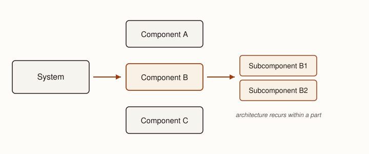

The purpose of architecture is to organize a system so that the many competing obligations of its
specification can be realized together. A specification says what an acceptable realization must
accomplish, but it deliberately leaves many choices about the system's organization open. Those
choices matter because obligations such as performance, security, reliability, and expected change
interact: an organization that serves one property well can make another harder to achieve.

Architecture is where engineers make those obligations coexist. Its choices create affordances and
constraints for the engineering work that follows. A boundary can make a change easier to isolate
while making coordination harder. A communication rule can improve failure isolation while weakening
consistency. An architectural decision therefore does more than describe a system. It changes the
space of designs available to the system's parts.

::: {.definition #def-architecture title="Software architecture"}
The architecture of a software system is the set of decisions about its major parts, the
responsibilities assigned to them, and the constraints on how they may interact. It reasons about
coarse-grained parts whose internals can, for the engineering question at hand, be treated as units.
:::

The distinction between architecture and design is recursive rather than absolute. A system
architecture sets the strategy for the design of its parts. A substantial subsystem will in turn
need an architecture that sets the strategy for its own internal parts. Architecture therefore does
not occupy one fixed level of a system's hierarchy.

## From specification to one system {#sec-spec-to-system}

Specification deliberately separates different engineering questions. A state model describes legal
transitions, a schema constrains information, and timing requirements bound when an operation must
complete. Each representation makes one property easier to state and examine on its own.

Architecture must bring those obligations back together in one coherent realization. This does not
mean mechanically combining specification models. Engineers instead choose an organization in which
the specified properties can coexist, deciding which responsibilities belong together, where
boundaries should fall, and how information and control should move between the resulting parts.

## The questions architecture must answer {#sec-questions}

An architecture makes consequential choices that constrain the engineering work below it. Four
questions are central.

1. **What are the major parts, and what is each responsible for?** Decomposition makes local
   reasoning possible. A useful part has a responsibility that can be understood without
   reconstructing the entire system.
2. **Where should the boundaries go?** Boundaries determine what must be reasoned about together
   and what may vary independently. Things belong together when they change together, must stay
   consistent, execute together, fail together, scale together, or must be secured together. These
   forces conflict, so there is rarely one mechanically correct decomposition.
3. **How may the parts interact?** Interfaces and dependency rules decide which information and
   assumptions cross boundaries. The goal is not to eliminate coupling; useful systems contain
   interacting parts. Architecture decides where coupling belongs and which dependencies should be
   hard to introduce by accident.
4. **What properties must the organization support?** Architectural choices are justified by
   engineering obligations. Performance may favor one organization while modifiability, availability,
   or expected evolution favors another.

A useful summary question is this: where should we draw boundaries so that the interactions and
changes we expect are easy, while the interactions and changes we do not want are difficult?

::: {.figure #fig-architecture-decomposition alt="A single System box is decomposed by an arrow into three components A, B, and C; a second arrow decomposes Component B into two subcomponents, B1 and B2, showing that architecture recurs within a part."}

Architectural decomposition progressively assigns responsibilities to smaller parts. Because the
activity recurs, a part such as Component B may itself require an architecture for its internals.
:::

As @fig-architecture-decomposition shows, decomposition is not a single step. What makes a decision
architectural is not a notation or a fixed level of abstraction. It is that the decision establishes
consequential organization within which further engineering decisions will be made.

## Architectural patterns provide alternatives {#sec-patterns}

Many architectural problems recur, and engineers have developed recurring organizations that address
them in different ways. Components that must communicate might call one another directly or
communicate through events. Computations over shared state might pass that state through a pipeline
or operate on a common repository. Dependencies might follow strict layers or deliberately cross
them. The recurring value of a pattern is the experience that comes with it: a reasoned expectation
about consequences, not a guarantee.

::: {.decision #decision-pipeline-repository title="Pipeline or repository?"}
**Problem.**
Several components must transform or share the same information.

**Pipeline.**
Pass each intermediate representation from one stage to the next. Stages stay independent and the
sequence of transformations is explicit.

**Repository.**
Store the shared state in a common representation that multiple components read and write
independently.

**Judgment.**
Prefer a pipeline when the transformations form a natural sequence and each stage consumes the
previous stage's output. Prefer a repository when several components need independent access to
persistent shared state, and accept the central dependency that creates.
:::

::: {.tradeoff #tradeoff-layering title="Strict layering"}
A layered organization gives comprehensible dependency rules: each layer depends only on the one
below it, so a reader can reason about the system one layer at a time.

The same rule obstructs interactions that naturally cross layers. When a high layer needs a
capability the intervening layers do not expose, engineers either thread it through every layer or
quietly break the rule. Strict layering buys analyzability of dependencies at the cost of friction
for cross-cutting concerns.
:::

The important skill is therefore not recognizing pattern names. For any proposed organization, ask
what the parts are and how they may interact, what the organization makes easier, what it makes
harder, and what properties it now lets you analyze.

::: {.note}
A pattern name is a hypothesis about consequences, not a decision. Two systems that both "use
layering" can differ on every question in @sec-questions. Name the forces, then choose.
:::

## Architecture makes some system properties analyzable {#sec-analyzable}

Architectural choices affect performance, reliability, security, and modifiability, but recognizing
that relationship is only the beginning. A useful architectural model makes the relationship
explicit enough to analyze. Which model is useful depends on the question. A dependency model can
show whether a proposed boundary actually isolates a component from expected change. A data-flow
model can expose which components lie on a latency-sensitive path. A deployment model can expose
which failures can affect multiple parts at once [@kruchten1995].

Architectural claims can be supported at different strengths. A pattern offers a reasoned
expectation from prior experience. An analytic model can support a structural argument, such as
establishing that no dependency crosses a proposed boundary. A quantitative model can go further
when the relevant quantities can be represented. Finally, measurements from a running system provide
observed evidence [@bass-saip].

Analysis itself has a cost. The useful question is whether resolving an uncertainty could change the
architectural decision enough to justify that cost. Models, prototypes, and measurements are ways of
buying information about a consequential choice; as the cost of producing that evidence falls, more
architectural questions become worth investigating [@fairbanks2010]. The more faithfully the model
captures the property we care about, the less we have to bet.

## From architecture to design {#sec-to-design}

Architecture deliberately does not decide everything. Once engineers have chosen the consequential
organization of a system, each part must still realize its assigned responsibility. Some choices are
constrained by the architecture, some are already settled by conventions that apply throughout the
engineering environment, and others remain deliberately open.

This is the transition from strategy to tactics. The relationship stays recursive: a subsystem that
appears as one part in a system architecture will itself require architectural decisions if it
remains too large to reason about directly. Detailed design may also reveal that an apparently local
choice has system-wide consequences, at which point design has exposed an architectural question.
Architecture constrains the available tactics; design tests whether the strategy is workable.

::: {.exercise #ex-boundary-forces}
Take a system you have built or studied. For one boundary in it, name the forces from
@sec-questions that put the two sides together or apart — what changes together, what must stay
consistent, what fails together. Then state one change the boundary makes easy and one it makes hard.
:::
