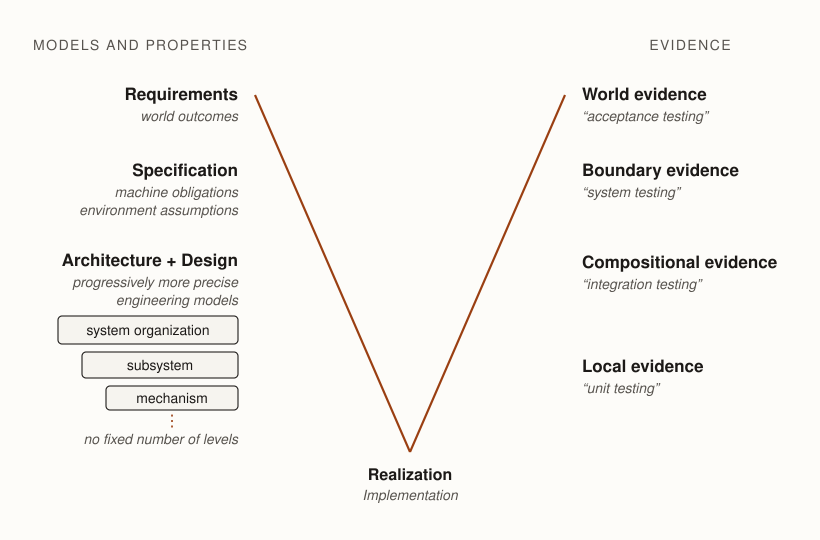
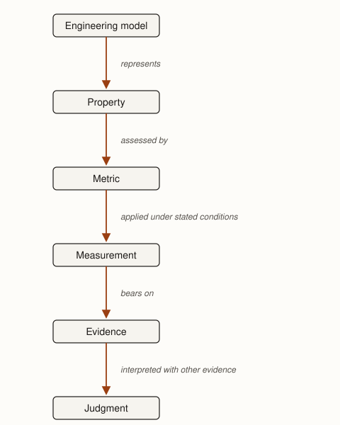

**Premise.** *Validation asks what evidence is sufficient to deliver a software system into the
world.*

Engineering decisions flow from purpose through requirements, specification, architecture, design,
and implementation. At each point, engineers make choices for which they are responsible.
Eventually those choices produce software that can be delivered. The engineer must then decide
whether there is enough reason to proceed.

This makes validation broader than testing. Tests are one way to obtain evidence about a system,
but the engineering question comes first: What must we know before we are willing to deliver it? A
review may provide useful evidence about a design. Static analysis may provide evidence about
possible program behaviors. Measurement may establish whether a performance objective has been met.
A proof may establish a property under stated assumptions. Different claims require different
evidence.

Nor does validation necessarily seek certainty. Software is unusually updateable.
@ch-software-engineering showed how an engineer can change one codebase and propagate the result
across an enormous deployed population. The same property that spreads mistakes makes repairs cheap
to distribute. @ch-process drew one consequence: when a decision is cheap to reverse, engineers can
experiment rather than spend more avoiding an error than correcting it would cost.

The same reasoning applies to delivery. Sometimes it is better to deliver software with known
uncertainty, observe what happens, and revise it. A game can ship with an occasional graphical
defect. An internal tool can be useful despite awkward workflows. A consumer application may need
to reach users before its engineers can learn which capabilities people actually value. In these
cases, delaying delivery until every known uncertainty has been resolved can cost more than
learning from use.

In that limited sense, *move fast and break things* describes a real engineering strategy. It is
not always irresponsible to deliver software that might fail. The engineering question is whether
failure after delivery is an acceptable way to learn.

That qualification matters because software's updateability can repair the software, but not
necessarily the consequences of its previous behavior. An update can correct a graphical defect
after players encounter it. It cannot necessarily recover money already lost, make disclosed
information private again, or reverse a physical injury. As the consequences of being wrong become
more substantial or less reversible, learning through failure becomes more expensive.

@ch-process deliberately left the consequence of failure out of its model for organizing
engineering work. Consequence does not tell us whether requirements can be known in advance,
whether a decision is expensive to reverse, or whether a partial system can be built and validated.
It answers a different question: How much assurance should we demand before delivery?

That is the question of this chapter.

## Acceptance is a professional judgment {#sec-professional-judgment}

Consider three software defects. A game sometimes draws a character incorrectly. A TODO application
occasionally loses a task. A medical device can sometimes deliver an incorrect dose.

These defects differ in more than severity. The game defect may directly annoy a player, but more
serious consequences require a longer causal chain. The TODO application destroys information on
which a user may depend: the lost task might cause a missed appointment or deadline. The medical
device can directly injure its user. The more substantial and direct the possible consequence, the
stronger the reason to reduce uncertainty before delivery.

Causal distance matters because almost any software behavior can be connected to serious harm
through a sufficiently long chain. A broken game may frustrate a player, and frustrated people
sometimes behave badly. That possibility does not make an ordinary graphical defect
safety-critical. Engineers must reason about consequences substantial and direct enough to matter
to the delivery decision.

This does not imply that consequential systems must be perfect. Engineering rarely offers
certainty, and useful systems can carry residual risk. Nor does consequence mechanically determine
an acceptable level of risk. Two people can agree completely about what might happen and disagree
about whether the available evidence justifies delivery.

Suppose everyone agrees that a particular failure could kill people. The organization building the
system may understand that consequence and nevertheless judge the residual risk acceptable because
of the benefit the system provides. A regulator may permit the system on the same understanding. An
engineer may still conclude that the available evidence is insufficient to justify delivery.

The disagreement is not about what the consequence is. It is about what that consequence requires.

Three things therefore contribute to the standard applied at delivery. Consequences establish what
is at stake if the engineering judgment is wrong. Stakeholders judge what outcomes, costs, and
risks they are willing to accept. Engineers exercise independent professional judgment about what
the available evidence allows them to stand behind. These judgments often agree, but none
substitutes for another.

The last judgment takes us to professionalism. Engineers do not act only as employees carrying out
the preferences of whoever controls a project. They are also members of a profession.

::: {.definition #def-professionalism title="Professionalism"}
Professionalism is the exercise of specialized capability under obligations that are not reducible
to the wishes of whoever asks you to use it.

A customer may be willing to accept a structural risk that an engineer judges inadequately
understood. The customer's willingness does not require the engineer to certify the structure. The
same distinction applies to software: another party may have authority to accept a risk without
determining what an engineer can responsibly claim about the system or requiring the engineer to
participate in its delivery.
:::

A profession exists partly because specialized decisions cannot always be made well by the people
who want the resulting system. Society relies on physicians to exercise medical judgment rather
than merely supply requested treatments, and on engineers to exercise engineering judgment rather
than merely realize requested artifacts. Professional communities accumulate standards, methods,
experience, and expectations about what their members should stand behind. Engineers draw upon that
accumulated judgment when exercising professional authority.

Professional judgment is therefore different from personal preference. Suppose a customer needs a
disposable internal tool by Friday. Its failures have minor consequences, and the customer can
tolerate occasional errors. An engineer might prefer to spend another six months making the
software extraordinarily reliable. That preference does not make the additional work good
engineering. Resources spent eliminating inconsequential uncertainty cannot be spent elsewhere.

The opposite error is more serious. Suppose a system can kill people when it fails. The customer
wants to proceed, but the engineer believes the available evidence does not justify delivery. The
customer's willingness to bear the risk does not end the engineer's responsibility. The engineer
may need to obtain stronger evidence, change the system, defer to someone with the necessary
competence, or refuse the work.

These cases expose two pathologies. An engineer can demand substantially more assurance than the
consequences and stakeholder needs warrant, pursuing perfection at unjustified cost. Or an engineer
can demand less assurance than the consequences warrant and deliver work they should not stand
behind. Good engineering lies in neither direction. It seeks a defensible standard for the decision
actually being made.

The relationship can be summarized as follows:

|  | Engineer accepts a lower standard | Engineer demands a higher standard |
|---|---|---|
| **Consequences are substantial** | Professional failure. The engineer's standard is inadequate to what is at stake. | Appropriate rigor, when the additional work materially reduces consequential uncertainty. |
| **Consequences are minor** | Often appropriate. Good enough may actually be good enough. | Overengineering, when additional assurance consumes resources without commensurate value. |

This table intentionally simplifies the stakeholder's role. Stakeholders help determine what the
software must accomplish and which ordinary failures they are willing to tolerate. They may also
participate in broader decisions about acceptable risk. The table isolates a different question:
whether the engineer's standard is appropriate to the consequences they understand.

Professional authority matters most when these judgments diverge. A customer, employer, regulator,
or government may be willing to accept a risk that an engineer will not. That willingness does not
erase the engineer's responsibility for their engineering judgment. The engineer may refuse to
certify the result and ultimately refuse to use their professional capabilities to produce or
deliver it.

This does not put engineers above society. Engineers do not acquire general authority over what
purposes other people may pursue merely because those purposes involve technology. But political,
organizational, and economic authority do not replace engineering judgment. Others can make
decisions within their authority. They cannot give an engineer evidence the engineer does not
possess or make defensible a judgment the engineer cannot defend.

Professional authority therefore includes the ability to say no.

Validation makes this responsibility especially visible because delivery requires a decision. But
professional responsibility does not begin there. An engineer who recognizes a dangerous omission
in the requirements cannot knowingly preserve it on the theory that validation will catch it later.
The same is true of an indefensible specification, architecture, or design. Each engineering
activity carries responsibility for its decisions.

Validation is nevertheless special because earlier decisions meet evidence there. Requirements
establish what the effort promised; specification represents the machine properties and
environmental assumptions needed to keep those promises; architecture and design represent the
organization, mechanisms, and local properties through which they will be realized; implementation
produces the realized system.

These models become progressively more specific toward implementation, but they do not merely
restate the same properties at finer levels of detail. A specification might require a request to
complete within 500 ms; an architectural model allocates that time across a path of interacting
services; a design might hold one worker below 4 GB of memory. Other properties concern correctness
rather than quantities: a payment may be charged at most once, a dependency may not cross a
boundary, and a retry mechanism may need to be idempotent.

Validation asks whether the realized system provides sufficient evidence for the properties on
which those engineering decisions depended. Evidence can confirm a model, expose a defect in the
realization, show that an assumption was wrong, or reveal that the model itself omitted something
consequential. What engineers learn therefore flows back through the decisions that constrained
realization.

The distinctive question at validation is whether the resulting evidence is enough to deliver.

## Consequence changes the amount of evidence we should demand {#sec-consequence-evidence}

What could happen if the delivery decision is wrong? Suppose a TODO application loses one task in
every thousand. A personal scratchpad may tolerate that loss; a task system coordinating emergency
maintenance may not. The same failure rate can justify different decisions because the consequences
differ.

::: {.definition #def-consequence title="Consequence"}
A consequence is an effect in the world that can result from an engineering decision or system
behavior.
:::

Consequences give engineers reason to demand more or less assurance, but do not determine a unique
threshold for delivery. Someone must still judge what evidence is sufficient.

Evidence obligations should reflect consequence. Not every property deserves the same validation
effort. A specification can identify some obligations as more critical than others, including
groups of obligations with their own internal priorities (@sec-prioritizing-effort). The stronger
the consequence of violating an obligation, the stronger the evidence we should ordinarily demand
before relying on it. This relationship is not mechanical: criticality can depend on operating
context, obligations can be incomparable, and finite evidence never eliminates uncertainty. Later,
when we examine failure, we will turn the relationship around. The criticality of the violated
obligation and the resulting consequence help determine the severity of a failure
(@ch-failure-aware-engineering).

That judgment changes as engineers learn. Before delivery, a harmful outcome may be only a
possibility supported by stronger or weaker evidence. Delivery produces new information: engineers
observe failures, measure outcomes, receive user reports, and discover consequences they did not
predict. This is one reason delivery under uncertainty can be valuable when possible consequences
are modest: use generates knowledge that might have been expensive or impossible to obtain
beforehand.

But new evidence changes the engineering decision. Suppose engineers initially believe a deployed
feature is unlikely to cause substantial harm. Later evidence indicates that it does. The original
justification cannot simply be reused. Continuing the same behavior is a new decision made with
different knowledge.

This distinction is especially important because software can often be updated quickly across a
deployed population. That capability makes learning after delivery more practical, but also makes
learned evidence harder to ignore. If engineers know that deployed behavior is causing substantial
harm and can change it, continued operation requires justification under the new state of
knowledge.

Validation therefore does not end with the first delivery. Evidence continues to flow from the
deployed system, and consequential new evidence should trigger reconsideration of the decisions it
bears upon.

The question remains the same even as the evidence changes: Do we know enough to justify what we
are about to deliver?

The next step is to make *know enough* precise. Before choosing tests, analyses, reviews, or other
validation techniques, engineers must identify what they are trying to establish.

## Identify the claim {#sec-claims-evidence}

Before choosing a validation technique, identify the claim that needs support. Saying that a system
has "been tested" tells us little until we know what the tests were intended to establish.

A payment service might need to support several claims: a payment submitted once should not be
charged twice; an unauthorized user should not be able to initiate a payment; a completed payment
should appear in the account history; a normal request should complete within an acceptable time.
Each claim concerns the same system, but evidence supporting one may say little about another.

This is why validation techniques should not be taught as a catalog from which engineers select a
sufficiently impressive collection. The engineering problem runs in the opposite direction:
identify what must be believed, consider how the system could violate the claim, then seek evidence
capable of distinguishing acceptable from unacceptable behavior.

If the claim concerns duplicate charging, engineers need evidence capable of exposing duplicate
execution under the conditions in which it might occur. If the claim concerns latency, they need
measurements under relevant workloads and environments. If the claim concerns behavior over all
possible values of some bounded input, exhaustive analysis or proof may provide evidence that
ordinary examples cannot.

The method follows from what engineers need to know.

## Validate at the scope of the property {#sec-scope-of-property}

Engineering models represent properties at different scopes. A design may depend on a property of
one mechanism or component. An architecture may depend on a property of several parts together. A
specification constrains behavior at the machine boundary and states the assumptions under which
that behavior should establish a requirement. Requirements concern the resulting outcomes in the
world.

Validation must therefore obtain evidence at the scope where the property exists. Establishing
every component's local properties does not establish every property of their composition. Three
services can each satisfy their local latency budget while communication and queueing cause the
end-to-end path to exceed its system budget. Two components can each behave correctly under their own
assumptions while their assumptions leave an important responsibility to neither. Two services can
each implement retries correctly while their interaction permits the same operation to occur twice.

This relationship gives the familiar V-shaped picture a useful engineering interpretation. The
left side does not prescribe a sequence in which engineers must complete Requirements before
Specification, Specification before Architecture, and so forth. @ch-process already showed why
engineering activities may be interleaved. Instead, the left side represents increasingly specific
engineering decisions as models constrain a realization; the right represents evidence about the
corresponding properties at progressively broader scopes.

The familiar terms unit testing, integration testing, system testing, and acceptance testing
describe common scopes of validation. Unit testing usually examines a chosen part in isolation;
integration testing examines interactions among parts; system testing examines an assembled system
at a chosen boundary; and acceptance testing asks whether the resulting system is acceptable for its
intended use. These terms are useful professional vocabulary, but their boundaries depend on
context. A subsystem may be treated as a unit from one perspective and as a system with its own
internal architecture from another.

The scope of validation should therefore follow the property being established, not a predetermined
testing level. Architecture and design progressively refine the machine until it can be realized as
an implementation (@ch-design). There need not be one architectural level followed by one design
level. A system may contain subsystems, components, services, modules, and mechanisms, with
consequential properties introduced at each scope. Validation follows that structure in reverse.
Local evidence can establish local properties, while properties arising from interactions require
evidence about those interactions. Properties of the machine as a whole require evidence at the
machine boundary, and requirements concerning outcomes in the world may require evidence about the
machine operating in its environment (@fig-models-evidence-v).

::: {.figure #fig-models-evidence-v alt="A V diagram. Down the left leg, engineering models become progressively more precise toward the point of the V: Requirements, concerning world outcomes; then Specification, concerning machine obligations and environment assumptions; then a single Architecture and Design wedge, shown as nested illustrative models — system organization, then subsystem, then mechanism — annotated that there is no fixed number of levels. The point of the V is Realization, the implementation. Up the right leg, evidence bears on the corresponding properties at broadening scopes: Local evidence, low on the rising leg, then Compositional evidence, then Boundary evidence, then World evidence at the top. Each right-side scope carries a lighter conventional term in quotation marks: unit testing, integration testing, system testing, and acceptance testing respectively."}

Models and properties become more precise toward realization; evidence bears on properties at
corresponding scopes. Conventional terms such as unit, integration, system, and acceptance testing
name common scopes of evidence, not fixed structural levels. The V represents correspondence between
engineering claims and evidence, not a required sequence of development activities.
:::

A conventional V-model is often drawn with a small number of development and testing levels.
@fig-models-evidence-v instead emphasizes the underlying engineering relationship: models introduce
properties as the system becomes more precisely described, and validation asks what evidence bears
on those properties at the scope where they live. The first question is therefore not whether a
test is a unit, integration, or system test, but what property must be established, at what scope,
and what evidence would justify believing it. The conventional labels are useful shorthand once
those questions have been answered.

The figure also shows why "correctness" is not one property established once at the bottom of the V.
Correctness may concern a local algorithm, the interaction of several components, behavior at a
system boundary, or an outcome in the world. Quantitative properties behave similarly: memory
consumption may belong primarily to one design, while end-to-end latency belongs to the path through
which a request travels.

**Validate a property at the scope where the property lives.** Local evidence can contribute to a
broader argument, but it cannot replace evidence about a property that exists only in composition. A
unit test can establish something about one unit. It cannot by itself establish an end-to-end latency
bound, system-wide consistency, or an outcome that depends on the environment.

Later chapters examine important classes of software properties more systematically. The point here
is structural: engineering models make consequential properties explicit enough to guide
realization, and validation asks what evidence establishes that the resulting system actually has
them.

Evidence is always evidence *for* something, under assumptions. Those assumptions should be
explicit because they bound what the evidence can mean. A proof can strongly establish a stated
property relative to its model while saying nothing about a requirement omitted from that model. A
load test establishes latency under the workload it generated, not under the workload users will
generate. Treating "we have strong evidence" as a property of a system rather than of particular
claims under particular assumptions is how validation programs mislead the people who rely on them.

The world, machine, and domain-assumption distinction from @ch-specification matters again here.
Most validation evidence attaches to the machine: tests, analyses, and proofs establish claims
about behavior at the machine's boundary. But requirements live in the world, and the connection to
machine behavior runs through domain assumptions [@zave1997darkcorners]. A system can satisfy its
specification perfectly while its requirement fails because a domain assumption was false.
Machine-side evidence cannot expose that failure when the machine is behaving exactly as specified.
Evidence from the world — observation of the deployed system in its actual environment — can. This
is one reason operational evidence is part of validation rather than an afterthought.

## Metrics connect properties to evidence {#sec-metrics-evidence}

Earlier engineering activities use metrics to reason about properties before the complete
realization exists: requirements attach measures to outcomes in the world, specification bounds
latency or capacity at the machine boundary, architecture analyzes critical-path latency and
failure domains, design compares mechanisms by memory or execution time. Validation uses these
metrics to obtain evidence about whether the realized system has the properties those engineering
decisions required.

Three terms must remain distinct. A property is something about the system or its environment that
matters to an engineering decision. A metric defines how some aspect of that property will be
assessed. A measurement is a value obtained by applying the metric under particular conditions.

Suppose an architectural model predicts that a request path will remain below a 500 ms latency
bound. Engineers might define the metric as p99 end-to-end request latency under workload W, then
measure 420 ms in a validation experiment. The number is not meaningful evidence by itself. Its
meaning comes from the property, the metric connecting the measurement to that property, and the
workload and environment under which it was obtained (@fig-property-to-judgment).

::: {.figure #fig-property-to-judgment width="46%" alt="A vertical chain of six boxes connected by labeled arrows. An Engineering model represents a Property. The Property is assessed by a Metric. The Metric, applied under stated conditions, yields a Measurement. The Measurement bears on Evidence. The Evidence, interpreted with other evidence, yields a Judgment."}

A measurement becomes evidence through an engineering claim. The model identifies a property that
matters; a metric defines how an aspect of it will be assessed; measurement supplies an observation
under stated conditions. Engineers interpret that observation as part of the evidence for a decision.
:::

A mismatch between model and measurement is itself engineering information. The implementation may be
defective. The model may have omitted an important cost. Its assumptions may not describe the actual
workload or environment. Or the metric may fail to capture the property engineers intended to assess.
Validation does not assume that the model is right and ask only whether the implementation conforms
to it.

Metrics therefore connect models to observations without replacing engineering judgment. Some
important properties cannot be reduced to one useful number, and even quantitative evidence must be
interpreted under assumptions. The engineering order runs from what matters to what should be
measured: choose a metric because it can provide evidence about a consequential property, not because
the number happens to be available.

## Choose an evidence mechanism {#sec-choosing-evidence}

Claim and scope are the first two decisions a validation argument makes. The rest follow, and this
chapter takes them in order (@tbl-validation-skeleton).

| Decision | The question it asks |
|---|---|
| Claim | What do we need to believe? |
| Scope | Where does the property exist? |
| Mechanism | How can we obtain evidence? |
| Strategy | What should we explore, and how will failure be recognized? |
| Strength | How much does the resulting evidence justify? |
| Decision | Is the residual uncertainty acceptable? |

: The decisions a validation argument makes. {#tbl-validation-skeleton}

Once the claim and its scope are explicit, engineers can choose how to obtain evidence. Of each
mechanism (@tbl-evidence-mechanisms), ask what uncertainty it can reduce, which failures it can
expose or exclude, and what remains outside its reach.

| Mechanism | What it observes or reasons over | Characteristic strength | Characteristic limitation |
|---|---|---|---|
| Human review | An artifact, plus engineering reasoning about it | Semantic judgment: assumptions, unconsidered consequences, omitted concerns | Limited attention; only the cases a reviewer imagines |
| Dynamic testing | Selected executions of the realized system | Direct evidence of what the system actually does | Sampling: executions not performed remain unobserved |
| Static analysis and model checking | Possible behaviors, without producing each one | *Excludes* classes of failure, which no finite set of executions can | Holds only over the model or abstraction it analyzes |
| Measurement and experimentation | Quantities obtained under stated conditions | Quantitative evidence wherever a metric reaches the property | Depends on whether metric and conditions represent what matters |
| Operational observation | The deployed system in its actual environment | Real workloads, real users, real domain behavior | Evidence arrives after exposure to consequences has begun |

: Evidence mechanisms differ in what they can reach and what stays outside them.
{#tbl-evidence-mechanisms}

Scope and mechanism are independent choices. A component can be reviewed, tested, analyzed, or
model-checked, and the same mechanism can be applied at a boundary or across an assembled system.

The first row carries a caution the others do not. Human judgment is what lets a reviewer notice
that engineers solved the wrong problem, but attention is itself a limited validation mechanism.
Research on vigilance shows that sustained
monitoring requires substantial mental effort and imposes measurable workload and stress
[@warm2008vigilance], while research on rare-target search shows that infrequent targets are
disproportionately missed [@wolfe2005rare]. These findings do not measure software review directly,
but they matter increasingly as automated systems produce more artifacts for humans to supervise. A
human reviewer should be used where human judgment is valuable, not treated as an infinitely
scalable detector of rare defects.

Choosing dynamic testing still leaves another question: which executions should we seek, and how
will we recognize failure?

## Choose a validation strategy {#sec-validation-strategies}

Dynamic testing contains a second engineering choice. Generating executions is often cheaper than
determining what each execution should produce. Validation strategies differ partly in how they
solve this *oracle problem*: where the judgment that distinguishes acceptable from unacceptable
behavior comes from (@tbl-validation-strategies).

| Strategy | What it searches | Where the oracle comes from |
|---|---|---|
| Example-based | Cases the engineer judged important | A known expected result, stated case by case |
| Property-based | Generated inputs across a class | One property stated over the whole class |
| Metamorphic | Related executions of the same system | A relation that must hold among them, even when no single answer is known |
| Differential | Inputs on which independent implementations disagree | An independently developed implementation |
| Fuzzing | Large, unusual, and malformed input spaces | A weak failure signal: a crash, a hang, an assertion failure |

: Validation strategies, ordered by where the oracle comes from. {#tbl-validation-strategies}

The progression is worth stating plainly: an explicit answer, then a property, then a relation,
then an independent implementation, then a weak failure signal. Each step gives up something about
knowing the right answer and buys search in return. Example-based testing is direct and cheap when
the important cases and their expected outcomes are known, and silent about every case not
selected. Property-based testing trades hand-picking examples for the harder work of stating what
should be true in general. A metamorphic relation asks less still: it needs only that two
executions stand in a stated relationship, which is why it reaches systems whose individual outputs
no one can predict. Differential testing is valuable exactly when the correct answer is expensive
to state case by case. Fuzzing exposes robustness failures cheaply while saying little about
functional correctness.

The strategies are not ranked, and they combine. Fuzzing can drive a property-based oracle;
differential comparison can supply the oracle for generated inputs. Strategy is also independent of
scope: a property can be stated over a function, a service boundary, or an assembled system.
Recognizing the shared problem matters more than memorizing the techniques, because new techniques
will confront it too.

## Judge the strength of the evidence {#sec-strength-of-evidence}

No technique supplies confidence by name alone. A model checker can exhaustively verify a property
of the model while leaving an incorrect model untouched. Thousands of generated tests can explore
an input space while sharing the same mistaken oracle. A code review can bring independent judgment
while still missing behavior that neither reviewer considered. Evidence must be evaluated relative
to the claim it supports and the assumptions on which it depends.

Evaluating a body of evidence is itself an engineering judgment, structured by several recurring
dimensions (@tbl-evidence-strength). None is a score; each names a question the evidence answers or
leaves open.

| Dimension | The question it asks |
|---|---|
| Coverage | How much of the relevant behavior did the evidence examine? |
| Detection power | Would this evidence have exposed the failure we care about? |
| Representativeness | Do the examined conditions resemble the conditions of delivery? |
| Scope | Does the evidence attach where the property actually exists? |
| Independence | Could one mistaken assumption invalidate several pieces of evidence at once? |
| Assumptions | What must be true for this evidence to mean what we think it means? |
| Residual uncertainty | What consequential possibilities remain unresolved? |

: Dimensions along which a body of evidence is judged. {#tbl-evidence-strength}

Several have already appeared. Scope is the relationship expressed by the V-shaped picture: an
argument that infers a compositional property from only local evidence has attached its evidence at
the wrong scope. Assumptions include a technique's own guarantees. When a tool claims soundness or
completeness, engineers should know what its verdicts guarantee and over what model. Residual
uncertainty is what the delivery decision ultimately weighs.

Detection power is the dimension most often confused with coverage. A test suite can execute every
line of a module and assert almost nothing about what those lines produced. Mutation testing makes
the difference visible: deliberately introduce small faults — invert a comparison, delete a
statement, change a constant — and measure how many of them the suite detects. A high coverage
figure beside a low mutation score describes evidence that reaches much of the system but notices
little when it is wrong. The question is not whether the evidence reached the behavior, but whether
it would have objected.

Strong validation for consequential claims tends toward triangulation: multiple forms of evidence
with sufficiently independent failure modes that a mistaken assumption in one can be caught by
another. Independence deserves particular attention because volume can imitate it.

::: {.key-idea #key-evidence-independence title="Evidence multiplies; independence does not"}
A thousand tests generated from the same mistaken interpretation of a requirement are not a
thousand independent reasons to believe the interpretation is correct. They are one reason,
repeated. The strength of a body of evidence depends not only on its quantity, but on the
independence of the assumptions and failure modes behind it.
:::

This point becomes more important as generation becomes cheap. When tests were expensive to write,
each embodied a deliberate act of engineering attention, so a large suite loosely signaled
substantial scrutiny. When a tool can generate implementations and thousands of passing tests from
the same prompt, the tests and the implementation can share a single mistaken interpretation, and
the suite's size signals nothing about it. @ch-software-engineering argued that as implementation
becomes abundant, the judgments surrounding it become relatively more important. The same shift
applies inside validation: cheap evidence generation makes judging its coverage,
representativeness, independence, and assumptions the scarce engineering work.

## Margin, discreteness, and containment {#sec-margin-containment}

Other engineering disciplines provide useful concepts for reasoning about residual uncertainty. A
tolerance describes a range of realized behavior that remains acceptable. A margin describes the
separation between expected or observed behavior and an unacceptable boundary. Suppose, for
example, that a system must keep p99 latency below 500 ms. Measurements of 420 ms and 499 ms both
satisfy the requirement, but leave the engineer in very different positions. The first leaves
substantially more room for variation in workload, environment, measurement, and prediction.

The observed separation from a threshold is not necessarily the margin an engineer can rely upon.
Measurements vary, models omit effects, operating conditions change, and the conditions used for
validation may differ from those encountered after delivery. Engineers therefore care about how
much margin remains after accounting for the uncertainty relevant to the decision. A system barely
inside a limit can satisfy its specification while providing little reason to believe that the
limit will continue to hold as conditions vary.

Software complicates this reasoning because its behavior is discrete. Nearby inputs or states need
not produce nearby outcomes. Changing one value, crossing one boundary condition, receiving one
unexpected message, or taking one previously unexplored branch can move execution onto a
qualitatively different path. Physical systems can also exhibit discontinuities such as fracture or
instability, but discontinuity is routine in software. There is generally no useful notion that an
execution was almost an authorization bypass or nearly performed the same transaction twice.

Discreteness limits what engineers can infer from observed executions. Executing many behaviors
near an unexplored behavior does not generally establish what the unexplored behavior will do.
Coverage tells us where evidence reached; it does not tell us how close we are to correctness.
Statement, branch, condition, state-space, and requirements coverage can expose important gaps in a
body of evidence, but increasing a coverage number does not by itself bound the behavior that
remains unexplored.

Software architecture provides another response to residual uncertainty: constraining the
consequences of behavior that validation fails to anticipate. This idea has deep roots in software
modularity. Meyer distinguished modular continuity, in which a small change affects only a small
number of modules, from modular protection, in which abnormal behavior remains confined to a small
neighborhood of the system [@meyer1997]. The same principle matters for assurance. If engineers
cannot economically establish everything a component might do, architectural controls can instead
constrain what that component is permitted to affect.

The progression is worth stating plainly. Continuity bounds the propagation of change. Protection
bounds the propagation of failure. Containment bounds the consequences of what the evidence failed
to discover. Meyer offered locality as a criterion of good modular structure; validation asks how
that same structure changes the evidence required to act under uncertainty.

The controls are familiar, but validation gives them a second job. Interfaces constrain how
components can interact. Process and container isolation can prevent one failure from corrupting
unrelated components. Type and memory-safety mechanisms exclude classes of behavior. Permissions
constrain authority. Transactions constrain partially completed changes. Resource limits, timeouts,
and circuit breakers restrict propagation. Staged rollout limits the population exposed to a new
behavior, while rollback can shorten the time for which a discovered failure remains active.
@ch-architecture treated a boundary as a decision about what must be reasoned about together and
what can fail independently. Here, the same boundary can convert an open-ended validation problem
into a bounded consequence problem.

These controls do not establish that the software inside them is correct. They change the
consequence of being wrong. If an uncertain component has unrestricted authority over a
consequential system, uncertainty about its behavior may demand very strong evidence before
delivery. If the same uncertainty is enclosed by controls that make consequential outcomes
impossible or tightly bounded, the delivery decision can be different. Architecture therefore
contributes to validation not only by making systems easier to test, but by bounding what failures
that validation missed can affect.

These two kinds of residual uncertainty therefore admit different responses
(@tbl-margin-containment).

| Kind of residual uncertainty | What the evidence can establish | The engineering response |
|---|---|---|
| Quantitative — a measured property standing some distance from a threshold | A separation that can be estimated, compared, and degraded by known sources of variation | Margin: how much separation survives the variation that matters |
| Discrete — an unexplored behavior or an unanticipated state | Where evidence reached, but no distance from failure | Containment: how far a failure is permitted to propagate if it occurs |

: Quantitative uncertainty admits margin reasoning; discrete uncertainty calls for containment.
{#tbl-margin-containment}

Engineers therefore have several distinct ways to reason about uncertainty. Margin asks how far
observed behavior is from a known unacceptable boundary. Coverage asks where evidence has reached.
Containment asks what can happen where the evidence is wrong. Reversibility asks what engineers can
do after discovering they were wrong. None eliminates uncertainty. Together they help determine
whether the remaining uncertainty is acceptable for the consequences of the decision.

## Deciding when to stop {#sec-when-to-stop}

No practical amount of validation establishes every relevant property over every possible software
behavior. The delivery decision therefore concerns residual uncertainty: what remains unknown, and
what follows if the evidence is wrong.

Additional evidence has a cost: the effort to produce it, the attention required to evaluate it,
and the value delayed while obtaining it. @ch-process observed that delivering an increment can
itself generate information. Withholding delivery to obtain more evidence therefore also has a
price, and the earlier mismatch table applies directly. For a low-consequence system, delivering
with unresolved uncertainty can be defensible, while demanding near-certainty can become
overengineering: consuming resources without commensurate value. For a high-consequence system, the
same unresolved uncertainty may justify expensive and diverse evidence, or it may mean that
delivery cannot currently be defended at all.

Before delivering, engineers can work through a short sequence of questions drawn from the argument
above.

- **Claims.** Have we obtained evidence for the consequential claims, rather than for whichever
  claims happened to be convenient to examine?
- **Strength.** How strong is that evidence along the dimensions above — its coverage, detection
  power, representativeness, scope, independence, and assumptions?
- **Margin.** Where the behavior is quantitative, how much defensible separation remains before
  the behavior becomes unacceptable?
- **Containment.** If an unanticipated behavior occurs, what controls limit its consequences?
- **Consequence.** What happens in the world if these arguments are wrong?
- **Reversibility.** Can we detect, stop, repair, and recover from a failure discovered after
  delivery?

These questions do not compute a decision. They make the judgment answerable. An engineer who can
say what the evidence establishes, how far the system sits from unacceptable behavior, what bounds
a failure, and what can be done afterward has provided reasons another engineer can examine. That
is what separates professional judgment from preference.

The decision at the end of validation is not binary. Evidence that fails to justify delivery does
not merely say "stop"; it usually indicates where the problem lies, and the response should go
there.

::: {.decision #decision-validation-outcomes title="The delivery decision"}
Deliver when the evidence supports the claims that matter at a standard defensible for the
consequences. Gather more evidence when the shortfall is knowledge and additional evidence is worth
its cost. Change the system when the evidence exposes behavior that should not be delivered.
Revisit an upstream decision when the evidence indicts a requirement, specification, architecture,
or design rather than the implementation. Refuse when the consequences demand a standard the
available evidence cannot meet and no party can make that gap disappear by accepting it.
:::

The last option needs no new argument. It is the professional authority of this chapter's opening
applied at the moment it matters. The three inputs remain distinct: consequence establishes what is
at stake; stakeholders judge which outcomes, costs, and risks they will accept; the engineer judges
what the evidence allows them to stand behind. A delivery decision is defensible when it can answer
to all three. People can agree about what a failure would do and still disagree about what evidence
its possibility demands.

## Evidence after delivery {#sec-after-delivery}

Delivery moves the system into the one environment no earlier validation could fully reproduce, and
the environment repays the favor with evidence. Monitoring reveals behavior under real workloads.
Incidents expose failures no one selected as a test case. Field measurements and experiments
quantify what analysis could only estimate. User reports carry consequences engineers did not
predict. The world itself also changes: a domain assumption that was true at delivery can quietly
become false as usage, populations, and conditions shift. Operational observation is therefore not
a courtesy that follows validation. It is validation continuing under better evidence.

Evidence also ages when the system changes. A modification need not invalidate all previous
evidence, but engineers must ask which claims the change could affect and which evidence must
therefore be renewed. Regression testing is one common mechanism for doing so.

The crucial point is that the decision must update when the evidence does. It is one thing to
deliver amid uncertainty about possible harm; that uncertainty was weighed, and the decision may
have been sound. It is another to continue the same behavior after evidence of substantial harm
accumulates. The original justification cannot be reused, because it was a justification under a
state of knowledge that no longer exists.

Recent litigation against social-media companies illustrates the distinction, if read carefully.
Plaintiffs — including states and school districts — have alleged that platform design features
harmed young users and that companies continued delivering those features after internal evidence
of harm accumulated. These allegations are not findings of fact or scientific proof of causation,
and this chapter takes no position on the underlying social-science debate. The engineering lesson
does not depend on their eventual adjudication. The shape of the accusation is exactly the failure
this section names: not that you delivered under uncertainty, but that your evidence changed and
your decision did not.

Software's medium gives this duty particular force. @ch-software-engineering observed that
copyability and updateability cut both ways: the mechanism that propagates a repair across millions
of instances can propagate a defect across them too. Updateability makes learning after delivery a
legitimate strategy when failures are tolerable: a repair can reach everyone cheaply. It also makes
inaction harder to defend when failures are not tolerable. Once evidence shows that deployed
behavior should change, engineers can often change it everywhere, quickly. An engineer who could
respond and does not has still made a decision, one that must be justified under the new state of
knowledge.

## Summary

Validation asks what evidence is sufficient to deliver a software system into the world. The
question is broader than testing and does not demand certainty. Software's updateability can make
delivery under known uncertainty a legitimate way to learn, but only when discovering a failure
after delivery is acceptable: an update can repair the software, not the consequences of its
previous behavior.

Three inputs shape the standard applied at delivery, and none substitutes for the others.
Consequences establish what is at stake. Stakeholders judge which outcomes, costs, and risks they
will accept. Engineers independently judge what the available evidence allows them to stand behind.
That judgment can fail in either direction, by demanding more assurance than minor consequences
warrant or less than substantial ones require.

Evidence starts from properties and claims, not techniques. Engineering models make consequential
properties explicit at different scopes as decisions move toward realization; validation works back
through those scopes. Evidence must attach where the property exists: local evidence cannot by
itself establish a property that exists only in composition.

Metrics connect properties to observations: a property identifies what matters, a metric defines
how an aspect of it will be assessed, and a measurement supplies an observed value under stated
conditions. Measurements become evidence only relative to claims and assumptions. Engineers choose
sources of evidence according to the uncertainty each can reduce, then judge the resulting body of
evidence by its coverage, detection power, representativeness, scope, independence, assumptions,
and residual uncertainty — not by its volume.

Software's discreteness bounds what this evidence can establish. Nearby inputs and states need not
produce nearby behavior, so coverage identifies where evidence reached rather than how near the
system is to correctness. Margin helps reason about quantitative uncertainty; containment bounds
the consequences of discrete behavior that evidence missed; reversibility determines what engineers
can do after discovering they were wrong.

The resulting decision is not binary: deliver, gather more evidence, change the system, revisit an
upstream decision, or refuse. The judgment recurs after delivery because evidence keeps arriving,
the system and world keep changing, and a justification made under one state of knowledge cannot
simply be reused under another.

::: read_further
Winters, Titus, Tom Manshreck, and Hyrum Wright, eds. [*Software Engineering at Google: Lessons
Learned from Programming Over Time*](https://abseil.io/resources/swe-book). Sebastopol, CA:
O'Reilly Media, 2020. An account of how engineers obtain evidence at different scopes, from review
through unit tests to larger-scale testing. Read the "Code Review" chapter (chap. 9) and the
testing chapters (chaps. 11–14).

Cockx, Jesper. ["An Introduction to Property-Based Testing with
QuickCheck"](https://jesper.sikanda.be/posts/quickcheck-intro.html) (2020). Introduces
property-based testing: state properties that should hold across a class of inputs, then generate
inputs in search of counterexamples. The Haskell syntax is incidental; the validation strategy is
not. For the technique's origin, see Claessen and Hughes, ["QuickCheck: A Lightweight Tool
for Random Testing of Haskell Programs"](https://doi.org/10.1145/351240.351266) (ICFP 2000); for a
contemporary application in an agentic setting, see Anthropic, ["Finding bugs across the Python
ecosystem with Claude and property-based
testing"](https://www.anthropic.com/research/property-based-testing) (2026).

McKeeman, William M. ["Differential Testing for
Software."](https://www.cs.tufts.edu/comp/150FP/archive/bill-mckeeman/DifferentailTesting.pdf)
*Digital Technical Journal* 10, no. 1 (1998): 100–107. Introduces differential testing:
independently developed implementations serve as partial oracles for one another.

Palshikar, Girish Keshav. ["An Introduction to Model
Checking."](https://webdocs.cs.ualberta.ca/~paullu/C605/EMS-2004-02-12.pdf) *Embedded Systems
Programming*, February 2004. An accessible introduction to model checking and the evidence
obtained by exhaustively checking a model.
:::
