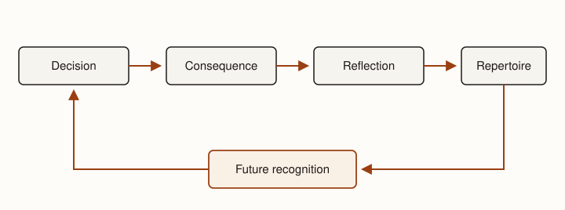
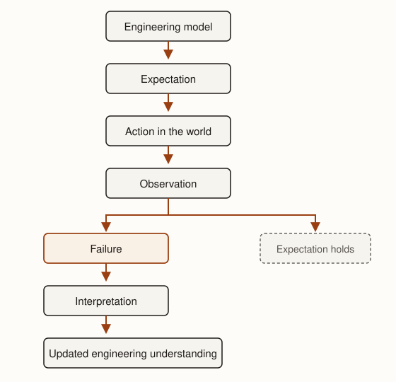
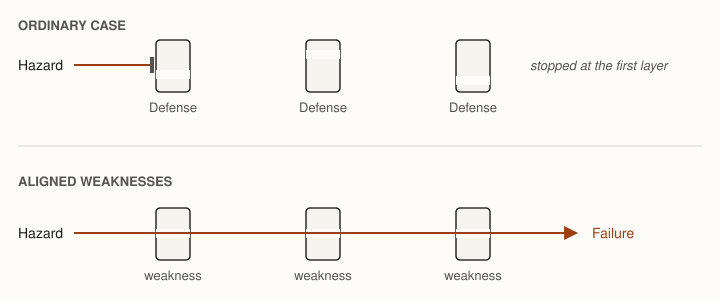
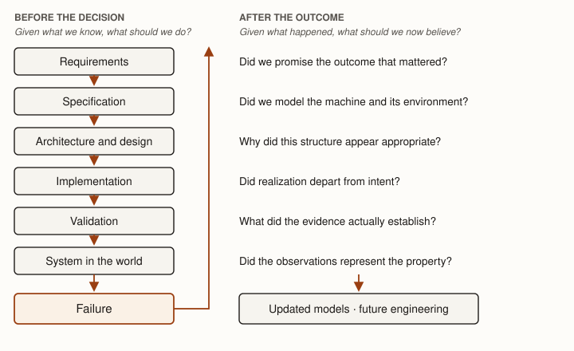

> Failure is central to engineering.
>
> — Henry Petroski [@petroski1992]

**Premise.** *Engineering judgment develops when engineers connect decisions to their consequences
and allow experience to change future decisions.*

Engineering is practiced with incomplete knowledge, imperfect models, fallible people, and finite
evidence. The techniques in this handbook are intended to make those imperfections apparent, so
that you engineer with full awareness of the hazards. Failure is therefore a predictable
engineering outcome; the question is what the engineer learns when reality violates expectations.

Throughout this book, we have used models to make engineering decisions explicit. Requirements
describe outcomes that matter in the world (@ch-requirements). Specifications describe obligations
of the machine and assumptions about its environment (@ch-specification). Architecture and design
describe how those obligations will be realized (@ch-architecture, @ch-design). Validation connects
claims about the system to evidence (@ch-validation). Metrics connect properties we care about to
observations we can make.

None of these activities makes engineering infallible. Requirements can omit something important.
Specifications can misrepresent the environment. Architectural decisions can create interactions
nobody anticipated. Designs and implementations can contain mistakes. Validation provides bounded
evidence rather than certainty. A system can therefore fail despite substantial and responsible
engineering effort.

Failure creates new evidence. The system has encountered circumstances under which some expectation
did not hold. Engineers can repair the immediate problem without learning much from that evidence,
or use the discrepancy to reconsider the understanding that produced the system. Failure-aware
engineering concerns the latter activity. It treats failure as part of a continuing engineering
process and asks what failed, why previous engineering did not reveal the problem, what the failure
teaches about the system and its environment, and what should change as a result. Those changes can
occur in the engineered system, in the knowledge and practices of the team, and in the judgment of
the individual engineer.

## Experience builds judgment {#sec-experience-builds-judgment}

The preceding chapters have taught one important form of engineering judgment: deliberate reasoning
about consequential decisions. Engineers identify the decision they face, construct appropriate
models, determine which properties matter, compare alternatives, gather evidence, quantify relevant
consequences where useful, and decide despite residual uncertainty.

Experienced engineers also exercise judgment through recognition. They notice that a seemingly
harmless assumption deserves investigation, recognize that two different systems share a
troublesome structure, or become suspicious of a result that satisfies the stated threshold but
conflicts with what they have seen elsewhere. The engineer may recognize which question needs to be
asked before knowing its answer.

This recognition develops from experience, but experience is not simply elapsed time. Engineers
encounter decisions and observe their consequences. Reflection connects the two: what did I expect,
what occurred, and what does the difference imply for a future situation? The resulting lesson
becomes part of the engineer's repertoire of situations, interpretations, and possible responses.

Donald Schön describes professional practice in terms of this relationship between action and
reflection [@schon1983]. Professionals can reflect while acting, revising their understanding as a
situation develops, and they can reflect afterward on what the experience revealed. In both cases,
practice produces more than an immediate outcome. Properly interpreted, it changes the resources
available for future judgment (@fig-reflective-cycle).

::: {.figure #fig-reflective-cycle alt="A cycle of four boxes across the top — Decision, Consequence, Reflection, Repertoire — connected left to right by arrows. An arrow leaves Repertoire, runs down and back to a highlighted box labeled Future recognition, and from there returns to Decision, closing the loop. A caption beneath the loop reads: recognition tells the engineer where deliberate reasoning is needed."}

Experience becomes judgment through reflection. A decision produces consequences; reflection
determines what those consequences reveal; the resulting lesson enters a repertoire the engineer
can recognize a situation against later.
:::

The relationship is reciprocal. Deliberate reasoning produces decisions whose consequences create
experience. Reflection can turn that experience into patterns an engineer later recognizes.
Recognition, in turn, helps the engineer identify where deliberate reasoning is needed. Mature
judgment therefore depends on both the ability to reason about a known problem and the ability to
recognize what kind of problem one is facing.

### Learning from success {#sec-learning-from-success}

Successful engineering contributes to this repertoire. A system that repeatedly produces the
intended consequences under varied conditions supplies evidence about the engineering decisions
that produced it. Engineers can learn which architectures tolerate growth, which interfaces remain
stable under change, which validation strategies reveal useful information, and which development
practices help teams make sound decisions.

Success can nevertheless be difficult to interpret. A system may operate successfully because its
architecture is robust, but it may also succeed because workloads remain forgiving, an incorrect
environmental assumption happens to hold, a latent defect is never exercised, or several weaknesses
never align. Observing success does not by itself distinguish among these explanations.

This is the same evidentiary problem encountered in @ch-validation. An observation becomes evidence
for a claim only through a model connecting the two. Successful operation under one set of
conditions is evidence about those conditions; broader conclusions require an argument about how
far the observation generalizes.

Failure often provides a sharper discrepancy. Something engineers expected to hold did not.

## Failure exposes a model {#sec-failure-exposes-model}

Suppose a service was designed under the assumption that an upstream dependency would respond
within two seconds. Months of normal operation may be consistent with that assumption without
establishing it as a reliable bound. An incident in which the dependency repeatedly takes thirty
seconds provides different information: the assumed bound does not describe at least some
conditions the deployed system can encounter.

The immediate engineering task may be straightforward. Engineers can introduce a timeout, change
retry behavior, isolate the dependency, or otherwise restore acceptable service. The incident also
creates a question about the understanding under which the system was engineered. Why was the
two-second assumption considered credible? Where was it represented? Which decisions depended on
it? What evidence supported it? Did engineers believe the dependency guaranteed the bound, or did
the assumption simply become embedded in the system without ever being made explicit?

::: {.figure #fig-expectation-observation width="52%" alt="A vertical chain: an Engineering model yields an Expectation, which leads to Action in the world, which yields an Observation. The Observation branches two ways. One branch, drawn in a lighter dashed box, is labeled Expectation holds. The other branch, highlighted, leads to Failure, then to Interpretation, then to Updated engineering understanding."}

An engineering model produces an expectation the world can contradict. When it does, the
observation becomes evidence about the model, but only after engineers interpret what the
discrepancy means.
:::

The interpretation step matters (@fig-expectation-observation). A failure does not explain itself. The first explanation engineers
construct may be wrong, and the same observation can be consistent with several causal accounts. A
production outage following a deployment may have been caused by the deployment, exposed by it, or
merely coincident with it. Reflection therefore requires the same discipline applied to other
engineering evidence: identify what was observed, distinguish observation from interpretation,
consider plausible alternatives, and determine how broadly the conclusion is justified.

The distinction between repair and learning follows from this model. Repair changes the immediate
system so that it again satisfies its obligations. Learning changes the understanding used in
future engineering. Many incidents require both, but accomplishing the first does not guarantee the
second.

## Experience does not guarantee learning {#sec-experience-not-learning}

Engineering organizations experience failures continually. Whether those experiences accumulate
into better engineering depends on what happens afterward.

A study of software-failure learning at a national space research center found that engineers did
learn from failures, but much of the learning was informal and individually driven
[@anandayuvaraj2026failures]. Reflection was not necessarily a routine organizational activity.
Knowledge could remain tacit, become fragmented across documentation systems, or depend on
experienced engineers remembering an earlier problem when a related situation arose. Practitioners
also described related problems recurring across projects and phases. The organization could
successfully repair individual problems without reliably converting each experience into durable
knowledge available to future engineering decisions.

That finding illustrates a more general distinction. An event can produce substantial experience
for the people directly involved while producing little persistent change in the engineering
organization. An engineer may remember the incident but later leave the team. A postmortem may
record what happened but be difficult for future engineers to find. A corrective change may
eliminate one observed manifestation while leaving the underlying condition available elsewhere.
@ch-engineering-knowledge described this movement as the difference between what an individual
knows and what the organization retains, represents, and can act upon.

The converse is also important. Engineers need not personally experience every failure from which
they learn. Case studies, postmortems, design reviews, conversations with experienced colleagues,
and preserved engineering knowledge allow one person's experience to contribute to another person's
repertoire. Engineering disciplines accumulate partly by making consequential experiences available
beyond the people who originally encountered them.

Failure-aware engineering therefore asks two related questions. What does this failure teach about
the engineered system? How should that lesson affect engineering after the immediate participants
and circumstances are gone?

Before answering them, engineers need to determine what kind of failure occurred.

## What failed? {#sec-what-failed}

Software failure is often discussed as though it were synonymous with an implementation defect.
That is the familiar case: the realized software does something its design did not intend. An
incorrect bounds check permits an out-of-bounds access; a mistaken condition sends execution down
the wrong path.

But software can fail even when every executed instruction behaves as its implementer intended. The
engineering activities developed in this handbook provide a sequence of progressively broader
questions about what an incident has revealed (@tbl-locating-failure).

| Engineering activity | A failure may reveal that… | Example |
|---|---|---|
| Implementation | The realized software departs from an otherwise adequate design. | Incorrect bounds handling permits an out-of-bounds memory access. |
| Design | A selected mechanism has consequences inconsistent with the properties it must satisfy. | A mechanism is functionally correct but cannot satisfy required latency under realistic load. |
| Architecture | Responsibilities, boundaries, resources, or interactions make an important system property fragile or impossible to preserve. | A critical function shares a resource whose exhaustion by another workload prevents the critical function from operating. |
| Specification | The required relationship between machine and environment was represented incorrectly or incompletely. | The machine behaves as specified, but an assumed environmental condition does not hold in deployment. |
| Requirements | The engineering effort pursued the wrong world outcome or omitted an important obligation. | A system performs its stated functions but fails an important stakeholder need. |

: Locating what an incident revealed among the engineering activities. {#tbl-locating-failure}

Implementation is the most familiar case: the realized artifact simply does something the design
did not intend. Design failures are subtler. The implementation may faithfully realize a selected
mechanism, but that mechanism may consume unacceptable time, memory, energy, or other resources.

Architecture widens the analysis further. Properties such as availability, isolation, and
throughput can depend on interactions among components that behave correctly in isolation. A
failure can therefore arise from how responsibilities, boundaries, resources, and interactions were
organized rather than from incorrect behavior within any one component.

Specification and requirements expose the least familiar possibilities. A machine can faithfully
implement its specification while the specification incorrectly represents the environment with
which it interacts. More fundamentally, software can correctly implement both its design and
specification while producing the wrong outcome because engineers committed to the wrong
requirement or omitted an outcome that mattered.

These categories are analytical aids rather than mutually exclusive classifications. One incident
can expose weaknesses at several levels. A requirements decision may create an unusually difficult
assurance burden; an architecture may make that burden harder to satisfy; an implementation defect
may provide the immediate trigger. The purpose of locating the failure is not to assign it to a
single box. It is to determine which engineering decisions deserve reconsideration.

That analysis also leaves another question unanswered. Whatever weakness existed, why did the
engineering process not reveal it before the failure became consequential?

## Why didn't we know? {#sec-why-didnt-we-know}

Validation asks engineers to connect consequential claims about a system to evidence. A delivered
failure provides an opportunity to examine that connection retrospectively.

@ch-validation distinguished the claim being evaluated, the scope at which the property exists, the
evidence mechanism used to observe or reason about it, the strategy used to search the relevant
behavior, the strength of the resulting evidence, and the judgment made from that evidence. A
failure can reveal a problem at any of these points.

Engineers may have validated the wrong claim. A team can accumulate extensive evidence that
individual components satisfy their interfaces while never asking whether the composed system
preserves the property that matters.

The scope can be wrong. Availability, resource isolation, end-to-end latency, and other
architectural properties may exist only at system scope. Evidence about individual components
cannot establish a property created by their interaction unless engineers have an argument
connecting the local evidence to the system claim.

The evidence mechanism can be poorly matched to the property. Ordinary execution tests can provide
strong evidence for many behavioral claims while providing little evidence about rare concurrency
schedules or adversarial memory-safety conditions. The mechanism may be useful without having the
detection power the consequential claim requires.

The strategy used with an appropriate mechanism can also miss the relevant condition. A testing
mechanism capable of exposing a defect provides no evidence about an execution the test strategy
never reaches. Similarly, operational measurements can fail to reveal a capacity boundary when
observed workloads remain far below it.

Finally, engineers can interpret reasonable evidence too strongly. Evidence supports a claim under
assumptions and with limitations. Those limitations are part of the engineering judgment
(@sec-strength-of-evidence).

::: {.note #note-failure-not-bad-validation title="Failure does not prove inadequate validation"}
A production failure does not establish that engineers should necessarily have discovered the
problem before delivery. Validation produces bounded evidence rather than certainty. Some adverse
outcomes remain inside residual uncertainty even after competent engineers have gathered evidence
commensurate with the expected consequence.

When failure occurs, ask what the new observation adds. It may reveal a weakness in the claim,
scope, mechanism, strategy, or interpretation of previous evidence. It may instead reveal an
uncertainty that was already recognized and deliberately accepted.
:::

This distinction prevents failure analysis from degenerating into hindsight. Knowing the outcome
changes what appears obvious. Failure-aware engineering instead reconstructs what engineers could
reasonably know before the outcome occurred and asks how the new evidence should alter future
decisions.

## Human error has structure {#sec-human-error}

Failure analyses often identify a human action somewhere in the causal history. Describing that
action as human error can be accurate while providing little guidance about what should change.

Donald Norman distinguishes between slips and mistakes [@norman2013]. A slip occurs when the
intended action is appropriate but execution does not match the intention. An engineer intends to
modify one configuration value and accidentally modifies another. The problem lies in carrying out
the intended action.

A mistake occurs when the action is performed as intended but the intention or plan is
inappropriate. An engineer deliberately modifies the intended configuration value because their
understanding of the system indicates that the change is safe. If that understanding is wrong, more
careful execution of the same plan does not help.

The distinction matters because the engineering responses differ. Slips can motivate interfaces
that make actions easier to distinguish, automation that removes repetitive manual operations,
constraints that prevent dangerous combinations, checks that expose accidental actions, or defaults
that make the safe action easier.

Mistakes direct attention toward the engineer's understanding. The relevant response may involve
better models, more accessible knowledge, different review practices, additional evidence, or cues
that cause engineers to recognize when a familiar decision is being made under unfamiliar
conditions.

In either case, telling people to be more careful is weak engineering when the environment can
economically make the error less likely or reduce its consequence. Human fallibility is one of the
conditions under which engineered systems operate. Designs can account for that condition just as
they account for unreliable networks, finite memory, variable workloads, and other properties of
the environment.

The slip-and-mistake distinction also matters for reflection. A mistake exposes an engineering
judgment that appeared reasonable to the person making it. Understanding why it appeared reasonable
can reveal missing knowledge or a model that future engineers might otherwise reproduce.

## Failures pass through systems of defense {#sec-defenses}

An error or defect does not necessarily become a consequential failure. Engineered systems contain
many mechanisms that can prevent, detect, contain, or mitigate problems: reviews, type systems,
validation, access controls, architectural boundaries, redundancy, monitoring, operational
procedures, rollback mechanisms, and others.

James Reason's Swiss-cheese model provides a useful representation of how failures can pass through
such defenses [@reason1990]. Individual defenses are imperfect. A weakness that passes through one
layer may be stopped by another. Consequential failure can occur when weaknesses in several
defenses align sufficiently for a hazard to propagate through them (@fig-defenses-alignment).

::: {.figure #fig-defenses-alignment alt="Two rows. In the upper row, labeled ORDINARY CASE, a hazard travels toward three defensive layers drawn as small blocks, each with a gap at a different height; the hazard is stopped at the first layer. In the lower row, labeled ALIGNED WEAKNESSES, the gaps in all three layers sit at the same height and the hazard passes through every layer to reach a failure."}

Each defense is imperfect, and each imperfection sits somewhere different. A hazard becomes a
consequential failure when several of those weaknesses happen to line up.
:::

The model discourages an analysis that stops with the person or component nearest the visible
failure. Suppose an implementation defect produces an invalid state. A type or memory-safety
mechanism might have prevented the state, validation might have exposed the defect, an
architectural boundary might have contained its effect, monitoring might have detected the problem
before substantial damage occurred, or an operational mechanism might have restored service
quickly. A consequential incident can therefore reveal information about several defenses even when
one defect supplied the initiating condition.

Investigations of this kind are conventionally called root cause analysis, and the term is worth
keeping because engineers will encounter it. The phrase can nevertheless mislead. A consequential
failure rarely has one cause; it has causes and contributing conditions whose combination produced
the outcome, and a report that names a single root has usually chosen one of them.

Reason's model should not be treated as a complete theory of causation either. Real incidents can
involve feedback, adaptation, organizational incentives, changing conditions, and interactions more
complicated than a sequence of defensive layers. Its value here is narrower: it directs engineering
attention from the visible error toward the system through which that error became consequential.

The question is therefore not only who or what made an error. Engineers should also ask which
conditions permitted the error to propagate and which defenses could economically prevent or
contain a similar event.

## How bad was the failure? {#sec-severity}

Failures differ in consequence. A misspelled label and an outage that prevents a safety-critical
service from operating are both departures from intended behavior, but they should not receive the
same engineering response.

Organizations commonly use severity classifications to make differences in consequence actionable.
The names and boundaries vary. An illustrative four-level scheme might distinguish the classes in
@tbl-severity-scale.

| Class | Consequence model | Relationship to engineering obligations |
|---|---|---|
| Critical | Catastrophic, mission-threatening, safety-critical, or system-wide consequential failure | A critical obligation is violated with severe realized or credible consequence |
| Major | Serious loss or degradation of important capability | An important obligation is substantially violated |
| Moderate | Bounded degradation with limited consequence or a practical workaround | A noncritical obligation is violated |
| Minor | Localized inconvenience or low-consequence deviation | A low-criticality obligation is violated |

: An illustrative severity scale, of the kind often numbered from Sev 1 down to Sev 4. The labels
are not universal definitions; an organization that uses such a scale must define what its levels
mean for the systems and consequences it manages. {#tbl-severity-scale}

The important engineering idea is what the scale represents.

::: {.definition #def-severity title="Severity"}
Severity is a model of the consequence of violating an engineering obligation. It is not an
intrinsic property of a defect.

An incorrect bounds check in a disposable local tool and the same defect in a network-facing
component controlling a consequential system do not create equivalent risk. The defect is
identical; the severity is not.
:::

Context matters as well. An outage can be minor under one operating mode and critical under another
because the obligations and consequences differ. A severity judgment therefore depends on the
violated obligation, operating context, extent of violation, and realized or credible consequence.
An organization must make these relationships operational if its severity levels are to mean
approximately the same thing to engineers applying them independently.

This relationship connects failure analysis back to @ch-specification. Specifications need not
treat every obligation as equally critical. Engineers can identify obligations whose violation
creates greater consequence, represent groups or classes of criticality, and distinguish priorities
where doing so supports later decisions. These priorities need not form a simple total ranking.
Criticality can depend on context, and two obligations can be consequential in ways that are
difficult to compare directly.

Criticality also connects failure analysis to validation. Before delivery, the consequence of
violating an obligation helps determine how much evidence engineers should demand before relying on
it (@sec-consequence-evidence). After a failure, the violated obligation and observed consequence
help determine the severity and therefore the appropriate response.

A severity classification is consequently another example of a metric as model. The label
compresses information about consequence into a representation that can support escalation,
resource allocation, investigation, and remediation. As with other metrics, its usefulness depends
on the relationship between the measured classification and the property engineers actually care
about.

## What changes because we failed? {#sec-what-changes}

Failure analysis has little engineering value if it produces no appropriate change. The change need
not always be large, and sometimes analysis will show that no additional intervention is
economically justified. When a lesson is consequential, however, engineers should consider where
that lesson belongs.

::: {.key-idea #key-learning-levels title="Three places a lesson can live"}
- **System.** Structure, safeguards, and validation can be changed so that recurrence becomes
  harder or its consequence smaller.
- **Team.** Knowledge, practices, and coordination can be changed so that engineers who did not
  experience the incident can still act on what it revealed.
- **Engineer.** An individual's repertoire, recognition, and judgment can be changed so that a
  resembling situation prompts investigation.

These levels interact. A lesson learned by an engineer can be communicated to a team. A team can
decide that the lesson is important enough to encode into architecture, tooling, validation, or
another part of the engineering environment. A structural change can then protect future engineers
who never learn the original history.
:::

### Change the system {#sec-change-the-system}

A common response to a software failure is to add a regression test that reproduces the conditions
under which the failure occurred. The test preserves useful engineering knowledge: if a later
change recreates those conditions, validation can expose the recurrence before delivery. For many
implementation defects, this is an inexpensive and effective response.

A regression test is memory, but extremely literal memory. It does not necessarily preserve the
more general lesson exposed by the failure. A buffer overflow triggered by one input may reveal a broader weakness in how lengths are represented
or checked. A capacity failure in one service may expose an architectural assumption shared by
several services. A new feature can recreate the same resource dependency through a different path
without reproducing the original incident closely enough to trigger its regression test.

Engineers should therefore ask what class of conditions the observed failure represents. Sometimes
the appropriate response remains a regression test. In other cases the lesson belongs in an
interface, architecture, specification, shared mechanism, static check, deployment control,
monitoring rule, or another part of the engineering environment.

This is the same movement of knowledge discussed in @ch-engineering-knowledge. A lesson can begin
as one engineer's experience, become an explicit representation, and eventually become part of the
structure within which future engineering occurs. When a consequential and sufficiently stable
lesson can economically be encoded in that structure, future engineers need not independently
remember the original incident to benefit from it.

Structural change is not always possible or desirable. Some lessons depend strongly on context.
Others concern tradeoffs that require future judgment rather than a fixed rule. Encoding every
incident as another mechanism can also accumulate complexity whose costs exceed the risks it
controls. The decision remains an engineering one: determine what the failure teaches, how broadly
the lesson applies, and which representation gives the lesson appropriate durability and force.

### Make the failure legible to others {#sec-failure-legible}

Lessons that cannot or should not be fully encoded in the system may still need to become available
to other engineers. A team cannot reliably learn from an incident whose interpretation remains only
in the memories of the people who handled it.

A postmortem is one mechanism for making an incident available for collective reflection. Practices
differ, but a useful postmortem ordinarily reconstructs the incident, its consequences, relevant
conditions, response, and actions intended to prevent or contain recurrence. The blameless
postmortem practice associated with site reliability engineering also discourages stopping at
individual fault [@lunney2016postmortem]. Engineers acted under particular information, incentives,
interfaces, procedures, and system conditions; understanding those conditions can reveal
interventions more useful than identifying a person who happened to perform the final action.

Failure-aware engineering adds another question to this reconstruction: under what engineering
understanding did the system appear acceptable before the failure?

Suppose an outage occurs because two services unexpectedly compete for the same finite resource. A
causal account might establish which workload increased, how the resource became exhausted, how
requests propagated, and which component ultimately stopped responding. Those facts are necessary
for understanding the incident.

A reflective account also asks why the architecture permitted the dependency. Engineers may have
believed that the workloads were independent. Perhaps the shared resource was absent from the
architectural representation. Perhaps it was represented but assumed to have effectively unlimited
capacity. Perhaps measurements supported that assumption under earlier workloads. Perhaps everyone
knew about the dependency but judged its failure sufficiently unlikely that isolation was not worth
its cost.

Those possibilities imply different lessons. A useful postmortem can therefore preserve two related
accounts (@tbl-causal-reflective).

| Causal account | Reflective account |
|---|---|
| What happened? | What did we expect to happen? |
| Which conditions contributed? | What model produced that expectation? |
| How did the failure propagate? | Which assumptions did that model depend on? |
| Which defenses prevented or failed to prevent propagation? | What evidence made those assumptions credible? |
| What changes can reduce recurrence or consequence? | What should change in our engineering understanding? |

: A causal account explains what produced the failure; a reflective account explains why the
available engineering knowledge permitted the system to remain credible. {#tbl-causal-reflective}

The reflective account is not an attempt to prove that someone should have known better. Sometimes
the reconstruction will show that the engineering decision was reasonable under the evidence
available at the time. That conclusion still produces useful knowledge. The lesson may concern
containment, margin, reversibility, monitoring, or how much consequence an acknowledged uncertainty
should be allowed to create.

In other cases, the reconstruction will expose a model that should have been questioned. The
important result is then not merely the historical fact that the model was wrong, but an
explanation of why it appeared adequate and what future circumstances should cause engineers to
reconsider a similar assumption.

This is how an incident becomes useful beyond its literal details. An incident record stating that
one workload exhausted one resource can help future engineers recognize that workload and that
resource. An account explaining that apparently independent critical and noncritical functions
shared an unmodeled resource teaches something that can be recognized in systems with entirely
different components. The later failure does not repeat the earlier incident. It resembles it in
the engineering relationship that matters.

### Change the engineer {#sec-change-the-engineer}

Some learning necessarily remains with people. Engineering encounters situations too varied to
encode every useful lesson into a rule, test, or architectural constraint.

Reflection contributes to the engineer's repertoire by identifying which aspects of an experience
deserve recognition later. The useful lesson from a failed deployment may not be the exact command
that caused it. It may be that a supposedly reversible operation depended on state outside the
rollback mechanism. The useful lesson from a performance incident may not be the particular
workload that overloaded one component. It may be that an asynchronous boundary hid a resource
dependency from the engineers reasoning about the critical path.

Such lessons influence what experienced engineers notice. A future design exposes a similar
relationship, and the engineer recognizes a reason to investigate it. The new situation need not be
identical to the old one. Recognition supplies a hypothesis that deliberate reasoning can then
examine.

This also explains why reflection should not end with a memorable story. Stories are useful because
concrete situations are easier to remember than abstract rules, but judgment requires some ability
to identify which features of the story mattered. Generalize too little and the engineer recognizes
only repetitions of the original incident. Generalize too far and the lesson becomes a slogan that
applies indiscriminately.

Reflection therefore involves modeling. The engineer chooses which relationships in an experience
explain its consequence and carries those relationships forward as candidates for future reasoning.

## Turn the handbook around {#sec-turn-the-handbook-around}

Before delivery, engineering is largely prospective. Engineers ask what the system should
accomplish, what behavior would satisfy those obligations, which structures and mechanisms can
realize them, and what evidence justifies believing that the resulting system is acceptable.
Failure permits the same reasoning to be examined retrospectively.

A reflective analysis can therefore retrace the major engineering activities developed in this
handbook:

- **Requirements.** Reconsider whether the requirements represented the outcomes that actually
  mattered. Did the system fail despite satisfying its stated requirements because an important
  stakeholder, consequence, or obligation was omitted or misunderstood?
- **Specification.** Reconsider the modeled relationship between the machine and its environment.
  Which obligations or environmental assumptions did the failure contradict, and why had those
  assumptions appeared adequate?
- **Architecture and design.** Reconsider the responsibilities, boundaries, interactions,
  resources, and mechanisms chosen to realize the specification. Which of these decisions
  contributed to the failure, and what understanding made the chosen structure appear appropriate
  beforehand?
- **Implementation.** Determine whether the realized system departed from the intended design. If
  so, examine both the defect and the engineering conditions that permitted it to be introduced and
  remain.
- **Validation.** Reconstruct the argument from claim to evidence. What claim was evaluated, at
  what scope, using which mechanism and strategy? What did the resulting evidence actually
  establish, and why was its remaining uncertainty judged acceptable?
- **Metrics.** Reconsider the models connecting properties to observations. Did the measurements
  used to understand or control the system represent the properties engineers believed they
  represented?

This retrospective traversal does not assume that every failure can be assigned to one engineering
activity (@fig-prospective-retrospective). Its purpose is to reconstruct the engineering
understanding embodied in the system and identify where the new evidence should change it. A
specification assumption may have shaped an architectural decision, for example, while the
resulting weakness remained undetected because validation was performed at the wrong scope.

::: {.figure #fig-prospective-retrospective alt="Two columns. The left column runs downward through Requirements, Specification, Architecture and design, Implementation, Validation, and System in the world, under the heading BEFORE DELIVERY and the question Why should we believe this? At the bottom, a highlighted Failure box sends an arrow back up the page into the right column, headed AFTER FAILURE and the question Why did we believe this? The right column carries one retrospective question opposite each activity, and they feed a box labeled Updated models and future engineering."}

Before delivery the activities run forward, each asking why we should believe the system will
produce the consequences we intend. A failure turns the same sequence around: each activity
acquires a retrospective question about the understanding under which it was performed.
:::

This retrospective use of the handbook is one reason a postmortem can contribute more than a
chronology of an incident. The system embodies earlier engineering decisions. Reconstructing those
decisions allows engineers to compare what was believed before the incident with what the incident
now gives them reason to believe.

A useful reflective account therefore preserves a change in engineering understanding. It explains
enough of the previous model to make the new model intelligible.

## Recurrence is evidence {#sec-recurrence}

A failure that has occurred before deserves particular attention. Recurrence can indicate that the
earlier experience changed too little, changed the wrong thing, or produced a lesson that did not
reach the engineering decision in which it was later needed.

The study of failure learning at the national space research center provides examples of this
problem [@anandayuvaraj2026failures]. Engineers described recurring failures while knowledge
remained distributed through individual experience, informal communication, and inconsistent
documentation. The organization contained people who had learned relevant lessons, yet those
lessons did not necessarily become available across projects or persist through time.

Recurrence can arise for several reasons. Engineers may repair the observed manifestation without
changing the condition that produced it. A team may understand the broader lesson but fail to
preserve or communicate it. The lesson may be available, but engineers may not recognize that it
applies to a superficially different situation. A structural intervention may prove weaker than
expected. The organization may also understand the failure correctly and deliberately tolerate some
probability of recurrence because eliminating it would cost more than the expected consequence
justifies.

The observation requires interpretation. Two incidents that appear similar may have different
causes, while two incidents that look different may expose the same engineering weakness. Counting
recurring incidents is therefore not itself a complete measure of organizational learning. At
scale, engineers can search incident records and postmortems for earlier failures that share the
same engineering relationship rather than the same literal symptoms. Language models can help
identify candidate relationships across large collections of incident reports, although engineers
must still judge whether two incidents genuinely express the same underlying lesson.

A consequential recurrence nevertheless creates a useful question: what did the previous experience
change, and why was that change insufficient here?

The answer can direct engineers back through the levels discussed above. If only the observed
instance was addressed, the system may need a more general structural change. If the lesson
remained with a few individuals, the team may need a more durable representation. If the lesson was
known but not recognized as applicable, the experience may need to be generalized differently. If
the recurrence was an explicitly accepted risk, engineers can reconsider whether the new evidence
changes the original tradeoff.

The first failure supplies evidence about the engineered system. Recurrence can additionally supply
evidence about how the engineering organization learns from failure.

## Measuring learning from failure {#sec-measuring-learning}

Failure-aware engineering creates an understandable desire for measurement. If an organization
invests in postmortems, corrective actions, regression tests, and other mechanisms for learning
from failure, engineers should ask whether those investments are changing what happens afterward.

Some useful observations are straightforward. Teams can measure the frequency and severity of
incidents, the time required to detect and recover from them, and the fraction of corrective
actions that are completed. They can identify failures that recur and measure the interval between
occurrences. They can examine whether similar failures appear in different components or projects.
They can also measure properties of the learning process itself: how quickly consequential
incidents are analyzed, whether identified actions are completed, and whether lessons judged
relevant to other teams are communicated or encoded into shared engineering structures.

These measurements answer different questions. Mean time to recovery describes operational
response, not learning. Action-item completion measures whether planned work occurred, not whether
the planned work addressed the important lesson. A declining incident count may indicate
improvement, but it can also reflect lower usage, changed workloads, or differences in reporting.
Recurrence can indicate that an earlier lesson was insufficiently generalized or applied, but
deciding whether two incidents represent the same underlying failure requires an engineering model
of what they have in common.

A small set of measures can nevertheless make the learning process more observable
(@tbl-learning-observables).

| Observation | What it can help reveal | What it does not establish |
|---|---|---|
| Failure frequency and severity | How often consequential failures are observed and how serious their consequences are | Why the rate changed, or whether engineers learned |
| Detection and recovery time | How effectively the system and organization expose and contain failures | Whether the underlying engineering weakness was removed |
| Corrective-action completion | Whether agreed changes were carried out | Whether the actions represented the right lesson |
| Recurrence | Whether related failure conditions continue to produce incidents | Whether two incidents share the same underlying engineering cause |
| Cross-project recurrence | Whether a lesson may have failed to propagate through the organization | Whether communication alone would have prevented the later failure |
| Structuralization of lessons | Whether lessons become tests, checks, models, architecture, tooling, or other durable engineering structure | Whether the encoded lesson is sufficiently general, or worth its cost |

: Observations that make a failure-learning process visible, each paired with the inference it does
not license. {#tbl-learning-observables}

The final row returns to a problem developed in @ch-engineering-knowledge. A lesson that moves from an
individual's memory into a test, model, validation rule, architectural constraint, or other shared
structure has become more durable. Counting such changes can describe one aspect of organizational
learning. It does not establish that the organization has learned everything the incident could
teach.

::: {.key-idea #key-judgment-not-measurable title="Judgment is not directly measurable"}
Engineering judgment itself should not be reduced to a metric. Judgment is the capacity to
recognize what matters in a particular situation and reason appropriately about it. No count of
incidents, postmortems, completed actions, or accumulated years of experience directly measures
that capacity.

This limitation follows from the model of metrics developed earlier in the handbook. A metric
connects a property we care about to observations we can make. The farther the observable quantity
lies from the property of interest, the stronger the model required to interpret it. We can observe
whether an engineer notices a particular hazard, asks a useful question, revises a model after
contrary evidence, or makes a sound decision in a particular case. Those observations can provide
evidence about judgment. They do not produce a context-independent quantity of judgment possessed
by the engineer.
:::

This matters especially when measurements become targets. Counting postmortems can encourage
writing postmortems. Counting action items can encourage producing action items. Counting recurring
incidents can encourage classifying incidents as unrelated. None guarantees that engineers have
improved the models and recognition they bring to future decisions.

Failure-aware engineering should therefore use metrics to make the learning system more observable
without pretending to quantify the judgment produced by that system. The important question remains
whether experience changes future engineering appropriately. Metrics can provide evidence for
answering that question; they cannot answer it by themselves.

## Measurement for decision-making {#sec-measurement-failure-aware-engineering}

The preceding section asked whether an organization's learning can be observed. This one asks what
the failure itself measured.

Every chapter of this handbook developed a model and then asked what an engineer could observe to
find out whether the model still held: whether change remains controllable
(@ch-software-engineering), whether the process fits the work as the work actually behaves
(@ch-process), whether the organization supplies the coordination the system demands (@ch-teamwork),
whether consequential knowledge survives to reach the decision that needs it
(@ch-engineering-knowledge), whether the promised outcome occurred (@ch-requirements), whether the
model of machine and environment still describes reality (@ch-specification), whether the predicted
properties emerge from the composition (@ch-architecture), whether the chosen mechanism produced the
tradeoff it was chosen for (@ch-design), whether the evidence is strong enough for the consequence
of being wrong (@ch-validation), and whether further investigation is buying information that
changes what we do (@ch-research-and-development). In each case engineers selected the observation,
and selected it while there was still time to deliberate.

Failure is the same loop running the other way. The observation is not selected, it arrives at a
time nobody chose, and it already disagrees. The deliberate work that remains is the step the
forward loop performs first: deciding which model the observation is about.

That is the movement of the entire book, compressed. We made decisions using models. We measured
reality to inform those decisions. Reality eventually contradicted one of our expectations. Which
model should change?

The retrospective traversal earlier in this chapter (@sec-turn-the-handbook-around) is the procedure
for answering that question, and its final entry deserves particular attention. A metric is a model
connecting a property we care about to something observable, so a metric can fail the way any other
model fails. Consider a service whose dashboard showed a healthy request-success rate throughout an
outage, because the rate was computed at a load balancer that never saw the requests dropped
upstream. Nothing was wrong with the measurement. What was wrong was the claim engineers had
attached to it. A failure alongside untroubled indicators is evidence about the indicators, and an
incident review that repairs the system while leaving that model intact has spent the failure
poorly.

Failures are expensive observations, and the organization has already paid for them. What remains is
to spend them on the model that deserves to change rather than on the smallest repair that makes the
symptom go away.

## Becoming a reflective engineer {#sec-reflective-engineer}

Failure-aware engineering is ultimately part of developing professional judgment. The engineer
begins with models and evidence, acts under uncertainty, observes consequences, and revises future
reasoning when those consequences reveal something important.

The models in this chapter support different parts of that activity. Schön explains how reflection
on practice contributes to professional judgment. Norman's distinction between slips and mistakes
helps engineers distinguish failures of execution from failures of intention or understanding.
Reason directs attention from a visible error toward the defenses and conditions through which it
became consequential. Severity classifications model the consequence of violating engineering
obligations. Validation provides a vocabulary for examining why earlier evidence did not reveal
what the world eventually did. Postmortems and other engineering records allow lessons to become
available beyond the people who directly experienced them.

None provides a mechanical procedure for learning the correct lesson. Reflection itself is an act
of engineering judgment. Engineers can infer the wrong cause, overgeneralize from one incident,
preserve irrelevant details, or impose an expensive control whose benefit does not justify its
cost. Lessons from failure therefore deserve the same skepticism applied to other engineering
knowledge.

A useful reflective practice begins by reconstructing the expectation and the observation. What did
you expect? What occurred? Why did the expectation appear credible? Which part of your
understanding does the observation actually challenge? What alternative explanations remain? How
broadly does the lesson generalize? What should change in the system, in shared engineering
knowledge, or in your own future judgment?

Success, near misses, experiments, and other engineers' experiences can contribute similarly when
they provide evidence across new conditions. The purpose is not to accumulate personal failures,
but to become increasingly capable of connecting engineering decisions with their consequences.

No engineer reaches a point at which this process becomes unnecessary. Systems change, environments
change, organizations change, and engineers take responsibility for systems unlike those they have
previously encountered. Models remain selective representations of reality, and evidence remains
finite.

Engineering therefore requires both forms of judgment developed in this chapter and throughout the
book. Deliberate reasoning helps engineers make consequential decisions under uncertainty.
Experience and reflection expand the repertoire with which engineers recognize what deserves such
reasoning in the first place. Each can improve the other over a career. A failure-aware engineer
treats the discrepancy between expectation and reality as new engineering evidence, determines what
that evidence supports, and allows consequential lessons to change future work. Failure is
inevitable. Recurring failure is not.

## Summary

Engineering judgment develops through the relationship between decisions and their consequences.
Deliberate reasoning constructs models, compares alternatives, gathers evidence, and supports
decisions under uncertainty. Experience contributes another form of judgment: recognition of
situations, assumptions, and hazards that deserve attention. Reflection connects the two by asking
what an outcome reveals about the understanding that preceded it.

Failure is particularly informative when it contradicts an engineering expectation. The
contradiction does not interpret itself. Engineers must determine what failed and what the
observation actually supports. Failures can originate in requirements, specification, architecture,
design, or implementation, and one incident can expose weaknesses at several levels.

A delivered failure also invites examination of validation. Engineers can reconsider the claim they
evaluated, the scope at which the relevant property existed, the evidence mechanism and search
strategy they used, the strength of the resulting evidence, and the judgment made from it. Failure
does not prove that the earlier validation was inadequate; finite evidence always leaves residual
uncertainty.

Human contributions to failure also require interpretation. Slips and mistakes suggest different
interventions, while systemic models such as Reason's direct attention toward the defenses and
conditions that permit an error to become consequential. Severity classifications then connect
observed failures to consequences and to the criticality of engineering obligations. These
classifications are models used to support decisions, not intrinsic properties of defects.

Learning from failure can change the system, the team, and the engineer. Regression tests preserve
particular examples, while structural changes can encode more general lessons into the engineering
environment. Postmortems and other representations make failures available for collective
reflection, especially when they reconstruct both what happened and why the previous engineering
understanding appeared adequate. Individual reflection contributes patterns and relationships to
the engineer's repertoire for future recognition.

Recurrence provides additional evidence. It can indicate that an earlier repair was too narrow, a
lesson was not preserved or communicated, engineers failed to recognize its applicability, or an
accepted tradeoff deserves reconsideration. Metrics can make a learning process observable, but
they cannot measure the judgment that process is meant to produce.

Failure-aware engineering does not promise the elimination of failure. Engineering is performed
with incomplete models, finite evidence, and residual uncertainty. Its obligation is instead to use
consequential experience well: repair what failed, understand what the failure revealed, preserve
lessons worth retaining, and allow new evidence to improve the decisions that follow.

::: read_further
Schön, Donald A. *The Reflective Practitioner: How Professionals Think in Action*. New York: Basic
Books, 1983. How professional judgment develops through reflection on practice. Read for
reflection-in-action, reflection-on-action, and the repertoire an experienced practitioner brings
to a new situation.

Norman, Donald A. *The Design of Everyday Things*. Revised and expanded ed. New York: Basic Books,
2013. The distinction between slips and mistakes, and why apparent human error often points at the
conditions and artifacts through which people act.

Reason, James. *Human Error*. Cambridge: Cambridge University Press, 1990. A systemic account of
human failure, latent conditions, and defenses. Read for the reasoning behind the Swiss-cheese
model rather than the diagram itself.

Petroski, Henry. *To Engineer Is Human: The Role of Failure in Successful Design*. New York:
Vintage Books, 1992. How engineering disciplines have treated failure as knowledge about the limits
of their designs and models.

Lunney, John, Sue Lueder, and Gary O'Connor. ["Postmortem Culture: Learning from
Failure."](https://sre.google/sre-book/postmortem-culture/) In *Site Reliability Engineering: How
Google Runs Production Systems*, edited by Betsy Beyer, Chris Jones, Jennifer Petoff, and Niall
Richard Murphy. Sebastopol, CA: O'Reilly Media, 2016. A production practice for turning operational
failures into shared organizational knowledge.

Anandayuvaraj, Dharun, Tanmay Singla, Zain A. H. Hammadeh, Andreas Lund, Alexandra Holloway, and
James C. Davis. "Learning From Software Failures: A Case Study at a National Space Research Center."
In *Proceedings of the 48th IEEE/ACM International Conference on Software Engineering*, 2026.
Empirical evidence on how practitioners gather, document, share, and apply lessons from failure,
and what happens when that learning stays informal.
:::
