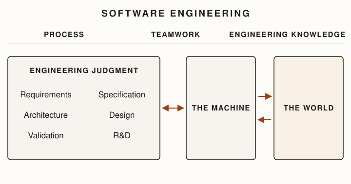

This handbook covers software engineering, process, teamwork, engineering knowledge, requirements,
specification, architecture, design, validation, and research and development.
The chapters follow a linear sequence to show the shifting concerns of engineering work, as well as
the judgments that are sustained throughout the process.
Real engineering is less orderly.
Requirements change as engineers learn, design can expose architectural problems, and validation
can reopen earlier decisions.

In this handbook, I make one change to the usual sequence of engineering work.
Research and development (R&D) typically occurs near the beginning, but we place it at the end.
R&D asks engineers to decide where scarce effort should go when they do not yet know what is
possible, whether an obstacle requires a genuinely new idea, and what evidence would establish an
advance.
These decisions are difficult to appreciate without some engineering experience.
By the end of the handbook, the reader will have developed more of the judgment needed to
understand them.

::: {#fig-judgment-machine-world .figure .unnumbered width="88%" alt="Under a heading reading Software Engineering, a full-width band names three sustained concerns: Process, Teamwork, and Engineering Knowledge. Below the band, a large box labeled Engineering judgment holds six judgment labels in a grid: Requirements, Specification, Architecture, Design, Validation, and R&D, with no connections among them. A double-headed arrow joins the judgment box to a peer box labeled The machine, and two opposing arrows join The machine to a tinted box labeled The world."}

:::

## How to read this book

Each chapter follows a recurring pattern. It first identifies the consequential decisions engineers
face in that part of software development: what must be decided, what alternatives are available, and
what consequences distinguish them. It then examines the knowledge and evidence that can inform those
decisions. The purpose is to make engineering judgment explicit enough to study and practice.

The chapters do not provide algorithms for making these decisions. Engineering judgment is necessary
precisely because consequential decisions usually involve competing considerations, incomplete
knowledge, and uncertainty. Instead, the chapters identify what deserves attention, provide ways to
reason about it, and develop the evidence from which a defensible decision can be made.

### A note about metrics

Metrics appear throughout this book. Engineering decisions are made under uncertainty, and
measurement is one of the principal ways engineers turn observations into evidence. Whenever
something matters, we can ask: What could we observe or measure that would tell us something about
it? The answer may be straightforward for properties such as latency or memory consumption. It
becomes more difficult for properties such as maintainability, productivity, usability, team health,
or delivered value.

Choosing a metric is itself an engineering judgment. A metric is a model: it represents some property
of interest through something we can observe or measure. That representation is necessarily
incomplete. Engineers must ask what a metric captures, what it omits, what assumptions connect it to
the property of interest, and what other evidence should accompany it. Almost no consequential
engineering decision can be reduced responsibly to a single metric. Measure the property at the scope
where it matters.

Metrics can also change the systems they measure. Once a measurement becomes a target, people and
systems may optimize for the measurement rather than the underlying property, an observation commonly
associated with Goodhart's Law. Later chapters show concrete examples of metrics that under-explain a
property, mislead decision-makers, or invite gaming. The lesson is not to avoid measurement, but to
treat the selection, interpretation, and combination of measurements as part of engineering judgment.
