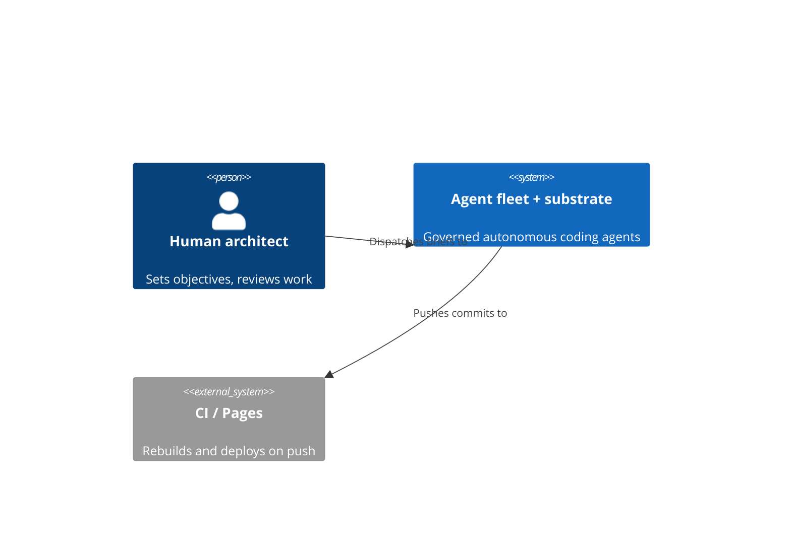
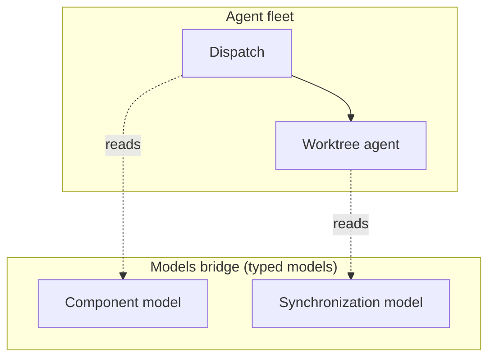
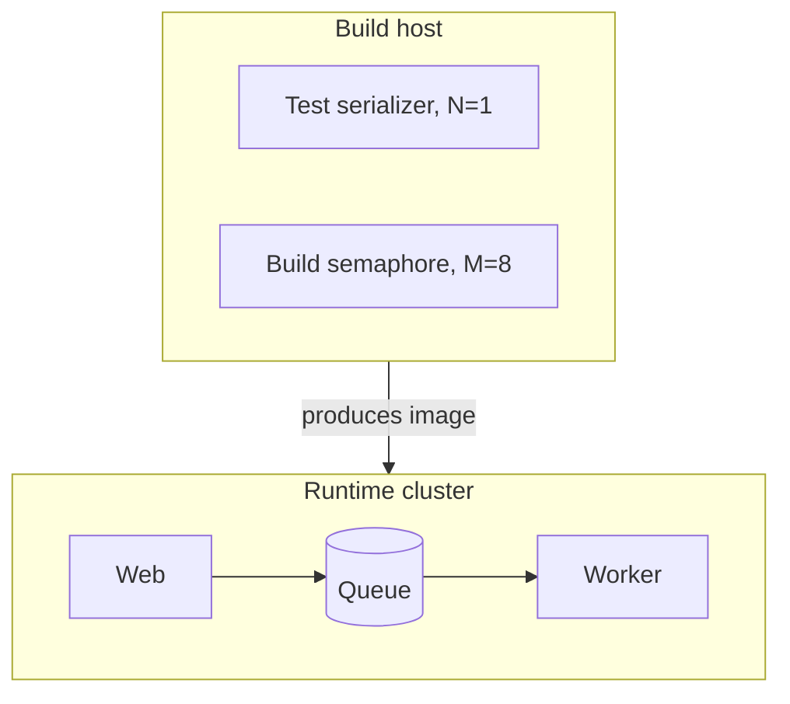
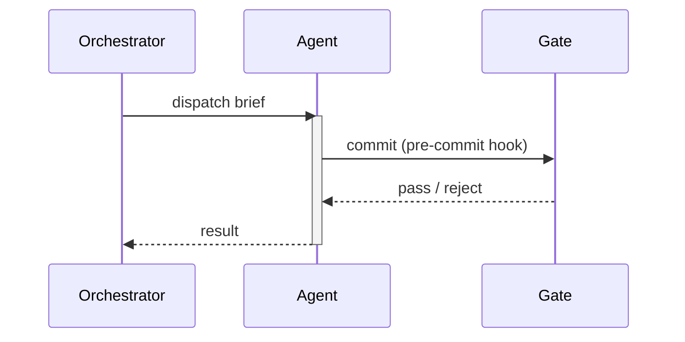
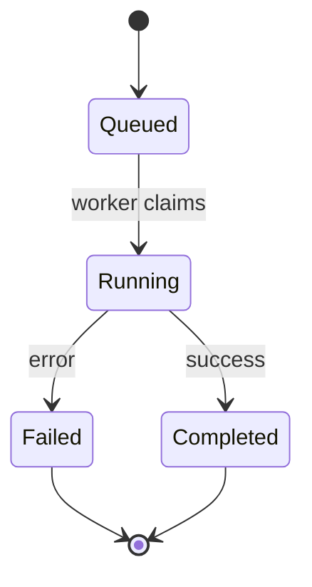
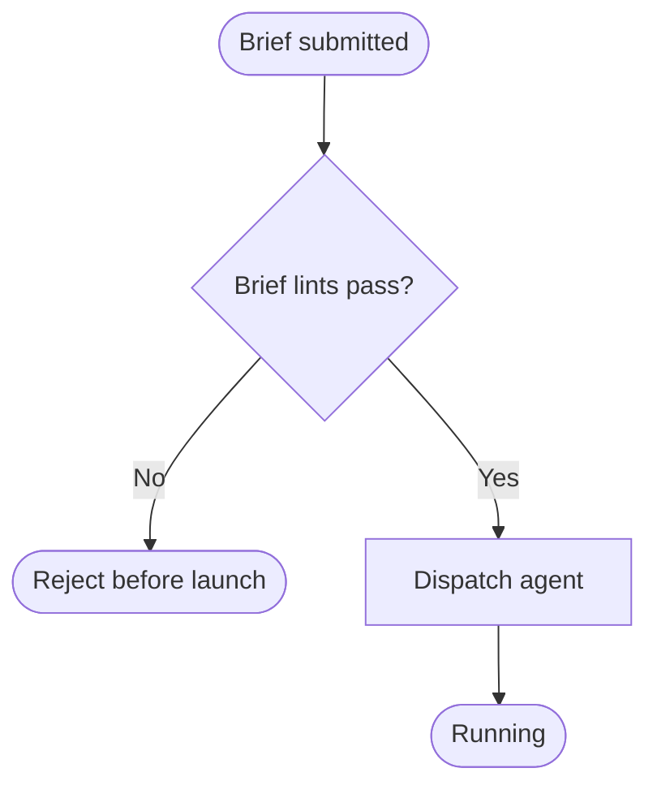
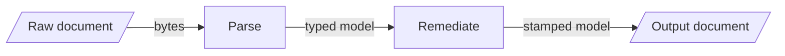
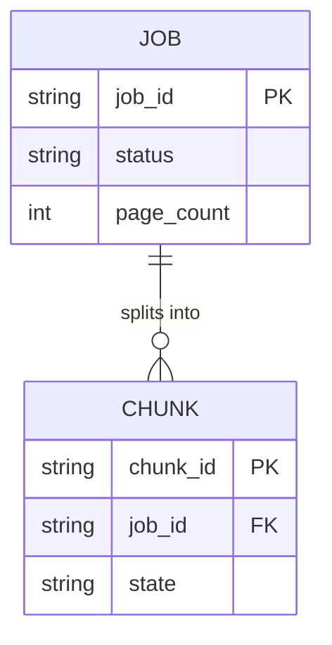
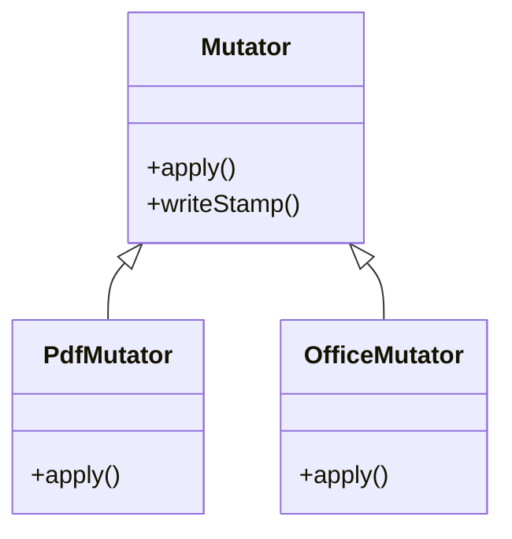

# diagrams.md — technical-diagram types and how to realize them

This is an **agent-facing** style doc (the drawing leg of the `self-communicate` skill, alongside the writing files), not a catalogue entry.
It is not rendered to HTML or served. It is the **visualization leg** of
self-communicate: the standard technical-diagram types, when to reach for each, and how to realize one.

Read it alongside its prose siblings — [`../writing/engineering.md`](../writing/engineering.md) (the
engineering-discourse layer: Diátaxis modes, docs-as-code), [`../writing/voice.md`](../writing/voice.md) (the
target register), [`../writing/rhetoric.md`](../writing/rhetoric.md) (the prose device toolkit), and
[`../writing/lexicon.md`](../writing/lexicon.md) (term discipline). Prose carries the argument; a diagram carries
the *shape* — a structure, a flow, a lifecycle, a schema. When the thing you are explaining has a shape,
draw it.

This doc picks the diagram **type** and realizes it. Its drawing sibling
[`figures.md`](figures.md) governs a prior, orthogonal question — the **editorial** judgment for a
*teaching* figure: what it should show, how much, and how it relates to the figures around it in the book.
Apply `figures.md` first to decide what the figure says; apply this doc second to decide how to draw it.

---

## Realization rule — Mermaid first, HTML/SVG only when it can't

**Author the diagram in [Mermaid](https://mermaid.js.org/) unless the layout genuinely needs a hand.**
Mermaid is text: an agent writes the diagram source directly in a fenced ```` ```mermaid ```` block, the
same way it writes a code sample. That text renders inline on GitHub and in most Markdown viewers, lives
in the same file as the prose it supports, and diffs like code. It fits docs-as-code — the diagram is
reviewed, versioned, and regenerated in the same pass as the paragraph beside it, so it can't silently
fall out of date the way a checked-in `.png` exported from a drawing tool does.

**Drop to hand-authored HTML / inline SVG only for a bespoke layout Mermaid cannot express.** The escape
hatch is real but narrow: reach for it when the picture needs precise spatial control Mermaid's
auto-layout won't give — overlapping zones, a custom legend, a non-graph geometry, a figure that is as
much an infographic as a diagram.

The canonical example is the catalogue's own landing figure — a hand-authored **"Y"** that draws one
method forking into a product-facing arm and an orchestration-facing arm over a shared spine, as
full-width inline SVG, because the fork-with-a-straddling-spine geometry is not a tree, a flowchart, or
any Mermaid graph shape. That figure earned the drop to SVG. Most diagrams do not; **default to Mermaid,
and justify the escape.**

- **Reach for Mermaid when:** the diagram is a graph, sequence, state machine, ER schema, or class model
  — anything with nodes and edges an auto-layout can place. This covers almost every case.
- **Drop to HTML/SVG when:** you need spatial control Mermaid won't give (custom zones, overlays,
  legends, a non-graph geometry). Cite the reason in a comment so the next reader knows it was a choice,
  not a default. See the accessibility section below — a hand-authored SVG carries its own a11y burden.

---

## Use the native construct, not stitched primitives

The drawing leg of the second governing stance (SKILL.md, §"The second stance: name the concept, then use
the name"): **when a format gives you a named construct for a thing, use it — do not re-assemble the thing
from lower-level primitives.** The native construct carries its own correct behavior; the hand-stitched
version reproduces the *appearance* and loses the *behavior*, which is exactly where it breaks.

The canonical case is the arrowhead. SVG has a native arrow: a `<marker>` referenced by `marker-end` (or
`marker-start`) on a `<line>` or `<path>`. With `orient="auto"` the marker rotates to the direction of its
line and pins to the endpoint, so it always points along the line, at the target — it *cannot* land rotated
or off-target. A hand-placed triangle `<path>` at a guessed position and angle has none of that: it looks
right in the one layout the author eyeballed and drifts the moment the line moves. Use the marker.

- **Draw the marker in the `+x` convention.** `orient="auto"` aligns the marker's local +x axis with the
  line's direction, then rotates the whole marker. So draw the arrowhead pointing along +x — apex at the
  right, e.g. `M0,0 L10,5 L0,10 Z` with `refX="10" refY="5"` — NOT pointing "up" or "down". A triangle
  drawn pointing along its own +y renders *perpendicular* to the line after auto-rotation; drawing the head
  in screen-up orientation is the single most common way a native marker still lands wrong. Let `orient` do
  the rotating.
- **A stroke must never cross a glyph.** A line running through its own label, or through another element's
  text, is never acceptable — route the connector to one side, break it, or move the text. (The width
  heuristic in the figure text-fit checker is blind to this; the line-through-text audit catches it, and
  otherwise watch for it by eye.)
- **Every edge terminates on — and plugs into — a named node.** A connector runs from one named element to
  another (a box, a labeled node) and never into open space, onto a bare field/background region, or to an
  ambiguous point near another edge. This is graph semantics: an edge asserts a relationship between two
  named things, so a line ending in whitespace asserts a relationship to nothing and misreads. If the
  destination is not worth naming, do not draw the edge. Use a field/container boundary as context, never as
  an endpoint (the region is not a node). Swoops and shallow curves are fine — a curved *body* is a style
  choice, not a defect; what must not happen is a *floating end*.
  - **The connect grammar** (proven on the engineering-capital figure; mechanically enforced). Give every
    node a native SVG `id`. Precede each connector with a declaration comment — `<!-- edge: SRC -> DST -->`
    for solid, `<!-- edge: SRC .. DST -->` for dotted (the markers are `->` / `..` because the sequence
    `--` is illegal inside an XML comment). Then two rules make the join clean at any angle: **draw the
    edges UNDERNEATH the nodes**, and **run each endpoint to the node's CENTER** — the node's opaque fill
    caps the line end, so it plugs in with no gap. The failure this kills: an endpoint that stops at a
    hollow shape's rim or in the thin gap beside it — geometrically "near," visibly floating in a busy
    figure (the endpoint grazed the rim of a node drawn *under* the edge). A simpler figure may accept a
    slightly-short connector by opting into the looser grammar with a standalone
    `<!-- edge-grammar: float-ok -->` marker comment.
  - **Enforcement.** A dangling-edge lint resolves each declared edge to its two nodes' geometry and checks
    that both endpoints land *inside* them (strict connect-inside by default; the `float-ok` marker relaxes
    it to a rim-touch). It skips figures that have not adopted the schema, so adoption is incremental. It is
    audit-only until a figure family is migrated. The lint proves the *coordinates*; it cannot see the
    *picture* — always pair it with the render-and-look step below.
  - **Directed edges invert the attach move.** The center-plug rule above is for an *undirected* relation
    line. A *directed* edge — one carrying an arrowhead or a crow's-foot cardinality glyph — must do the
    opposite: seat the endpoint on the target's **perimeter** so the **arrowhead tip touches the boundary
    and the head body sits OUTSIDE the fill**, with the edge drawn on top. Run a directed endpoint to the
    center and the node fill *buries the arrowhead* — erasing the mark that carries the edge's direction.
    - **The failure to avoid** is the *inner-rim* seat: pushing the endpoint a few px INSIDE the node so a
      "must be inside" check passes leaves the whole arrowhead a hair under the border — it reads as landed
      *in* the node, not *arriving at* it. Seat it the other way: the head base just OUTSIDE the rim.
    - **The seating recipe.** For a target node with center `C` and an approaching endpoint coming from
      point `P`, set the line's end to `E = C − (r + tip) · unit(C − P)` for a circle (radius `r`), or to
      the point where segment `P→C` crosses the box border, nudged `tip` px back outward, for a box. `tip`
      is the marker's tip overhang (~1–3px for a thin arrowhead) so the tip lands right on the boundary.
      Then **render and zoom the arrowhead** to confirm the head sits on the rim — this is sub-pixel work
      the numbers get close to but the eye settles (exemplar: the observed-vs-declared figure's A→B / A→C).
    - **The lint is marker-aware.** It reads `marker-end`/`marker-start` (on the drawable OR an enclosing
      `<g>`): a directed end is allowed to sit slightly *outside* the rim (up to a marker length) and is
      flagged if it is *buried* deep inside — the opposite of the undirected must-be-inside rule. So correct
      directed seating passes and a buried head is caught; you do not have to push the endpoint inside to
      satisfy it. Most real diagrams are directed.
    - **A head arrives PERPENDICULAR into the border it crosses.** `orient="auto"` points a head along the
      edge's end tangent, so a curve (or diagonal line) approaching at a shallow angle lays its head flat
      along the border — it reads as landing *in* the node, not *arriving at* it. The head must aim into the
      node: **radially** for a circle, along the **inward normal of the entered edge** for a box — which for
      a WIDE box is *not* aiming at the box centre (an arrow dropping straight into the top of a wide box is
      correct though the centre lies far to one side). The lint checks this (tolerance a few degrees above
      the coordinate-rounding floor); its **`--fix`** auto-repairs it deterministically — re-aiming a cubic's
      last control point, or bending a straight line / M-L path into a gentle curve that departs along its
      chord and arrives perpendicular. `python3 book-models/lint_figure_dangling_edge.py --fix`.
    - **A child edge LEAVES THE PARENT'S FLOW BORDER, not a perpendicular side.** A parent/source node's
      outgoing edge to a downstream child must leave the flow-direction border — the source's **bottom** in a
      top-down figure, the facing **side** in a left-to-right one — and enter the child's **leading** border
      (the child's top for top-down). It must **not** exit the source's perpendicular left/right side: a child
      edge leaving a side breaks the parent→child hierarchy, because the source stops reading as the parent.
      For a **fan-out** (one source, several children spread below), every edge leaves the source's bottom —
      the exits distributed along the bottom edge, or a short common trunk dropping from bottom-centre that
      then branches — runs down, goes horizontal to above each child, and drops into the child's top. This is
      a **two-turn flow elbow** (down, across, down for top-down): a single elbow can exit the flow border OR
      enter the leading border, never both, so a diagonal downstream child needs the two turns. The
      orthogonal router builds it: it reads the figure's flow axis from the dominant source→sink direction,
      then for a downstream child forces the exit onto the parent's flow border (overriding the dominant-axis
      single-elbow choice, which would exit a side). `python3 book-models/lint_figure_dangling_edge.py
      --orthogonalize`. The `figure-edge-should-be-orthogonal` sensor flags a **PARENT_SIDE_EXIT** — a
      downstream child edge that leaves its parent on a perpendicular side — independently of the edge's drawn
      shape, so even a clean ortho-elbow that side-exits is caught and cannot regress.
    - **`--fix` cannot see labels; `keep-angles` opts a figure out.** The auto-repair bends a head to
      perpendicular geometrically — it does not know a `<text>` label sits on the diagonal it would sweep
      through. On a decision-tree whose branch labels ("no"/"yes") ride the diagonal, a *straight* diagonal
      that clears the label beats a perpendicular curve through it. Such a figure carries a standalone
      `<!-- edge-grammar: keep-angles -->` marker: the angle check and `--fix` both leave its head angles
      alone (seating is still enforced), so a later `--fix` never re-introduces the collision.
  - **Forbidden / absent edges.** Two idioms, opposite handling. A *deliberately-unreached ghost* — an arc
    that curves away and is struck through to read as "does not connect" — is exempt from connect-inside;
    forcing it onto the node contradicts its meaning, so leave it unannotated (the lint skips it). A
    *struck-but-spanning* "no edge" — a line that does run between the two nodes with an X on it — is a real
    connection visually and **must** still plug both ends in; annotate it like any dotted edge. The `->`/`..`
    markers carry solid-vs-dotted only; "forbidden" currently rides on the drawn X glyph.
  - **A node need not be a drawn shape.** When an edge targets a bare `<text>` label with no box or circle,
    give it a **transparent anchor** — a `<rect>` with `fill="none" stroke="none"` carrying the `id`, sized
    over the label. Zero visual change, and the lint reads its geometry like any node. (Preferred over
    teaching the lint font-metric text extents.) Fan-in — many edges sharing one destination id — and a node
    with several edges both work as-is; no special grammar. One real limit remains: the lint's node reader
    recognizes only `id`-bearing `<circle>`/`<rect>`, so a `<polygon>` (diamond, parallelogram, hexagon) or
    a cylinder group can't yet carry a lint-legible id — annotate such a figure only after adding a
    transparent-rect anchor, or leave it float-fixed-by-eye until the node reader grows those shapes.
  - **Fork / merge — one path per branch.** A connector the reader sees as a single trunk that *splits* to
    N targets (or N sources that *merge* into one head) has no single drawable whose two ends land on named
    nodes. Encode it as **one `<path>` per logical branch**, each running source→target so each terminates on
    its own node; the branches share/overlap pixels along the trunk, so it still reads as one fork/merge while
    every edge is lint-legible. (Recurred across several chapter graphs — obligation→N-questions forks,
    N-methods→gate merges.)
- **Reach for the format's named shape in general** — `<rect rx>` for a rounded box, `<marker>` for an
  arrow, a `<pattern>` / `<symbol>` for a repeated motif, a Mermaid edge label for an edge label — before
  composing one from strokes. The named form is shorter to write, reads correctly to a tool and a screen
  reader, and holds its behavior when the layout shifts.

A dependency-free starter that audits a directory of SVGs for all of the above — the marker-not-`+x`
arrowhead, a stitched arrowhead outside a `<marker>`, a stroke through a glyph, and text that overflows
its box or the canvas — ships beside this doc as [`svg-audit.py`](svg-audit.py): `python3 svg-audit.py
<dir>`. It is a heuristic, but it catches the arrowhead and stroke-through-glyph mistakes a
width check is blind to.

**Render it and look — the lint holds the line, but it cannot replace the eye.** Every check above reasons
over the *markup*; none of them sees the *picture*. A figure can pass every geometric check and still read
wrong — an endpoint that satisfies "touches the node" numerically can still float visibly, two lines that
clear each glyph can still tangle, a label that fits its box can still crowd its neighbour. So before you
trust a figure, rasterize it and look at it as a reader will:

- **Render to a PNG and Read it back.** `rsvg-convert -w 1200 fig.svg -o fig.png` (or `inkscape`); then
  actually open the image. This is the step that catches what the numbers miss — a busy figure's floating
  edge slipped through an endpoint-only lint precisely because the coordinates were "close enough"; the
  render made it obvious in one look, and the fix (and the stronger lint) followed from *seeing* it.
- **Zoom the busy regions.** Override the `viewBox` and width on a throwaway copy to crop-and-magnify the
  corner you doubt; a defect that hides at whole-figure scale is unmissable at 4×.
- **Overlay when you must localize.** To pin *which* end floats, inject a bright dot at each connector
  endpoint and a ring at each node's geometry and render that — the mismatch jumps out.

The order is: eye sets the standard, lint holds it. Use the render loop while authoring; once a figure
reads right, the lint keeps a later edit from quietly breaking it.

---

## Less is more — the simplest form that carries the idea

The drawing leg of the skill's governing stance (SKILL.md, §"The governing stance: less is more"): **a visual
aid is the simplest form that carries the idea.** Tufte's data-ink ratio and Picasso's *Bull* name the
discipline — every mark on the page should earn its place by carrying part of the idea; strip the marks that
only decorate.

- **Pick the simplest type that carries the shape.** Before a C4 four-box context diagram, ask whether a
  one-line "A → B → C" flow says the same thing. A three-node point is a sentence, not a diagram; two nodes
  and an arrow are often enough. The eleven-plate *Bull* reduces a bull to a few lines because each removed
  line was one the idea could spare — reduce a diagram the same way, and stop at the plate where the next
  cut would lose the thing.
- **Strip the chartjunk.** Drop the ornament that decorates without informing — gratuitous color, gradients,
  3-D bevels, drop shadows, redundant gridlines, a legend for two colors a label would name. Mermaid's plain
  default *is* the low-chartjunk choice; do not reach for custom styling to dress a diagram up. Color should
  carry a distinction (and never carry it *alone* — see the accessibility section), not brighten the picture.
- **Do not elaborate when simple works.** A ten-node diagram with three-word labels that a reader can't parse
  on one look is usually two clearer diagrams, or one prose sentence plus a three-node picture of the part
  that has a real shape. The failure is drawing more than the idea needs, not less. When you are tempted to
  add a node, an annotation, or a second color, ask what part of the idea it carries; if the answer is
  "none, it looks more complete," cut it.

This is the visual twin of the prose economy rule in [`../writing/voice.md`](../writing/voice.md)
(§"Economy — less is more"): there, cut the fluffy adjective; here, cut the decorative mark. The
[`../writing/audit.md`](../writing/audit.md) procedure flags an over-elaborate diagram in its visualization
pass.

---

## The diagram vocabulary

The types below are locked. They group into **structure** (what the system *is*), **behavior** (what it
*does* over time), and **data** (what it *stores*). For each: what it shows, when to reach for it, when
not, and a minimal, correct Mermaid example.

### Structure — what the system is

#### C4 (context / container / component)

The [C4 model](https://c4model.com/) draws architecture at four zoom levels; you pick the level, not draw
all four. **Level 1 — System Context:** your system as one box, with the users and external systems it
talks to. Draw it to fix scope. **Level 2 — Container:** the deployable/runnable units inside your system
(a web app, a worker, a database, a queue) and how they communicate. Draw it for the high-level technical
shape. **Level 3 — Component:** the major parts inside one container. Draw it to explain one container's
internals. **Level 4 — Code** (classes) is rarely worth drawing by hand — use a class diagram if you need
it.

- **Reach for it when:** you are orienting a reader to an architecture — a new service, a subsystem, the
  whole system's place among its neighbors. Pick the *coarsest* level that answers the question.
- **Not when:** you only need to show one interaction (use a sequence) or one lifecycle (use a state
  diagram). C4 is for standing structure, not for a flow.

Mermaid's C4 support is **experimental** — the syntax may change across releases. For a stable Level-1
context it is fine; for finer levels a component diagram (below) is often the safer choice.



#### Component diagram

A component diagram shows the internal parts of one system or container and the wiring between them. In
Mermaid, realize it as a `flowchart` with **subgraphs** marking boundaries (a container, a zone, a tier).
This is the workhorse for "here are the pieces and how they connect" when C4's experimental syntax is more
than you want.

- **Reach for it when:** you are showing a fixed set of parts and their connections — the components of a
  pipeline, the seams between modules, a models-bridge component/zone map.
- **Not when:** the emphasis is *ordered* interaction over time (sequence) or a single entity's states
  (state). A component diagram shows *what connects to what*, not *what happens first*.



#### Deployment topology

A deployment diagram shows *where things run* — which process sits on which host, cluster, or tier, and
what talks to what across those boundaries. Realize it as a `flowchart` whose **subgraphs are the
runtime boundaries** (a cluster, a node, a network zone). It answers a different question from a component
diagram: not "what are the parts" but "where do the parts live."

- **Reach for it when:** the runtime placement matters — a service that must run on one host, a lock held
  per-machine, a queue crossing a network boundary, a "this cluster owns this prefix" invariant.
- **Not when:** placement is irrelevant to the point. If the reader doesn't need to know *where* a part
  runs, a component diagram is simpler.



### Behavior — what the system does over time

#### Sequence diagram — interactions over time

A sequence diagram shows a set of participants exchanging messages in order down the page. Time flows top
to bottom; each arrow is one message. It is the right tool when the *ordering* of a cross-actor exchange
is the content — a request/response, a handshake, a protocol.

- **Reach for it when:** you are explaining a multi-actor interaction where order matters — a client
  calling a service that calls a store, a dispatch handshake, a commit-then-verify exchange.
- **Not when:** there is only one actor (use a flowchart or state diagram), or the parts don't
  interact in a fixed order (use a component diagram).

Solid arrow `->>` is a call; dashed arrow `-->>` is the return. `activate`/`deactivate` (or the `+`/`-`
shorthand on an arrow) shows when a participant is doing work.



#### State diagram — lifecycles

A state diagram shows one entity moving through a fixed set of states via labeled transitions. `[*]` marks
the start and end. It is the right tool for a lifecycle — a job, a worktree, an agent — where the value is
seeing *which states exist* and *which transitions are legal* (and, by absence, which are not).

- **Reach for it when:** you are documenting a lifecycle with named states and constrained transitions —
  exactly the shape a code state machine encodes. Draw the states an entity can be in and the events that
  move it.
- **Not when:** the "states" are really steps in a linear procedure with no branching or return (a
  flowchart reads better), or when the emphasis is interaction between actors (sequence).



#### Flowchart — control and decision flow

A flowchart shows control flowing through steps and **decisions** (the diamond). It is the most general
and most over-used type: it fits any "do this, then check that, then branch" procedure. Reach for it when
the content is a decision-bearing process; do **not** reach for it as a default when a more specific type
(sequence, state, ER) fits the shape better.

- **Reach for it when:** the point is a branching procedure or decision logic — a triage rule, a gate's
  pass/fail path, an "if X then Y else Z" the reader must follow.
- **Not when:** a more specific type fits. Ordered actor messages → sequence. A single entity's
  lifecycle → state. Standing structure → component. A flowchart used where a state diagram belongs hides
  the fact that the "steps" are really states.

Node shapes carry meaning: `[rectangle]` a step, `{diamond}` a decision, `([rounded])` a start/end.



#### Data-flow

A data-flow view shows *data* moving through transforms — a source, the stages that reshape it, and the
sink. It differs from a control flowchart: the edges carry *data*, not *control*, and the labels name what
flows, not what decides. Realize it as a `flowchart` (usually left-to-right) whose edge labels name the
data on the wire.

- **Reach for it when:** the story is a pipeline — input reshaped through stages to output, where the
  interesting content is *what data crosses each edge* (a document, a JSON blob, a rendered page).
- **Not when:** the branching decisions matter more than the data (control flowchart), or the stages are
  standing components you're not tracing data through (component diagram).



### Data — what the system stores

#### ER / schema diagram

An entity-relationship diagram shows the entities (tables), their attributes, and the cardinality of the
relationships between them (one-to-one, one-to-many). It is the reference picture of a data model. In
Mermaid, crow's-foot cardinality reads outside-in: `||` exactly one, `o{` zero-or-more, `|{` one-or-more.

- **Reach for it when:** you are documenting a persistent data model — a database schema, a set of typed
  records and how they relate. This is *reference* material (see the Diátaxis tie-in below).
- **Not when:** the relationships are behavioral, not structural (a class diagram carries methods; ER
  carries only data), or when there is one entity with no relationships (just describe it in prose).



#### Class diagram

A class diagram shows types with their members and methods, and the relationships between types —
inheritance (`<|--`), composition (`*--`), aggregation (`o--`), association (`-->`). It carries *behavior*
(methods) that ER does not. Use it to document an object model — the classes in a subsystem and how they
compose.

- **Reach for it when:** the design is object-oriented and the *types and their relationships* are the
  content — a typed model's class hierarchy, the shape of a set of records with methods.
- **Not when:** you only need the data shape (ER is simpler and reads as reference), or when there is no
  meaningful relationship between types to draw.



---

## Three tie-ins

### 1. Diátaxis mode ↔ diagram type

The [Diátaxis](https://diataxis.fr/) mode of a passage predicts which diagram it wants — the same modes
that structure the engineering register in [`../writing/engineering.md`](../writing/engineering.md).

- **Explanation** (orienting a reader to how something works) pulls **structure and state** — a C4 or
  component diagram for the architecture, a state diagram for a lifecycle. Explanation earns a claim by
  showing the *shape* of the thing.
- **How-to** (getting a task done) pulls **sequence and flow** — a sequence diagram for an interaction,
  a flowchart for a decision procedure. A how-to shows the reader the path.
- **Reference** (looking a fact up) pulls **ER / schema and class** — the data model, the type
  relationships. Reference defines; a schema diagram is a definition in picture form.

Match the diagram to the mode. A reference section with a sequence diagram, or an explanation with a bare
schema and no architecture, is usually reaching for the wrong picture.

### 2. Models-bridge ↔ diagrams — generate the diagram from the model

Each typed system-model has a **natural diagram**: a state-machine model → a state diagram; a
component/zone model → a component diagram; a deployment-topology model → a deployment diagram; a
domain-registry of related records → an ER diagram. The model and the diagram describe the same shape.

The model-driven move is to **generate the diagram from the model**, not draw it by hand. A hand-drawn
diagram is a second copy of a fact the model already holds — and a second copy drifts the moment the model
changes. A generated diagram cannot drift: it is a projection of the source of truth, regenerated whenever
the model changes, the same discipline as generating any artifact from a model rather than maintaining it
by hand. When a model exists for the shape you want to draw, prefer emitting the Mermaid from the model
over authoring it once and letting it rot.

### 3. Accessibility — a diagram nobody can read is worse than a paragraph

A diagram is a communication artifact; if a reader can't perceive it, it has failed, and the prose it
replaced would have served them better. Every diagram — Mermaid or hand-authored SVG — must clear a
legibility-and-labeling bar.

- **Legible labels.** Text large enough to read at the size it renders; no essential distinction carried
  by color alone (a colorblind reader must still parse it); enough contrast against the background. A
  cramped ten-node diagram with three-word labels is often two clearer diagrams.
- **Text must fit its box — and the canvas.** A label may not spill its `<rect>` box (running over a
  neighboring shape or an arrow) or run past the figure's `viewBox` edge. A spilled label reads as a
  collision, not a name. When text doesn't fit, enlarge the box, add space into the diagram, shorten or
  wrap the label, or — last, and never below the legibility floor — shrink the font for that figure. The
  `svg-audit.py` shipped beside this doc estimates each label's width and flags likely overflows; the fix
  order — enlarge, wrap, then shrink — is the SVG-hygiene rule below.
- **Alt text / a description.** A diagram needs a text equivalent a screen reader can announce — a
  concise statement of what it shows and its takeaway. Mermaid supports an accessible title and
  description (`accTitle` / `accDescr`); a hand-authored SVG uses `<title>` and `<desc>` wired with
  `aria-labelledby`. The description states the *content*, not "a diagram."
- **`role="group"`, not `role="img"`, for an interactive SVG.** This is the catalogue's own hard-won
  lesson. When an inline SVG contains focusable, clickable children — the linked node rects in the
  catalogue's "Y" figure — mark the container `role="group"`, not `role="img"`. `role="img"` tells
  assistive tech the element is a single flat image and hides its interactive children; `role="group"`
  keeps the children reachable. The catalogue's "Y" figure uses `role="group"` with `aria-labelledby`
  pointing at its `<title>` and `<desc>` for exactly this reason — its node rects are links, and a reader
  must be able to reach them.

The test: read the alt text alone, with the picture hidden. If it doesn't convey what the diagram was for,
the diagram is decoration, and decoration that carries load is an accessibility bug.

---

## Annotation — three tiers, and the fonts they demand

Text in a figure does three different jobs, and each job wants a different size. Name the tier, then size
for it. The "Legible labels" bullet above sets the bar; this section says how to hit it.

- **Headings — the largest text.** The figure's title, or a panel title when the figure splits into
  panels. One per figure (or one per panel). It names what the reader is looking at before they parse the
  parts. This is the biggest type on the page.
- **In-figure labels — the medium text.** The names of the things: a node, a box, an axis, a lane. This
  is the working text of the diagram — the reader reads these to know what each shape *is*. Most text in a
  figure is a label.
- **In-figure annotations — the smallest text.** The marginal notes: an aside, a callout, a caption under
  a box explaining an element, an arrow label naming what flows. An annotation comments on a label; it is
  never the primary name of a shape. Smallest, but still legible without effort.

The tiers are a *hierarchy of size*, and the ordering is the rule: a heading reads larger than a label,
a label larger than an annotation. When two pieces of text are the same job, they are the same size.

### The fonts are too small — recalibrate up

**State it plainly: the prevailing figure fonts are uniformly too small.** They force the reader to zoom,
and zooming is a failure — a reader on a laptop, a reader presenting to a room, a reader who does not
think to pinch the page all read a too-small label as no label. Calibrate for a fifty-year-old's eyes on
an ordinary screen, not a twenty-five-year-old's on a retina display. If *you* have to lean in, the font
lost.

The principle, before any number:

- **A primary label is never smaller than the body text around it.** The figure sits inline in prose at
  book width; a node's name should read at least as large as the paragraph beside it. A label the reader
  must work harder to read than the sentence that introduced it has failed.
- **Size for the rendered width, not the viewBox width.** A font size in SVG user units renders smaller
  the wider the viewBox, because the whole thing is scaled down to fit the column. A 12-unit label in a
  520-wide viewBox and a 12-unit label in a 960-wide viewBox are *not* the same apparent size — the second
  is nearly half as tall on screen. Reason in apparent size, and scale the user-unit number up for a wider
  viewBox.
- **Contrast backs the size.** A large label in a low-contrast grey still fails. Dark text on light, light
  on dark; never mid-grey on mid-grey.

Concrete minimums, for a figure shown inline at book width (~50rem) with a **~500-unit-wide viewBox**:

| Tier | Minimum (500-wide viewBox) | Job |
|---|---|---|
| **Heading** | ~20–24 user units | figure / panel title |
| **In-figure label** | ~15–17 user units | node, box, axis names |
| **In-figure annotation** | ~12–13 user units | asides, callouts, arrow labels |

**Scale the numbers up for a wider viewBox.** These minimums are for a ~500-unit viewBox. For a 900-unit
viewBox, multiply by ~1.8; for a 960-unit one, by ~1.9 — so a label wants ~28–32 user units, not 15–17, to
render at the same apparent size. The table is a floor in *apparent* size; convert it to user units for the
viewBox you are drawing in. When in doubt, go one step larger — a label that is slightly too big costs
nothing; one that is too small costs the reader the figure.

---

## SVG hygiene — text fits its box, lines don't cross glyphs

Two defects recur in hand-authored SVG. **Don't ship either.** Check every figure with the
`svg-audit.py` that ships alongside this doc (it takes a single file or a whole directory of them):

```
python3 svg-audit.py  path/to/figure.svg
```

### Text must fit its box and the canvas

A `<text>` whose estimated width exceeds its `<rect>`'s inner width (**box overflow**) or runs past
the `viewBox` width (**canvas overflow**) is a defect — the label spills. Estimate the fit *as you
author*, don't wait to run the checker:

- **width ≈ `len(text) × font-size × 0.55`** ( `× 0.6` for bold ). A box's usable inner width is
  **≈ `rect-width × 0.88`** (labels sit ~6% off each edge). Centered text at `cx` spans `cx ± width/2`;
  keep that inside both the box and the `viewBox`.

Fix in order of preference (geometry + text only — never redraw a working figure just to satisfy the check):

1. **Widen** the `viewBox` (and its `width`/`height` and the background rect to match) and the offending
   box; recenter middle-anchored labels and any arrows so the layout stays balanced.
2. **Reflow** a long label onto more lines.
3. **Shrink** only the offending label's font-size — last resort, and stay above the annotation-tier
   minimums in the fonts rule above.

**Rotated-text blind spot:** the width heuristic is blind to `rotate(...)` — a long *rotated* bar title
reads as horizontal to the checker and to the rect it sits on. Author rotated text at a safe anchor and
place it with `translate(...) rotate(...)`, decoupling the anchor from the rect so it is measured where
it actually lands, not where its pre-rotation coordinates fall.

### A connector line must not run through a glyph

A `<line>`/`<path>` stroke passing through a `<text>` box is a **stroke-through-glyph** finding — the
connector visually strikes out the label. Resolve it, in order:

1. **Route the line aside** — nudge its `y`/`x` so it runs above or below the label.
2. **Break the line** — split it into two segments with a small gap over the glyph band, keeping the
   `marker-end` arrowhead on the segment that points into the target. Least-disruptive: the line still
   reads as one continuous connector, just interrupted where the label sits.
3. **Move the text** slightly off the line — only when the label is narrow enough to clear it.

### Loop/cycle arcs curve outward (concave figure)

When connectors wrap a cyclic flow — a run/measure/assess loop, a feedback cycle, a round-trip — bend
each arc **away from the enclosed content** so the whole loop reads as one clean concave sweep: the top
arcs arch up, the bottom arcs bow down, like the rim of a circle. An arc that sags toward the interior
makes the figure look convex and lens-like, and the eye reads the inward bulge as an error. Keep the
bend direction consistent around the whole loop.

In SVG cubic Bézier terms (`M x0,y0 C cx1,cy1 cx2,cy2 x1,y1`): for a top arc whose endpoints sit near
`y=70`, the control points belong **above** `y=70` (smaller `y` values, since SVG's `+y` is down). If
you find the controls sitting *below* the endpoints, the arc sags south — flip the control-point `y` to
the same distance above the endpoints. The lower-half arcs of the same loop mirror the rule: their
control points sit below their endpoints, bowing outward at the bottom.

---

## One style source for a figure-set — restyle the whole set in one place

When a *set* of figures should share styling — the same label font, the same panel color, the same callout
treatment — define that style in **one place**, and let every figure read from it. Change the one place, and
the whole set restyles. Hand-tune each figure and you own a scatter of copies that drift the moment one gets
edited and the others don't.

The move has three parts:

- **Define the shared style once.** For a set of Mermaid diagrams, a single theme configuration — a Mermaid
  `initialize` block with `themeVariables` — sets font and color for every diagram at once. For hand-authored
  SVG or HTML figures, a shared CSS block, an SVG `<style>`, or a set of CSS custom properties on a common
  ancestor plays the same role: one declaration, many figures.
- **Make the defaults compliant.** The shared style should make figures right *by default* — labels already
  large enough (the font floors above), contrast already sufficient. If the default is compliant, no figure
  needs a per-figure font hack to be legible, and a figure that skips styling entirely still clears the bar.
  A default that forces every figure to override it is not a source of truth; it is a trap.
- **Override locally only where a figure genuinely differs.** A per-figure override is for a real exception —
  a diagram whose shape needs a knob the shared default can't set. A sequence diagram, for instance, sizes its
  text through its own font settings, separate from the flowchart label size, so a set that mixes the two
  carries a sequence-specific override alongside the shared default. Reach for an override when the figure
  needs one, not to re-tune something the default already handles.

Two instances ground the pattern:

- **A central Mermaid theme config** that sets font sizing for every diagram in one edit. Bump the shared
  label size there and every flowchart, state diagram, and ER schema grows together — no per-diagram font
  tags. The one wrinkle: sequence diagrams read their sizing from their own font knobs, so the central config
  sets those explicitly too, rather than assuming the flowchart size carries over.
- **A concept-callout styled entirely through CSS custom properties** behind a single swap point. The
  callout's color, border, and type all read from named variables set in one place; swap that one point — a
  different variable set, a different representation — and every callout re-skins at once, with no per-callout
  markup touched.

This is the visual twin of the term-discipline rule in [`../writing/lexicon.md`](../writing/lexicon.md): there,
one name for one concept everywhere; here, one style source for one figure-set. Both kill drift by refusing a
second copy of a fact.

---

## The short version

Draw the shape when the content has one. Author it in Mermaid — it is text, it renders in Markdown, it
diffs like code — and drop to hand-authored SVG only for a geometry Mermaid can't lay out, as the
catalogue's "Y" figure does. Pick the type that fits the shape: structure for what the system *is*,
behavior for what it *does*, data for what it *stores* — and matched to the Diátaxis mode of the prose
around it. Generate the diagram from a model where one exists, and style a figure-set from one source so the
whole set restyles in one edit. And label it so a reader who can't see it
still gets the point — headings largest, labels medium, annotations smallest, and every tier sized to read
without zooming at book width, for older eyes on an ordinary screen.
